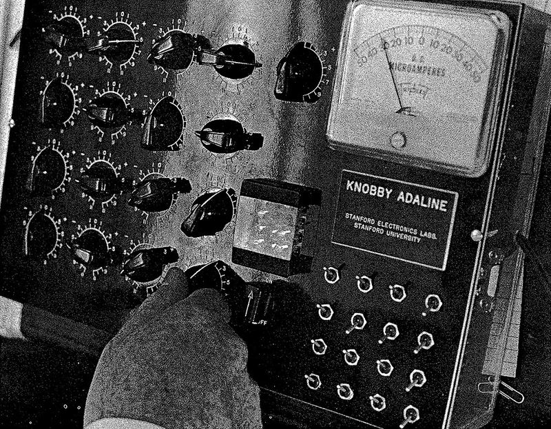

Rosenblatt's perceptron learned by being told when it was wrong. At
Stanford, an electrical engineer and his first graduate student found a way
for a machine to learn from _how_ wrong it was, and their rule went on to run
inside the telephone network.

## Widrow and Hoff

**Bernard Widrow** (1929–2025) came to Stanford from MIT, where he had worked
on magnetic core memory for the Whirlwind computer. For his doctorate he had
learned about the _Wiener filter_, which separates a signal from noise but
needs the signal's statistics in advance. Widrow built a filter that found
its settings for itself instead, by gradient descent on the mean squared
error. He also attended the 1956 Dartmouth workshop, and came away wanting to
work on artificial intelligence.

In 1959 his first graduate student, **[Marcian "Ted" Hoff](kloom:e/marcian-hoff)**, joined him. That
year they turned the adaptive filter into a rule that took one small step
after every example. They published it in 1960 as "Adaptive switching
circuits", a few months after Rosenblatt first presented his perceptron rule;
the two rules were worked out independently in 1959. Theirs is known as the
_LMS_ (least mean squares) algorithm, or the _Widrow–Hoff delta rule_.

## Learning from the error

Their machine was **ADALINE**, the _adaptive linear neuron_ (later "element").
Like a perceptron unit, it weights its inputs, adds them up and passes the sum
through a threshold that outputs +1 or −1. The difference is where it looks
for its error. Rosenblatt's rule compared the thresholded output with the
right answer. ADALINE compares the _sum itself_, before the threshold, with
the desired response. That error, ε = d − s in the drawing, is a number rather
than a yes or no, so it says which way each weight should move and roughly
how far: each weight changes in proportion to the error times its own input.

That is a step down the slope of the squared error. In modern terms the LMS
rule is _stochastic gradient descent_, which, with backpropagation to carry
the error back through many layers, is still the dominant way to train a
neural network. Widrow's lab could not find that second piece. Their
multi-unit **MADALINE** networks of 1962 had only one trainable layer, and
the lab "never succeeded" in training more.

The "knobby" ADALINE, above, kept its weights on knobs turned by hand.
To make adaptation automatic, Widrow and Hoff invented the _memistor_, a
resistor whose conductance was changed by electroplating copper onto
graphite. The largest MADALINE, built in the early 1960s, had 1,000
memistor weights. Adalines and Madalines were set to recognise speech and
patterns, forecast the weather and balance an inverted pendulum.

## Into the telephone

Unable to train deeper networks, Widrow's lab moved to _adaptive signal
processing_: antennas that steer themselves, noise cancelling, seismic
data. The biggest use came from others. In Widrow's words, work "by Lucky and
others at Bell Laboratories led to major commercial applications of adaptive
filters and the LMS algorithm to adaptive equalization in high-speed modems
and to adaptive echo cancellers for long-distance telephone and satellite
circuits".

Echo is a modem's particular problem. An ordinary telephone line carries
both directions on the same pair of wires, so some of a modem's outgoing
signal comes back to it, and it cannot tell that echo from the far end's
signal. Early modems split the band, each end talking in its own tones.
Cancelling the echo instead, by subtracting an estimate of it, let both
modems use the full band and roughly doubled the possible speed. Because a
line's echo is not known in advance, the canceller has to adapt, which is the
job an LMS-style filter does.

Hoff left in 1968 for Intel, where he helped conceive the Intel 4004, the
first commercial microprocessor. Widrow came back to neural networks in 1985,
when he heard about backpropagation at a conference in Snowbird, Utah: "This
was long before Paul Werbos. Backprop to me is almost miraculous." He died on
30 September 2025, aged 95.

Straight lines were the limit of a single ADALINE, as of a single
perceptron: it splits its inputs with one line, plane or hyperplane. In 1969
two mathematicians at MIT set out to prove exactly what that ruled out.
