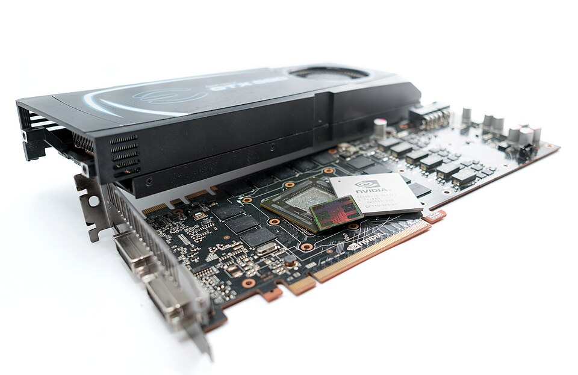
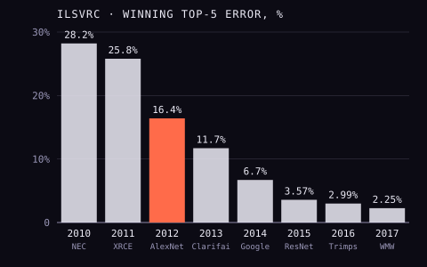

In 2012 the idea that a program should learn its own visual features from
data was a minority position in computer vision. Progress came from features
designed by hand, and the ImageNet leaderboard moved a few points a year. Then
a team of three from the University of Toronto entered a large neural network,
and won by more than ten points.

## Three people and two graphics cards

**Alex Krizhevsky** and **Ilya Sutskever** were graduate students; **Geoffrey
Hinton** was Krizhevsky's doctoral adviser. In 2011 Hinton had been asking colleagues
what it would take to convince them that neural networks were the future, and
Jitendra Malik, a sceptic, pointed him at the ImageNet challenge. Krizhevsky
had already written _cuda-convnet_, code for training convolutional networks
on a graphics processor. Sutskever persuaded him to try it on ImageNet, and
Krizhevsky extended it to run on two. By one account the network was trained
in his bedroom at his parents' house. Hinton later summed up the division of
labour: "Ilya thought we should do it, Alex made it work, and I got the Nobel
Prize."

The network, later called **AlexNet**, had five convolutional layers and three
fully connected ones: 60 million parameters and 650,000 neurons. It was too
big for one card, so it was split across two **Nvidia GTX 580** cards with
3 GB of memory each, and the halves talked to each other only at certain
layers. That split is the upper and lower half of the plate on the left.
Training took five to six days.

## Two tricks

Two choices in the paper became standard practice. The first was the
_rectified linear unit_, or ReLU, a neuron whose output is simply max(0, _x_),
in place of the smooth curves then usual. On a smaller test the authors found
a network of ReLUs reached a given training error six times faster, and they
wrote that they could not have experimented with networks this large
otherwise. The second was _dropout_: in training, each neuron in the first two
fully connected layers was switched off at random, with probability one half,
so that no neuron could rely on particular others. Without it, they reported,
the network overfitted badly.

The team entered as _SuperVision_. Their best entry had a top-5 error of
**15.3 per cent**; the second-best team, using the established methods, had
26.2. That entry was helped by extra training images from the full ImageNet;
trained on the challenge's own data alone, SuperVision scored 16.4 per cent,
which is the figure the chart below uses. The paper also made a
prediction: "All of our experiments suggest that our results can be
improved simply by waiting for faster GPUs and bigger datasets to become
available."

## Deep learning won

The chart shows the winning top-5 error in each year of the challenge. The
drop in 2012 was only the start. In 2013 the great majority of entries used
deep convolutional networks, and in 2014 GoogLeNet's error of 6.7 per cent
came close to that of a trained human: **Andrej Karpathy**, a co-author of
the challenge's own report, labelled 1,500 test images himself and missed 5.1 per
cent. In 2015 a network from
Microsoft Research got under that, at 3.57 per cent. Yann LeCun called
AlexNet "an unequivocal turning point in the history of computer vision".

| Year | Winning team          | Top-5 error |
| ---- | --------------------- | ----------: |
| 2010 | NEC                   |       28.2% |
| 2011 | XRCE                  |       25.8% |
| 2012 | SuperVision (AlexNet) |       16.4% |
| 2013 | Clarifai              |       11.7% |
| 2014 | GoogLeNet             |        6.7% |
| 2015 | MSRA (ResNet)         |       3.57% |
| 2016 | Trimps-Soushen        |       2.99% |
| 2017 | WMW                   |       2.25% |

The figures are each year's lowest top-5 classification error using only the
challenge's own training data, from the organisers' published tables and
results pages; the 2015 figure is the one reported in the ResNet paper.

None of the pieces was new. Convolutional networks went back to Yann LeCun's
LeNet, graphics processors had trained neural networks before, and ImageNet
existed. Fei-Fei Li later called the moment symbolic because three things
converged for the first time: big labelled data, graphics processors and
deep networks. The next frames follow the same shift, from representations
built by hand to representations learned, from pictures to words.
