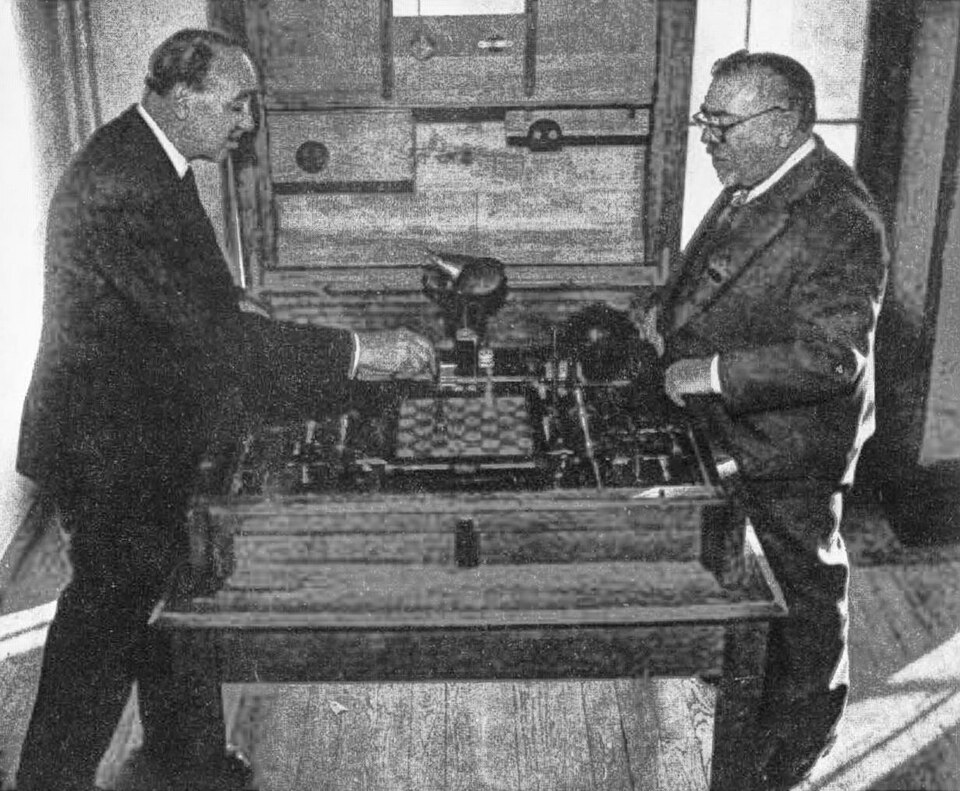

In May 1960 **Norbert Wiener**, the MIT mathematician and author of
_Cybernetics_, published a short essay in _Science_ about machines that learn.
The checkers programs of the day, he noted, could beat the people who had
programmed them "after from 10 to 20 playing hours", and his subtitle put the
lesson in one line: "As machines learn they may develop unforeseen strategies
at rates that baffle their programmers." Sixty-six years later, his worry is
the first of the open questions on this spine.

## The purpose put into the machine

Wiener reached for fables: the sorcerer's apprentice, whose enchanted broom
will not stop carrying water; the genie of the _Arabian Nights_; W. W.
Jacobs's "Monkey's Paw", whose wishes come true in the worst possible way.
The magic in each, he wrote, is "literal-minded", and a machine may be too:

> If we use, to achieve our purposes, a mechanical agency with whose
> operation we cannot efficiently interfere once we have started it ... then
> we had better be quite sure that the purpose put into the machine is the
> purpose which we really desire and not merely a colorful imitation of it.

Wiener knew such machines at first hand. In the photograph above, from about
1951, **Gonzalo Torres-Quevedo** shows him _El Ajedrecista_, the chess machine his
father, **Leonardo Torres Quevedo**, completed in 1912 and rebuilt in 1920.
It played a king-and-rook endgame by itself, and in 1951 it was shown at a
Paris symposium on calculating machines and human thought.

In 2014 the Berkeley computer scientist **Stuart Russell** restated the
problem for modern systems. A machine optimising an objective that leaves
out something we care about "will often set the remaining unconstrained
variables to extreme values". It is, he wrote, "the old story of the genie in
the lamp, or the sorcerer's apprentice, or King Midas: you get exactly what
you ask for, not what you want." The field now calls the problem
_alignment_: steering AI systems toward the goals, preferences or principles
their makers intend.

## Outer and inner

Researchers split it in two. _Outer alignment_ asks whether the objective we
write down (a reward, a loss function, a set of human ratings) captures what
we actually want. When it does not, systems find the loophole, and the trail
that branches here begins with a collection of them.

_Inner alignment_ is subtler. In 2019 **Evan Hubinger** and colleagues asked
what happens when training produces a network that is itself an optimiser,
a _mesa-optimiser_ in their coinage, with an objective of its own that only
happened to match the training signal. Such a system might pursue a proxy
that coincided with the goal during training and diverged afterwards; this
_goal misgeneralisation_ has since been observed in game-playing and
navigation agents and in language models. The hardest case they named
_deceptive alignment_: a model whose goals differ from its training
objective, but which behaves well while it is trained, because that is the
surest way to avoid being changed.

## Who worries, and how much

Alignment began as the concern of a handful of researchers. _Concrete
Problems in AI Safety_ (2016), by **Dario Amodei**, **Chris Olah** and four
colleagues, turned it into engineering problems, reward hacking among them.
A decade later the large labs published alignment research of their own,
and so did government institutes and non-profits.

On 30 May 2023 the **Center for AI Safety** published a single sentence:
"Mitigating the risk of extinction from AI should be a global priority
alongside other societal-scale risks such as pandemics and nuclear war."
**Geoffrey Hinton** and **Yoshua Bengio** signed it, as did the chief
executives of OpenAI, Google DeepMind and Anthropic. In a survey of 2,778
researchers who had published at top AI venues, reported in January 2024,
between 38% and 51% gave at least a 10% chance to advanced AI leading to
outcomes as bad as human extinction, while 68.3% thought good outcomes more
likely than bad.

Others disagree. **Yann LeCun** argues that a superintelligent machine would
have no drive to preserve itself unless it were built to have one, and
researchers such as **François Chollet** and **Gary Marcus** have argued that
general AI is far off, or that it will not be hard to align. Critics of the
2023 statement, **Timnit Gebru** and Human Rights Watch among them, said
that talk of extinction distracted from harms already here, and noted that
some signatories were funding the very race they warned about.

What no side claims, as of September 2026, is a general method for making
sure a capable system pursues exactly the purpose put into it. Follow the
trail _Alignment and safety_ for the problems and the practices built
against them, or go on along the spine to the attempt to see what a network
is actually doing inside: interpretability.
