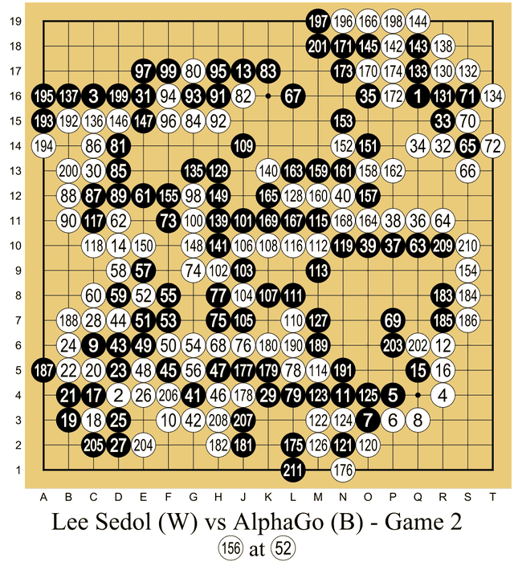
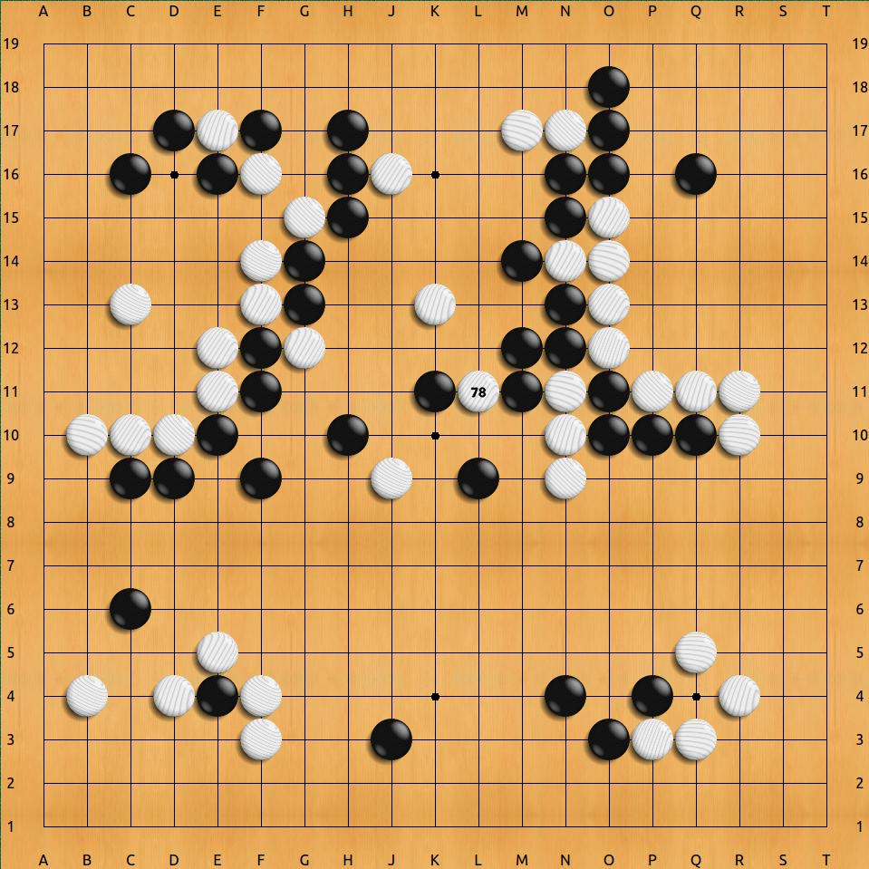

Deep networks had learned to recognize images from millions of labeled
examples. Much of what an intelligent agent has to do comes with no labels:
it has to act, and find out afterwards whether it did well. That is
[_reinforcement learning_](kloom:e/reinforcement-learning), learning from reward. Between 2013 and 2016 a
London company, **[DeepMind](kloom:e/google-deepmind)**, joined it to deep learning, and used the result
to beat a champion at the classic game long thought hardest for machines.

## Pixels and a score

In December 2013 **Volodymyr Mnih** and colleagues at DeepMind described a
convolutional network, trained by a variant of _Q-learning_, that learned to
play [Atari 2600](kloom:e/atari-2600) video games from the raw pixels on the screen, with the
score as its reward. It beat all previous approaches on six of the seven
games they tried, and surpassed a human expert on three. In February 2015
the team, by then part of [Google](kloom:e/google), reported in _Nature_
that the same program, the **deep Q-network**, with one architecture and one
set of settings, reached a level comparable to a professional human games
tester across 49 games. Nobody told it what a paddle or a spaceship was.

## Go

[Go](kloom:e/go-game) had long been the game that computers could not play well. On a 19 × 19
board the space of possible games is enormous, and a position is hard to
judge at all. Before 2015 the best programs reached only amateur dan level.

**[AlphaGo](kloom:e/alphago)**, described in _Nature_ in January 2016 by **[David Silver](kloom:e/david-silver-computer-scientist)** and
colleagues, used two deep networks. A _policy network_ proposed promising
moves; a _value network_ estimated who was winning. They were trained first
on about 30 million moves from 160,000 games by strong amateurs on an
internet Go server, then improved by reinforcement learning, playing against
versions of themselves. A tree search guided by both chose the move. AlphaGo
won 99.8 percent of its games against other Go programs, and in October
2015 it beat the European champion, **Fan Hui**, 5–0: the first time a
program had beaten a professional on a full-sized board without a handicap,
a feat the paper said had been thought at least a decade away.

## Five games in Seoul

The challenge match against **[Lee Sedol](kloom:e/lee-sedol)**, a Korean professional of the
highest rank with 18 international titles, was played at the Four Seasons
Hotel in [Seoul](kloom:e/seoul) from 9 to 15 March 2016, for a prize of a million dollars.
Lee predicted he would win. DeepMind's Aja Huang placed the stones for
AlphaGo, which ran on Google's cloud with its servers in the United States.
How much hardware it used is reported differently: about what it had used
against Fan Hui, 1,202 CPUs and 176 GPUs, by one account, and 1,920 CPUs and
280 GPUs by _The Economist_'s.

AlphaGo won the first three games. In the second, its 37th move was a
_shoulder hit_ on the fifth line from the edge, a move most professionals
would not have considered. The commentator Michael Redmond called it
"creative" and "unique", and DeepMind later put the chance of its being
played at 1 in 10,000.

In the fourth game Lee answered in kind. His 78th move, a wedge into the
center that the Chinese professional Gu Li called a "divine move", was
another that DeepMind put at 1 in 10,000. AlphaGo's reply was poor, and a few
moves later its own estimate of its chances collapsed; it resigned. It won
the fifth game, and the match, **4–1**. The prize went to charities.

Lee said the defeat was his own, "not a defeat of mankind". [Murray Campbell](kloom:e/murray-campbell),
one of [Deep Blue](kloom:e/deep-blue-chess-computer)'s designers, called the result "the end of an era... board
games are more or less done". In 2017 a stronger AlphaGo beat the
world number one, Ke Jie, and a version that learned without any human
games, [AlphaGo Zero](kloom:e/alphago-zero), beat the Lee Sedol version 100 games to 0. In November
2019 Lee retired from professional play, calling the programs "an entity
that cannot be defeated".

AlphaGo's successors are followed on the games trail from Deep Blue. On the
main spine the next step came from a different direction, in a 2017 paper
with a confident title: "[Attention is all you need](kloom:e/attention-is-all-you-need)".
