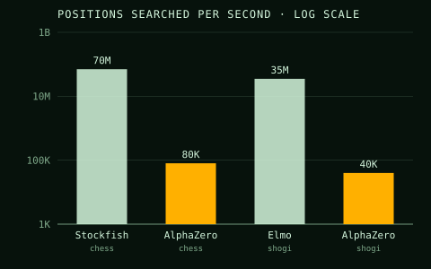

The strongest [chess](kloom:e/chess) and shogi programs of 2017 carried their makers' knowledge: evaluation functions refined by experts over decades, opening books, endgame tables. On
5 December 2017 [DeepMind](kloom:e/google-deepmind) described a program that was given the rules of
chess, shogi and [Go](kloom:e/go-game) and nothing else, and within a day played each of them
better than any program before it.

## One network, one search, three games

**[AlphaZero](kloom:e/alphazero)** generalised _AlphaGo Zero_, the self-taught successor of the
AlphaGo that had beaten Lee Sedol at Go in 2016. The preprint by **[David
Silver](kloom:e/david-silver-computer-scientist)** and colleagues put the claim plainly: "Starting from random play,
and given no domain knowledge except the game rules, AlphaZero achieved
within 24 hours a superhuman level of play in the games of chess and shogi
(Japanese chess) as well as Go." In [Shannon](kloom:e/claude-shannon)'s terms it is a program that
learns by its mistakes, and it learns its own evaluation.

A single neural network takes a position and returns two things: _p_, a
probability for each legal move, and _v_, an estimate of who will win. A
[_Monte Carlo tree search_](kloom:e/monte-carlo-tree-search) uses p to decide which moves to look at and v to
judge where it stops, and so goes deep along a few lines instead of wide
along all of them. The program plays itself with that search, and the
network is trained on the games, to predict the moves the search chose and
the results the games reached. That is the loop in the drawing. For chess,
5,000 first-generation [TPUs](kloom:e/tensor-processing-unit) generated the self-play games and 64
second-generation TPUs trained the network; the chess run took nine hours
and 44 million games.

The search is far narrower than a conventional engine's. The authors called
it "arguably a more 'human-like' approach to search, as originally proposed
by Shannon":

| Program   | Game  | Positions per second |
| --------- | ----- | -------------------: |
| Stockfish | chess |          ~70,000,000 |
| AlphaZero | chess |              ~80,000 |
| Elmo      | shogi |          ~35,000,000 |
| AlphaZero | shogi |              ~40,000 |

These are the 2017 preprint's figures. The final paper, with different
hardware, gives about 60 thousand for AlphaZero and 60 million for
[Stockfish](kloom:e/stockfish-chess).

## The argument about Stockfish

In the preprint, AlphaZero played 100 games against **Stockfish 8** at one
minute a move and won 28, drew 72 and lost none; against the shogi program
**Elmo** it won 90 of 100; against [AlphaGo Zero](kloom:e/alphago-zero) it won 60 of 100. The chess
result drew objections. Stockfish had 64 threads and a 1 GB hash table,
which Stockfish's **Tord Romstad** called suboptimal; it was a year old;
it had no opening book; and it is not built for a fixed time per move. The
grandmaster **Hikaru Nakamura** said AlphaZero was "basically using the
Google supercomputer" while "Stockfish was basically running on what would
be my laptop."

The paper published in _Science_ in December 2018 answered much of this.
AlphaZero had been trained on thousands of TPUs but played on one machine
with four TPUs and 44 CPU cores. The final chess match used a development
version of Stockfish 9 on 44 cores with a 32 GB hash and endgame
tablebases, under tournament time controls of three hours plus fifteen
seconds a move. Over 1,000 games AlphaZero won 155, lost 6 and drew 839.
The engine developer **Larry Kaufman** still judged that AlphaZero would
probably lose to the newer Stockfish 10 under the conditions of the Top
Chess Engine Championship. AlphaZero itself was never released, but an open
reimplementation, **[Leela Chess Zero](kloom:e/leela-chess-zero)**, went on to contest championships
against Stockfish.

## Without the rules

The next step removed the rules too. **MuZero**, announced in November 2019
and published in _Nature_ in 2020, learns its own model of the game: one
network turns the observation into a hidden state, a second predicts how
an action changes that state, and a third predicts the move probabilities,
value and reward. It plans inside that learned model. It matched AlphaZero
at chess and shogi, improved on it at Go, and set a new state of the art on
57 Atari video games, where there is no rulebook to give it.

Board games have perfect information: both players see everything. The
last frame of this trail is about games where they do not.
