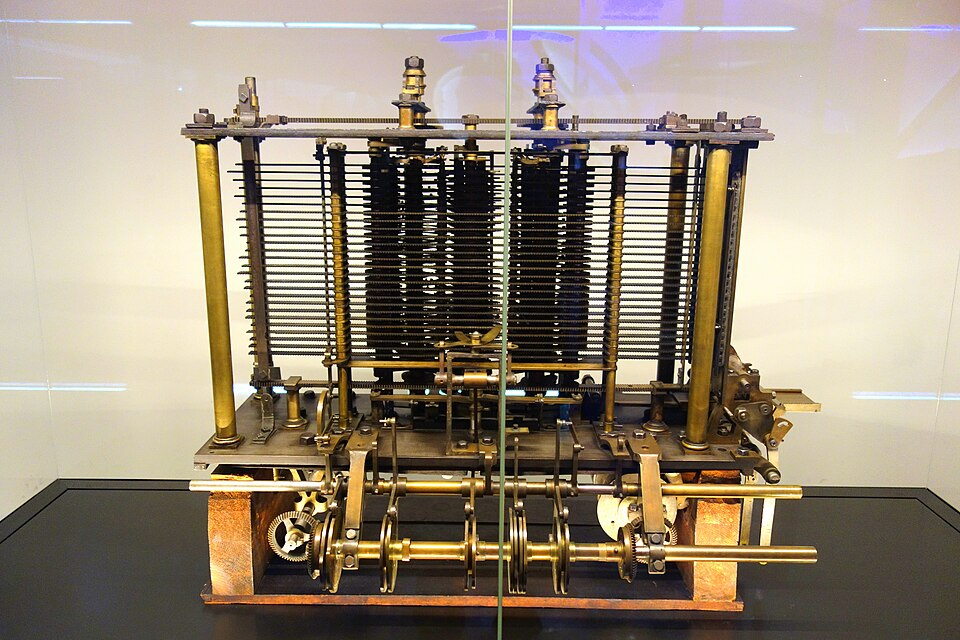
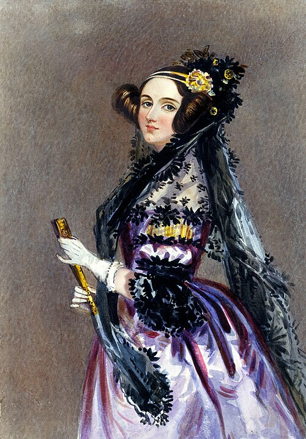

In the 1830s a [London](kloom:e/london) mathematician who had failed to finish one
calculating machine designed a second, far more ambitious one: a machine that
could be told, on [punched cards](kloom:e/punched-card), what to calculate. It was never built. But a
translation of a lecture about it, published in 1843 with long notes by a
twenty-seven-year-old countess, holds the first published program for a
computer, and the first argument about whether such a machine could ever
think for itself.

## A loom for numbers

**[Charles Babbage](kloom:e/charles-babbage)**'s first machine, the [_Difference Engine_](kloom:e/difference-engine), was built to
tabulate functions by the method of finite differences. It was never
completed: Babbage quarreled with his chief engineer, Joseph Clement, and the
British government withdrew its funding. While working on it, around 1833, he
saw that a much more general machine was possible, and he first described
the **[Analytical Engine](kloom:e/analytical-engine)** in 1837.

Its design has the shape of a modern computer. A _store_ was to hold 1,000
numbers of 40 decimal digits each. A _mill_ would perform the four
arithmetic operations, and comparisons, on numbers brought from the store.
The instructions and the data came in on **punched cards**, an idea
borrowed openly from the silk industry. In 1804 **[Joseph Marie Jacquard](kloom:e/joseph-marie-jacquard)** had
patented a loom attachment driven by a chain of punched cards laced
together, one card for each row of the pattern; change the cards and the
same loom wove a different design. Babbage's engine had separate cards for
operations, for numbers, and for moving numbers between store and mill, and
it could loop and branch. In today's terms it would have been
_Turing-complete_. Babbage wrote some two dozen programs for it between 1837
and 1840.

Only fragments were made. The trial model above, a portion of the mill with
its printing mechanism, was still under construction when Babbage died in
1871; it is now in the [Science Museum](kloom:e/science-museum-london) in London. In 1878 a committee of the
British Association called the engine "a marvel of mechanical ingenuity",
and recommended that it not be built.

## Lovelace's notes

In 1840 Babbage explained the engine in a seminar at Turin, the only public
account he ever gave of it. A young engineer, **[Luigi Menabrea](kloom:e/luigi-federico-menabrea)**, wrote it up
in French, and **[Charles Wheatstone](kloom:e/charles-wheatstone)** asked **[Ada Lovelace](kloom:e/ada-lovelace)** (Augusta Ada
King, Countess of Lovelace, the daughter of [Lord Byron](kloom:e/lord-byron)) to translate it.
She added seven notes, lettered A to G, about three times as long as the
article itself. They appeared in 1843 in Taylor's _Scientific Memoirs_,
signed only "A.A.L."

The notes say what the engine _was_, in a way Babbage never wrote down. In
Note A she compares it with the loom: "We may say most aptly, that the
Analytical Engine weaves algebraical patterns just as the Jacquard-loom
weaves flowers and leaves." It could act on things other than number, she
suggested, if their relations could be expressed in its notation: given the
rules of harmony, "the engine might compose elaborate and scientific pieces
of music of any degree of complexity or extent." In Note F she points out
that a woven portrait of Jacquard had needed 24,000 cards, and that the
engine's power to repeat a set of cards (a loop) would save most of them.

Note G works one problem in full: computing the **[Bernoulli numbers](kloom:e/bernoulli-number)**, a
sequence used in analysis, each from the ones before it. She set it out as a
table of operations, each naming the variable columns (_V_) it reads and
writes. Twenty-five operation cards, she showed, would compute every number
in the sequence in turn. The first seven steps, with the program's starting
values _V_₁ = 1, _V_₂ = 2 and _V_₃ = _n_:

| Step | Operation | Result into | Value                    |
| ---: | --------- | ----------- | ------------------------ |
|    1 | V₂ × V₃   | V₄, V₅, V₆  | 2n                       |
|    2 | V₄ − V₁   | V₄          | 2n − 1                   |
|    3 | V₅ + V₁   | V₅          | 2n + 1                   |
|    4 | V₅ ÷ V₄   | V₁₁         | (2n − 1) ÷ (2n + 1)      |
|    5 | V₁₁ ÷ V₂  | V₁₁         | ½ · (2n − 1) ÷ (2n + 1)  |
|    6 | V₁₃ − V₁₁ | V₁₃         | −½ · (2n − 1) ÷ (2n + 1) |
|    7 | V₃ − V₁   | V₁₀         | n − 1                    |

Step 4 carries a bug. The division is written the wrong way round, and a
modern run of the table as printed gives −25621/630 where the answer should
be −1/30. Whose program it was is argued over. Babbage wrote in his memoirs
that he had offered to do the Bernoulli algebra himself, and that she sent it
back having found "a grave mistake" in it. Historians note that Babbage's own
unpublished programs came first; others, such as Stephen Wolfram, argue that
nothing he wrote was as sophisticated or as clean as hers.

## "No pretensions whatever"

Note G opens with a warning against expecting too much:

> The Analytical Engine has no pretensions whatever to originate anything.
> It can do whatever we know how to order it to perform. It can follow
> analysis; but it has no power of anticipating any analytical relations or
> truths.

A century later [Alan Turing](kloom:e/alan-turing) called this "Lady Lovelace's Objection" and made
it one of the questions any thinking machine would have to answer. The
engine could follow analysis. To follow _reasoning_, a machine would first
need reasoning written as algebra, and a self-taught schoolmaster from
Lincoln was about to write it.
