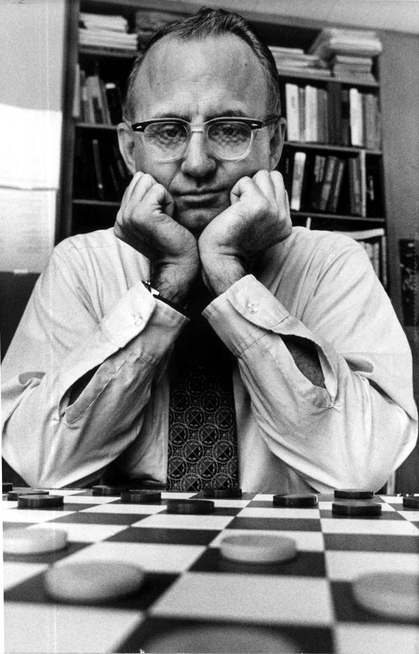

In 1989 a team at the [University of Alberta](kloom:e/university-of-alberta) set out to build a [checkers](kloom:e/checkers)
program that could beat the world champion. The champion was the greatest
player the game had known, and the contest between them ended not with a
win but with a proof.

## The program and the champion

**[Chinook](kloom:e/chinook-computer-program)** was the work of **[Jonathan Schaeffer](kloom:e/jonathan-schaeffer)** and a small team (Rob
Lake, Paul Lu, Martin Bryant and Norman Treloar). It had an opening book
built from grandmasters' games, a deep search, a hand-written evaluation
function (piece count, kings, trapped kings, runaway checkers and more),
and databases of every endgame with eight or fewer pieces. None of it was learned: every piece of its knowledge was programmed by its makers.

Its opponent was **[Marion Tinsley](kloom:e/marion-tinsley)**, a professor of mathematics in Florida
who had been world champion from 1955 to 1958 and again from 1975, and who
never lost a world championship match. Sources count his losses between
1950 and his death differently (Chinook's team says three to 1991;
Wikipedia's count to 1995 is seven, two of them to Chinook), but it was a
handful in some forty-five years. **[Derek Oldbury](kloom:e/derek-oldbury)**, sometimes ranked the second-best player ever, said Tinsley was "to checkers what Leonardo da Vinci was to science, what
Michelangelo was to art and what Beethoven was to music."

In 1990 Chinook came second to Tinsley at the U.S. national tournament,
which normally earns a place in a world championship match. The American
and English federations would not let a computer play for the title.
Tinsley resigned his title and played the machine anyway, in a new
_Man-Machine World Championship_. In 1992 he won, four games to two, with
33 draws. In one of their games Chinook made a mistake on its tenth move, and Tinsley
told it: "You're going to regret that." Chinook resigned 26 moves later.

The rematch began in August 1994. After six games, all drawn, Tinsley
withdrew for health reasons; he was diagnosed with pancreatic cancer soon
after, and died in April 1995. Chinook became the first program to win a
human world championship title, though it never beat him in the match that
decided it. It defended the title against **Don Lafferty** in 1995, one win
and 31 draws, and then Schaeffer retired it from play.

## Solving the game

Schaeffer turned instead to a question the unfinished match had left open.
If checkers were a draw with perfect play, a perfect program could never
lose, not even to Tinsley. Checkers has about 5 × 10²⁰ positions. The
computation, running almost continuously from 1989, used more than two
hundred processors at its peak in 1992, and had three parts, which the
drawing shows:

- **Endgame databases**, computed backward from the end of the game: the
  value of every one of 3.9 × 10¹³ positions with ten or fewer pieces.
- A **proof-tree manager**, searching forward from the start: it keeps the
  tree of moves and best replies, and picks the positions still to be
  settled.
- A **proof solver**, which settles the value of each of those positions with two different search programs.

In July 2007 _Science_ published "Checkers Is Solved": from the starting
position, "perfect play by both sides leads to a draw". The game was
_weakly_ solved. The result and a strategy that never loses are known for
the start of the game, though not every position has been worked out, as
it has in a _strongly_ solved game. The paper called it "roughly one
million times as complex as Connect Four", and the most challenging popular
game solved to that date.

It also ended an argument that [Samuel](kloom:e/arthur-samuel-computer-scientist)'s single win of 1962 had started.
Checkers had been called solved for forty-five years; now it was, in a
sense that could be checked. [Chess](kloom:e/chess), with far more positions, has been solved only for endgames of up to seven pieces, and may never be solved in full. Its best programs still play by search and judgment, and since 2017 that judgment can be learned by self-play, as the next frame shows.
