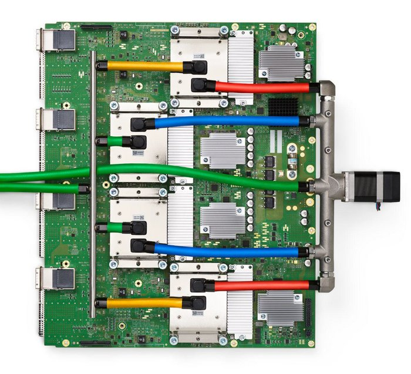
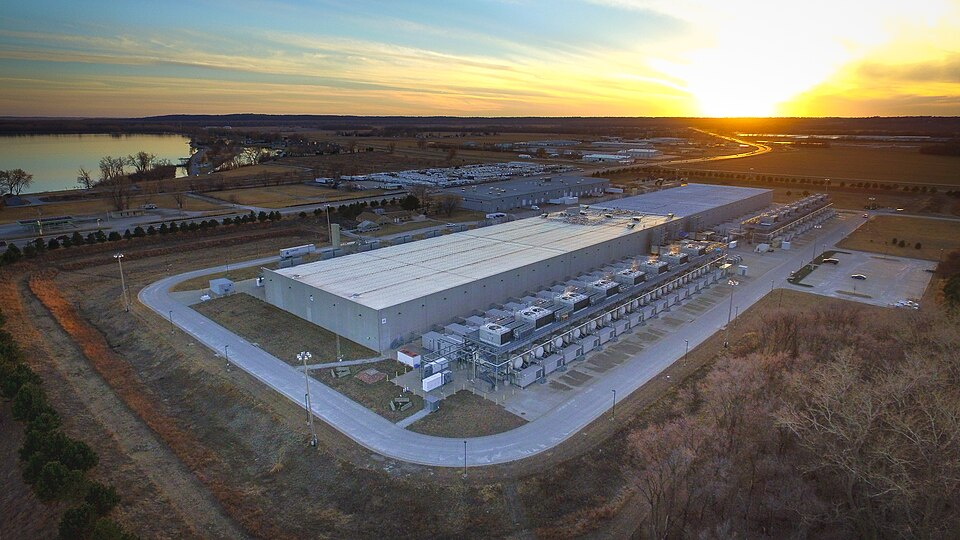
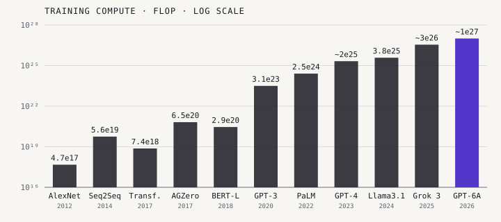

Every frame on this stretch of the spine ran on the same resource: vast
amounts of arithmetic, done by specialized chips, in buildings that draw as
much power as a town. By 2026 the supply of that arithmetic, and who is
allowed to buy it, had become a question of industrial policy.

## Chips

Machine learning runs on linear algebra, and graphics chips have many
cores that can do it in parallel.
**[Nvidia](kloom:e/nvidia)**'s [CUDA](kloom:e/cuda) software, which let programmers use those cores for
general computing, made its GPUs the default: [AlexNet](kloom:e/alexnet) was trained on two of
its GTX 580 cards in 2012, and by 2025 Nvidia held more than 80% of the
market for GPUs used to train and run AI models. In March 2022 Nvidia announced the
**H100** of its _Hopper_ architecture: 80 billion transistors,
made by [TSMC](kloom:e/tsmc). Its successor, **Blackwell** (March 2024), has 208 billion,
and Nvidia said in May 2026 that the next, _Vera Rubin_, was ramping into
full production. Nvidia's data-center revenue in its
2026 financial year was $193.7 billion, up 68% on the year before.

**[Google](kloom:e/google)** took another route. In May 2016 it revealed the **[Tensor
Processing Unit](kloom:e/tensor-processing-unit)**, at heart a matrix-multiplication engine designed for
neural networks, which it had
already been running in its data centers for more than a year. Its
engineers reported the first TPU to be 15 to 30 times faster than
contemporary GPUs and CPUs on their workloads. By 2025 Google was on its
seventh generation, _Ironwood_, in pods of 9,216 chips; [Amazon](kloom:e/amazon-company) designs its own,
_Trainium_.

## Clusters and power

The frontier is trained on tens or hundreds of thousands of such chips at
once. [Meta](kloom:e/meta-platforms) described two clusters of 24,576 H100s each in March 2024. In
2024 **[xAI](kloom:e/spacexai)** built _Colossus_ in Memphis, 100,000 Hopper GPUs, in 122 days.
In January 2025 [OpenAI](kloom:e/openai), SoftBank, Oracle and MGX announced _Stargate_, which
intended to invest $500 billion over four years in AI infrastructure for
OpenAI in the United States. [Epoch AI](kloom:e/epoch-ai) reported in June 2026 that the record
for computing capacity in a single data center had doubled every seven
months since 2024.

The **International Energy Agency** estimated that data centers used about
415 terawatt-hours of electricity in 2024, around 1.5% of the world's
consumption, and projected that this would more than double, to around 945
TWh, by 2030, with AI the most important driver.

## The curve

**Epoch AI**, a research group that tracks AI models, estimates that the
compute used to train frontier models grew about four to five times a year
from 2010 to 2024. The chart shows eleven notable models from its data, on a
logarithmic scale: each gridline is a thousandfold. From AlexNet to the
largest models of 2026 is a factor of about two billion.

| Model          | Released | Organization  | Training compute (FLOP) | Epoch's confidence |
| -------------- | -------- | ------------- | ----------------------: | ------------------ |
| AlexNet        | 2012     | Univ. Toronto |                4.7×10¹⁷ | Confident          |
| Seq2Seq LSTM   | 2014     | Google        |                5.6×10¹⁹ | Confident          |
| Transformer    | 2017     | Google        |                7.4×10¹⁸ | Confident          |
| AlphaGo Zero   | 2017     | DeepMind      |                6.5×10²⁰ | Confident          |
| BERT-Large     | 2018     | Google        |                2.9×10²⁰ | Confident          |
| GPT-3 175B     | 2020     | OpenAI        |                3.1×10²³ | Confident          |
| PaLM 540B      | 2022     | Google        |                2.5×10²⁴ | Confident          |
| GPT-4          | 2023     | OpenAI        |               ~2.1×10²⁵ | Likely             |
| Llama 3.1 405B | 2024     | Meta          |                3.8×10²⁵ | Confident          |
| Grok 3         | 2025     | xAI           |               ~3.5×10²⁶ | Likely             |
| GPT-6 Astra    | 2026     | OpenAI        |                 ~1×10²⁷ | Likely             |

Many of these numbers are Epoch's own estimates, made from the hardware
and training time, rather than figures the labs published; only some, such
as GPT-3's and Llama 3.1's, come straight from the papers. For many recent frontier models, Claude's and Gemini's among them,
Epoch gives no figure at all.

## Export controls

The chips became an instrument of policy. From October 2022 the US Commerce Department
restricted exports of advanced AI chips to China, and in October 2023
changed its tests for which chips are restricted to "preempt future
workarounds". When it required a license for Nvidia's China-specific H20 in April
2025, Nvidia said it expected charges of up to $5.5 billion. The rules have
moved back and forth since: in January 2026 the department began reviewing
H200 sales to China case by case, but Nvidia reported that China's
government discouraged its companies from buying, and that such sales came
to less than 1% of its data-center revenue.

Whether more compute keeps buying more capability, and whether those
capabilities stay under human control, are the open questions that begin
with alignment, the next frame.
