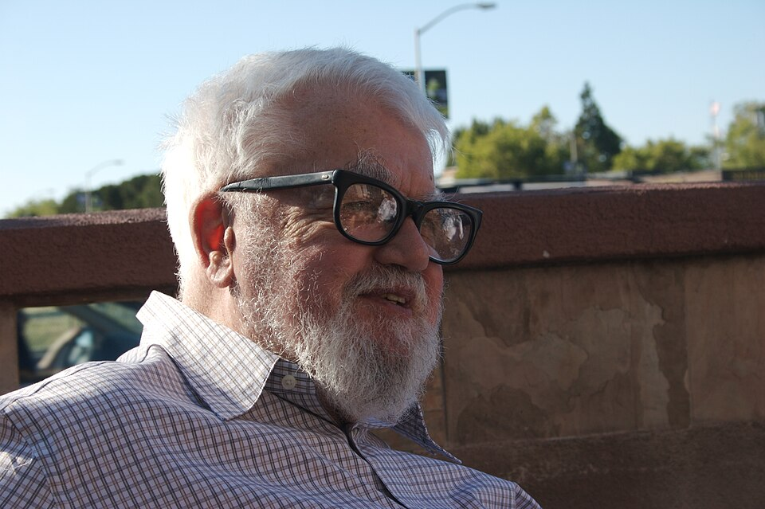

In the early 1950s the study of thinking machines had several names and no
field. People called it _cybernetics_, _automata theory_ or _complex
information processing_, and each name carried its own idea of what the work
was. In 1955 a young mathematician at **Dartmouth College** chose a new one,
and the name outlived every argument about what it meant.

## The proposal

**John McCarthy** was an assistant professor of mathematics at Dartmouth in
Hanover, New Hampshire. Early in 1955 he approached the **Rockefeller
Foundation** about paying for a summer seminar of about ten people, and in
June he and **Claude Shannon** of Bell Labs met the foundation's director of
biological and medical research, Robert Morison, who was not sure money
would be found for anything so visionary. The proposal itself is dated 31
August 1955 and signed by four men: McCarthy; **Marvin Minsky**, then a
Harvard Junior Fellow; **Nathaniel Rochester**, manager of information
research at IBM, who had helped design the IBM 701; and Shannon, the founder
of information theory. It opens:

> We propose that a 2 month, 10 man study of artificial intelligence be
> carried out during the summer of 1956 at Dartmouth College in Hanover, New
> Hampshire. The study is to proceed on the basis of the conjecture that
> every aspect of learning or any other feature of intelligence can in
> principle be so precisely described that a machine can be made to simulate
> it.

The document is credited with introducing the term _artificial
intelligence_. McCarthy chose it partly for its neutrality: it avoided
tying the field to narrow automata theory, and it avoided cybernetics, which
was built around analogue feedback and would have meant accepting Norbert
Wiener as its guru, or arguing with him. The proposal then listed seven
"aspects of the artificial intelligence problem":

| #   | Aspect                                             | What the proposal asked                                                            |
| --- | -------------------------------------------------- | ---------------------------------------------------------------------------------- |
| 1   | Automatic computers                                | The obstacle is not machine capacity but "our inability to write programs"         |
| 2   | How can a computer be programmed to use a language | Whether thought is "manipulating words according to rules"                         |
| 3   | Neuron nets                                        | How hypothetical neurons might be arranged to form concepts                        |
| 4   | Theory of the size of a calculation                | How to do better than trying every possible answer in turn                         |
| 5   | Self-improvement                                   | How a truly intelligent machine might improve itself                               |
| 6   | Abstractions                                       | How machines might form abstractions from sensory and other data                   |
| 7   | Randomness and creativity                          | Whether creative thought is competent thought with some guided randomness injected |

Nearly every later chapter of this subject is on that list: programs,
language, neural networks, search, learning. The money asked for was small.

| Item                                         |    Estimate |
| -------------------------------------------- | ----------: |
| 6 faculty salaries of $1,200                 |      $7,200 |
| 8 travel and rent allowances, averaging $300 |      $2,400 |
| 2 graduate-student salaries of $700          |      $1,400 |
| Secretarial and organisational expense       |        $850 |
| Additional travelling expenses               |        $600 |
| Contingencies                                |        $550 |
| **Total**                                    | **$13,500** |

## The summer

It did not go as planned. On 26 May 1956 McCarthy sent the foundation eleven
names: six for the full period, three for four weeks (Shannon, Rochester and
**Oliver Selfridge**) and two for the first two weeks (**Allen Newell** and
**Herbert Simon**). In the event people came and went. The workshop is
usually said to have lasted six weeks, but **Ray Solomonoff**'s notes show
it running for about eight, from around 18 June to 17 August, and only
Solomonoff, Minsky and McCarthy stayed throughout. The group had the top
floor of the mathematics department, and on most weekdays between three and
about eight people met in its main classroom. Solomonoff's own list of who
came names twenty people, among them John Nash, Arthur Samuel, W. Ross Ashby
and Warren McCulloch.

It was not a directed research project, and it consisted largely of
brainstorming. But several directions are traced to it: the rise of symbolic
methods, systems that work in one limited domain (the seed of the later
expert systems), and the long argument between deductive and inductive
approaches. It was not even the
first meeting on the question: the 1951 Paris conference on cybernetics and
the Macy meetings came earlier. What it did was give the field a name and a
founding story, and those who came became the leaders of AI research for the
next two decades. It has been called "the Constitutional Convention of AI".

Newell and Simon arrived with something the others had only proposed: a
working program, written the winter before in Santa Monica. At Dartmouth it
met a lukewarm reception.
