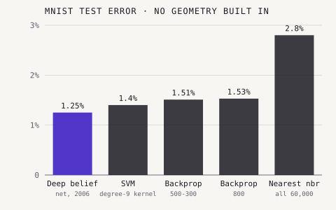
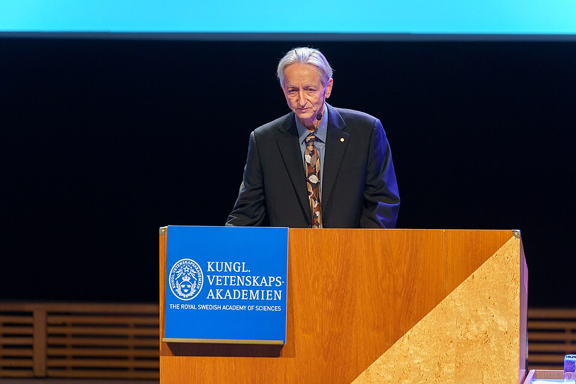

By the early 2000s neural networks had real uses, reading handwritten
cheques among them, but deep ones did not work. "To many researchers in the
field," the Nobel Committee for Physics later wrote, "training dense
multilayered networks seemed out of reach." In 2006 a small group funded by a Canadian
research institute showed a way to train them, one layer at a time.

## A home in Canada

Hinton moved to Canada in 1987 and joined the first program of the
**Canadian Institute for Advanced Research** (CIFAR), then called Artificial
Intelligence, Robotics and Society. In 2004 he and others, among them
**Yoshua Bengio** and **David Fleet**, proposed a new CIFAR program, _Neural
Computation and Adaptive Perception_, which Hinton led for ten years. Its
members included **Yann LeCun**; it is now called Learning in Machines and
Brains. Hinton, Bengio and LeCun later shared the 2018 Turing Award for
deep learning. The 2006 paper describes Hinton as a fellow of the institute.

## One layer at a time

"A Fast Learning Algorithm for Deep Belief Nets", by Hinton, **Simon
Osindero** of Toronto and **Yee-Whye Teh** of the National University of
Singapore, appeared in _Neural Computation_ in July 2006. Its method was
greedy. Train a restricted Boltzmann machine on the raw pixels. Freeze it,
and treat the activity of its hidden units as the data for a second
machine, and so on up. Each new layer learns to model the patterns in the
layer beneath, and the lower layers are never told what any image shows.
Only then are the
layers fine-tuned together. The top two layers form an associative memory,
like Hopfield's; the connections below point downward, so the network can
also run in reverse and draw digits of its own, showing, the authors wrote,
"what the associative memory has in mind".

Their test network, in the drawing, took a 28 × 28 image of a handwritten
digit through layers of 500 and 500 units to a top layer of 2,000, joined to
ten label units: about 1.7 million weights in all. The greedy stage took "a
few hours per layer" in Matlab on a 3 GHz Xeon; with fine-tuning, the whole
training took about a week. On the 10,000 test digits of the MNIST set it
made 1.25 per cent errors, better than the best support vector machine and
the best backpropagation networks, when none was given any knowledge of
image geometry.

| Method (no geometry built in)                 | Test error |
| --------------------------------------------- | ---------: |
| Deep belief net, 784-500-500-2000 + 10 labels |      1.25% |
| Support vector machine, degree-9 kernel       |       1.4% |
| Backpropagation, 784-500-300-10               |      1.51% |
| Backpropagation, 784-800-10                   |      1.53% |
| Nearest neighbour, all 60,000 training images |       2.8% |

The same table in the paper is honest about the limits. Networks that were
told about geometry did better still: LeCun's convolutional LeNet-5 made 0.95
per cent errors, and a convolutional net trained on extra, distorted images
0.4. What mattered was not the best score on digits but that a deep network
could be trained at all, with most of its learning done without labels.

The same month, _Science_ published Hinton and **Ruslan Salakhutdinov**'s
"Reducing the Dimensionality of Data with Neural Networks". It used the same
layer-by-layer pretraining to start deep _autoencoders_, networks that
squeeze data through a narrow middle layer, which then learned compact codes
"much better than principal components analysis".

## A name, and what came after

The words _deep learning_ were older: the Wikipedia history credits Rina
Dechter with bringing the term to machine learning in 1986, and Igor
Aizenberg and colleagues with applying it to neural networks in 2000. What
2006 supplied was a demonstration. By linking layers pretrained this way,
the Nobel Committee wrote, Hinton made deep, densely connected networks work,
"a milestone toward what is now known as deep learning".

The method itself did not last long. Around 2009 and 2010, speech
researchers found that with enough data, plain backpropagation could do
without the pretraining, and the committee notes that other methods later
replaced it. But the belief that deep networks were worth the effort
survived, and so did the group CIFAR had kept together.

This trail began with the perceptron's single layer of adjustable weights.
It ends with those weights stacked many layers deep. Go back to the
perceptron to rejoin the main story, which picks up in 2012, when Hinton and
his students Alex Krizhevsky and Ilya Sutskever entered a deep network called
AlexNet in the ImageNet challenge, and won.
