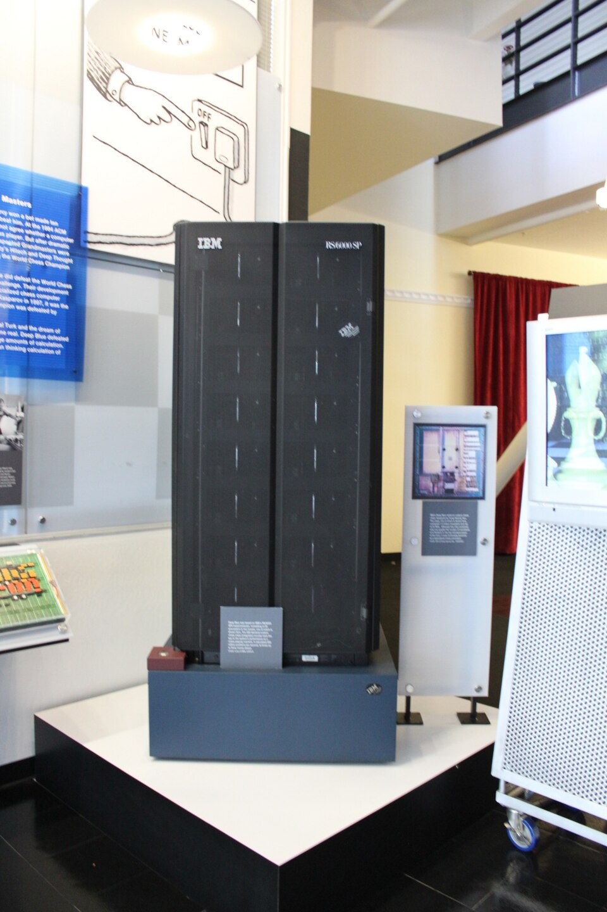
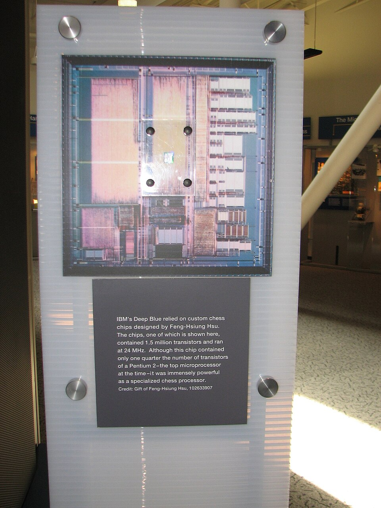

Ever since an [IBM](kloom:e/ibm) mathematician, Alex Bernstein, wrote the first complete
[chess](kloom:e/chess) program in 1957, chess had been the test that computing set itself: a
game that takes a lifetime to master, with clear rules and a clear result. In
May 1997, in New York, a machine built by **IBM** beat the reigning world
champion over a six-game match.

## Chess chips

The machine began as a student project. In 1985 **[Feng-hsiung Hsu](kloom:e/feng-hsiung-hsu)**, a
doctoral student at [Carnegie Mellon University](kloom:e/carnegie-mellon-university), started building a chess
machine called _ChipTest_, which won the North American Computer Chess
Championship in 1987. Its successor, _Deep Thought_, lost two games to
**[Garry Kasparov](kloom:e/garry-kasparov)** in 1989. That year Hsu and **[Murray Campbell](kloom:e/murray-campbell)** joined IBM
Research, and the project was renamed [_Deep Blue_](kloom:e/deep-blue-chess-computer), a play on the company's
nickname, Big Blue.

Deep Blue was a search engine in the literal sense. It looked ahead through
the tree of possible moves and replies, scored the positions at the end of
each line with an _evaluation function_, and backed the best score up the
tree. The plate on the left shows the trick that makes this affordable,
[_alpha–beta pruning_](kloom:e/alpha-beta-pruning): once one reply is found that refutes a move, the rest of
that branch need not be searched at all. Its strength came from doing this
very fast. Deep Blue's own designers described the 1997 machine as a 30-node
IBM RS/6000 SP computer carrying **480 custom chess chips**, sixteen to a
processor, each of which searched 2 to 2.5 million positions a second. The
move generator on each chip was an 8×8 circuit, a chess board in miniature.

How fast the whole machine was depends on who is counting. IBM's figure is
**200 million positions a second**. The designers' own paper is more careful:
in the 1997 match the average speed in searches longer than a minute was 126
million positions a second, and the fastest sustained speed was 330 million.
The knowledge was human. Between the matches the team rebuilt the evaluation
function to use more than 8,000 features, grandmasters tuned it and prepared
an opening book of about 4,000 positions, and an "extended book" summarised
700,000 grandmaster games.

## Six games in New York

The first match, in Philadelphia in February 1996, went to Kasparov by 4–2,
though Deep Blue won the first game: the first time a computer had beaten a
reigning world champion under ordinary tournament time controls. The rematch
was played at the Equitable Center in New York from 3 to 11 May 1997.
Kasparov won the first game and lost the second. The next three were drawn,
leaving the score level at 2½–2½. In the sixth game Kasparov chose a dubious
line of the Caro–Kann Defence, reasoning that a computer would not play the
well-known knight sacrifice against it without a concrete gain. Deep Blue
played it, and Kasparov resigned in under twenty moves. The final score was
**3½–2½**. IBM's team took the $700,000 winner's prize, and Carnegie Mellon
added the $100,000 Fredkin Prize, set up in 1980 for the first program to beat
a reigning world champion.

## The arguments afterwards

Kasparov did not accept the result quietly. After the second game he accused
IBM of cheating, suggesting that a human grandmaster had intervened: the move
that surprised him, 37.Be4, turned down a material gain in a way he thought
too subtle for a machine. IBM denied it, saying the only human intervention
came between games, which the rules allowed. Kasparov asked for the machine's
logs; IBM refused at the time and published them later. He asked for a
rematch; IBM declined, and it was reported that Deep Blue had been dismantled,
though it stayed in operation for several years. A 2003 documentary, _Game
Over: Kasparov and the Machine_, revisited the charge. Later, Kasparov called
Deep Blue "as intelligent as your alarm clock".

There was a quieter argument about what had been proved. Deep Blue did not
learn: it searched, with rules that people wrote and tuned. It could play
chess and nothing else. Chess engines such as [Leela Chess Zero](kloom:e/leela-chess-zero) now use neural networks
that train themselves by play, and the next frames follow the idea that
replaced hand-written knowledge: learning it from data.

Follow the trail from here into the long history of machines at play, from an
eighteenth-century chess hoax to programs that taught themselves. On the main spine, the next step was not a
faster search but a bigger dataset: [ImageNet](kloom:e/imagenet).
