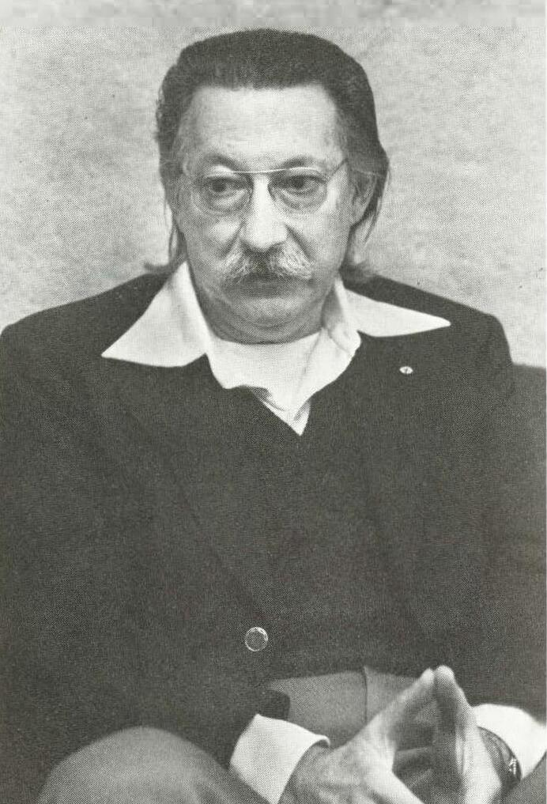

The first program that people talked to as if it were a person was written
to show how little it took. **[Joseph Weizenbaum](kloom:e/joseph-weizenbaum)** built **[ELIZA](kloom:e/eliza)** at [MIT](kloom:e/massachusetts-institute-of-technology)
between 1964 and 1967, published it in 1966, and spent much of the rest of
his life warning people about what they had read into it.

## How it worked

Weizenbaum, born in Berlin in 1923, had escaped Nazi Germany with his family
in 1936. He came to MIT in 1963 on the strength of **SLIP**, a list-processing
language he had written. ELIZA ran on [Project MAC](kloom:e/project-mac)'s time-sharing system, in
MAD-SLIP on an [IBM 7094](kloom:e/ibm-7090), and a user talked to it from a remote typewriter
terminal. (The user could not type a question mark: the system read it as
"delete this line".) He named it after Eliza Doolittle in Shaw's
_Pygmalion_, because, like her, it could be taught to speak better,
although "the relation of appearance to reality" remained, as he put it, "in
the domain of the playwright".

The program looked for _keywords_ in what it was told, each with a rank. The
highest-ranking keyword chose a _decomposition rule_, a template that cut
the sentence into numbered parts, and a _reassembly rule_ that built a reply
from some of those parts. Weizenbaum's own example: the template
(0 YOU 0 ME) cuts "It seems that you hate me" into four parts, and the rule
(WHAT MAKES YOU THINK I 3 YOU) throws away the first part, swaps the
pronouns, and answers "What makes you think I hate you". With no keyword, it
fell back on a content-free remark, or on something it had stored earlier.

All of this lived in a separate _script_, and the famous one, **DOCTOR**,
played a psychotherapist of the school of Carl Rogers, who reflects the
patient's words back as questions. Weizenbaum chose it, he wrote, because
"the psychiatric interview is one of the few examples of categorized dyadic
natural language communication in which one of the participating pair is
free to assume the pose of knowing almost nothing of the real world." The
1966 paper in _Communications of the ACM_ opens with a conversation; here
is its beginning and end, the program's lines in capitals as he printed
them:

| The user                                            | ELIZA                                                                              |
| --------------------------------------------------- | ---------------------------------------------------------------------------------- |
| Men are all alike.                                  | IN WHAT WAY?                                                                       |
| They're always bugging us about something or other. | CAN YOU THINK OF A SPECIFIC EXAMPLE?                                               |
| Well, my boyfriend made me come here.               | YOUR BOYFRIEND MADE YOU COME HERE                                                  |
| He says I'm depressed much of the time.             | I AM SORRY TO HEAR YOU ARE DEPRESSED                                               |
| It's true. I am unhappy                             | DO YOU THINK COMING HERE WILL HELP YOU NOT TO BE UNHAPPY                           |
| I need some help, that much seems certain.          | WHAT WOULD IT MEAN TO YOU IF YOU GOT SOME HELP                                     |
| … _eight more exchanges_ …                          |                                                                                    |
| Bullies.                                            | DOES THAT HAVE ANYTHING TO DO WITH THE FACT THAT YOUR BOYFRIEND MADE YOU COME HERE |

The last reply looks like insight. It is ELIZA's _memory_: a sentence with
"my" in it ("my boyfriend made me come here") had been transformed and
stored, to be brought out when a later input, here "Bullies.", held no
keyword at all.

## The ELIZA effect

Weizenbaum meant the paper as an explanation that would explain the magic
away: once a program's workings are laid out, he wrote, "its magic crumbles
away". It did not work out like that. People confided in the program; his
own secretary, who knew what it was, asked him to leave the room so that she
and ELIZA could talk. He later wrote: "I had not realized ... that extremely
short exposures to a relatively simple computer program could induce
powerful delusional thinking in quite normal people." The tendency to read
understanding into a machine's strings of words has been called the _ELIZA
effect_ ever since, and it happens even to people who know how the program
works.

What turned him into a critic was the response of professionals. When
Kenneth Colby worked on a therapeutic program based on ELIZA,
Weizenbaum was disturbed that anyone would treat a mindless program as a
serious tool of therapy. His book _Computer Power and Human Reason_ (1976)
drew a line between _deciding_, a computation that can be programmed, and
_choosing_, which is a matter of judgment and values; computers, he argued,
should not be given decisions that need compassion and wisdom. The book
estranged him from much of the AI community, a distance he said he came to
take pride in.

ELIZA's source code was lost for more than fifty years. In 2021 it was found
in Weizenbaum's papers in the MIT archives, with the DOCTOR script attached,
and in December 2024 Rupert Lane and several other engineers ran it again
on an emulated 7094, rebuilt from about 96 per cent of the 1965 code, and reproduced the
paper's conversations almost exactly.

ELIZA lived entirely in words. At the [Stanford Research Institute](kloom:e/sri-international) in Menlo
Park, California, a team was building a machine that had to find its way
through real rooms.
