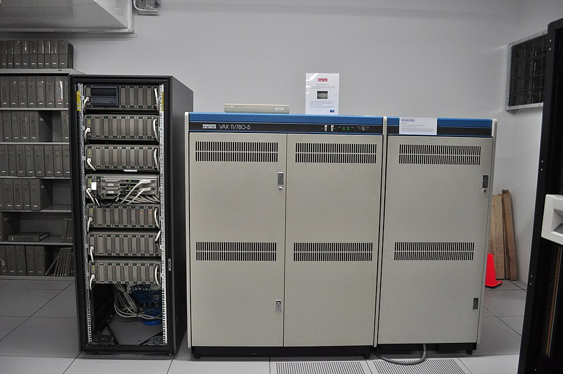

The lesson AI took from the 1970s was that cleverness was not enough. A
program that searched well but knew nothing drowned in possibilities; a
program that knew a great deal about one narrow subject might not need to
search much at all. By 1980 that idea had a name, the _expert system_, and a
first commercial success.

## Knowledge is power

An expert system splits a program in two. The _knowledge base_ holds what an
expert knows, written mostly as **if–then rules**; the _inference engine_ is a
general procedure that matches the rules against the facts of a case, picks one
to fire, adds what it concludes, and repeats. Because the reasoning is a chain
of named rules, the system can say which rules led to its answer, and why it is
asking a question.

The approach came out of Stanford. **Edward Feigenbaum**, often called the
"father of expert systems", led the Heuristic Programming Project, and put its
principle in one sentence: "intelligent systems derive their power from the
knowledge they possess rather than from the specific formalisms and inference
schemes they use." The first system was **DENDRAL**, begun in the mid-1960s
(accounts give 1964 or 1965) with **Joshua Lederberg**, **Carl Djerassi** and
**Bruce Buchanan**. Given the mass spectrum of
an unknown organic compound, it used rules of chemistry to cut the number of
possible molecular structures down to a few a chemist could check by hand.

**MYCIN**, written in Lisp in the early 1970s as **Edward Shortliffe**'s
doctoral work, diagnosed severe bacterial infections such as bacteraemia and
meningitis and recommended antibiotics, with the dose adjusted for the
patient's weight. It held about 600 rules. In an evaluation at Stanford's
medical school, specialists rated its prescriptions acceptable 65 per cent of
the time, against 42.5 to 62.5 per cent for five faculty members. It was never
used on patients: it was a stand-alone program that needed every fact typed
in, on a time-shared computer, before there were personal computers.

## The notable systems

| System      | Began              | Domain              | What it did                                                                                             |
| ----------- | ------------------ | ------------------- | ------------------------------------------------------------------------------------------------------- |
| DENDRAL     | 1964–65            | Organic chemistry   | Proposed the structures of unknown molecules from their mass spectra                                    |
| MYCIN       | Early 1970s        | Infectious disease  | Identified the bacteria behind severe infections and recommended antibiotics, from about 600 rules      |
| INTERNIST-I | Early 1970s        | Internal medicine   | Ranked possible diagnoses; by 1982 it represented fifteen person-years of work                          |
| R1 / XCON   | 1978; in use 1980  | Computer sales, DEC | Configured customers' VAX orders; about 2,500 rules and 80,000 orders by 1986                           |
| PROSPECTOR  | Field result, 1982 | Mineral exploration | Using a specialist's rules, located previously unknown ore-grade molybdenum at Mount Tolman, Washington |
| CADUCEUS    | Mid-1980s          | Internal medicine   | Built on INTERNIST-I's method; could eventually diagnose up to 1,000 diseases                           |

## R1 goes to work

The system that turned the idea into business was **R1**, known inside
Digital Equipment Corporation as **XCON**. A [VAX](kloom:e/vax) computer was not sold in a
box: every cabinet, cable, board and piece of software was ordered separately,
and salespeople who were not engineers often sold systems that lacked a
cable or a driver, which meant delays, angry customers and sometimes lawsuits.
**John McDermott** of Carnegie Mellon wrote R1 in the rule language OPS5 in
1978, drawing on DEC's own engineers, who sometimes disagreed about the right
configuration. It went into use in 1980 at DEC's plant in Salem, New
Hampshire. It eventually held about 2,500 rules; by 1986 it had processed
80,000 orders with 95 to 98 per cent accuracy.

How much it saved depends on the source: $25 million a year in one estimate,
$40 million a year by 1986 in another, $40 million over six years in a third.
All agree it paid. By 1985 corporations around the world were spending more
than a billion dollars on AI, most of it in their own in-house groups,
and a new trade, _knowledge engineering_, grew up to do the work: sitting with
experts, drawing out what they knew, and writing it down as rules. Feigenbaum
co-founded **Teknowledge** in 1981 to bring it to industry. Rule-based systems
were built for law, geology and even chip design; in 1982 **PROSPECTOR**, given the
maps of Mount Tolman in Washington State and rules from a specialist in
porphyry molybdenum, pointed to ore that no one had yet found there, in what
its authors called the first such find by a computer-based approach.

## What a rule base costs

The difficulty was already visible in MYCIN. Getting knowledge out of experts
and into rules was slow and expensive, a problem that became known as the
_knowledge acquisition bottleneck_. Experts disagreed; rules could contradict one another; and the
systems were hard to update when the products, the law or the medicine
changed. They could not learn. They knew exactly
what they had been told, and nothing more.

For a few years that did not seem to matter, because the money was coming in,
along with a new kind of computer built to run the Lisp programs in which
most of these systems were written. The next frame follows a different line
of work, which set out to have networks learn their knowledge rather than be
told it.
