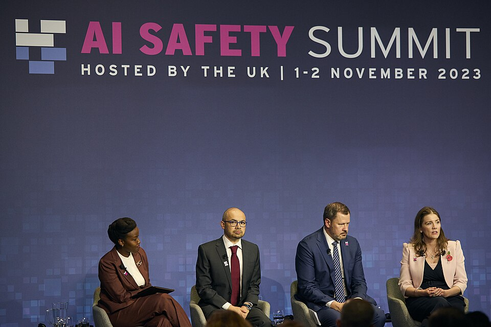

For most of its history AI was governed, if at all, by laws written for
something else: privacy, product safety, copyright, export controls. After
ChatGPT that changed quickly. Between 2023 and 2026 governments wrote
AI-specific laws, signed declarations, founded institutes to test models,
and in the United States wrote rules and then rewrote them. Courts began to
answer the question of what training on other people's work is worth.

## Brussels: a law by risk

The **European Union**'s _Artificial Intelligence Act_, first proposed by the
Commission in April 2021, was approved by the Council in May 2024, published
in the Official Journal on 12 July 2024 and entered into force on 1 August 2024. It sorts AI by the risk of harm into four levels (unacceptable, high,
limited and minimal) and adds a category for general-purpose models such as
those behind chatbots. Practices at the top, such as social scoring, are
banned; high-risk uses, in hiring, education, critical infrastructure or
border control, must meet requirements for risk management, data quality,
logging and human oversight before they reach the market. The largest fines
reach €35 million or 7% of worldwide turnover.

The obligations arrived in phases. Prohibitions applied from 2 February
2025 and the rules for general-purpose models from 2 August 2025, and most of
the rest became applicable on 2 August 2026. The high-risk rules did not. In
November 2025 the Commission proposed a simplifying "AI Omnibus"; after a
political agreement in May 2026 it entered into force on 27 July 2026,
moving the rules for high-risk uses to 2 December 2027, and for AI built into
regulated products to 2 August 2028. It also added a ninth prohibition, on
systems that generate non-consensual intimate images or child sexual abuse
material, applying from December 2026.

## Washington: orders and counter-orders

The United States passed no comprehensive AI law. Policy came by executive
order. On 30 October 2023 President Biden signed Executive Order 14110,
which among other things required AI developers to share safety test
results with the government. On 20 January 2025
President Trump revoked it, and three days later signed EO 14179, _Removing
Barriers to American Leadership in Artificial Intelligence_, which called for
an "AI Action Plan". In December 2025 EO 14365 directed agencies to
challenge state AI laws that conflicted with a national framework, with
exemptions for child safety and some others; the White House sent Congress
legislative recommendations in March 2026. Meanwhile the states legislated:
California's _Transparency in Frontier Artificial Intelligence Act_ (SB 53)
took effect on 1 January 2026, and New York's RAISE Act, signed in December
2025, is due to follow in 2027.

## Summits and institutes

In November 2023 the British government brought governments and
companies to **Bletchley Park**, the wartime codebreaking centre. Its
declaration, agreed by the governments present, the United States, China
and the European Union among them, warned of risks "at the 'frontier' of AI", including "unintended issues of
control relating to alignment with human intent". Britain and the United
States each founded an _AI Safety Institute_ to test models. The series
drifted from safety toward opportunity: Seoul in May 2024, then the Paris
_AI Action Summit_ in February 2025, where the US and UK declined to sign
the final statement and US Vice President **JD Vance** warned that
"excessive regulation" could "kill a transformative sector", then New Delhi
in February 2026. In February 2025 the UK renamed its institute the _AI
Security Institute_; in June the US one became the _Center for AI Standards
and Innovation_.

| Jurisdiction   | Instrument                                  | Date                 | Status, September 2026                                                                |
| -------------- | ------------------------------------------- | -------------------- | ------------------------------------------------------------------------------------- |
| International  | Bletchley Declaration                       | 1 Nov 2023           | Non-binding; followed by summits in Seoul, Paris and New Delhi                        |
| China          | Interim Measures for Generative AI Services | in force 15 Aug 2023 | In force                                                                              |
| United States  | Executive Order 14110                       | 30 Oct 2023          | Revoked 20 Jan 2025                                                                   |
| European Union | AI Act (Regulation 2024/1689)               | in force 1 Aug 2024  | Mostly applicable since 2 Aug 2026; high-risk rules deferred to Dec 2027 and Aug 2028 |
| United States  | Executive Order 14179                       | 23 Jan 2025          | In force                                                                              |
| California     | SB 53, Transparency in Frontier AI Act      | signed Sep 2025      | In effect since 1 Jan 2026                                                            |
| United States  | Executive Order 14365                       | 11 Dec 2025          | In force; legislative recommendations sent to Congress, March 2026                    |
| New York       | RAISE Act                                   | signed 19 Dec 2025   | Due to take effect 1 Jan 2027                                                         |
| European Union | AI Omnibus (amending the AI Act)            | in force 27 Jul 2026 | In force                                                                              |

## Courts: who owns the training data

The copyright cases moved more slowly than the models. In February 2025 a
US judge ruled against Ross Intelligence, which had trained a legal search
tool on Westlaw's headnotes, though that system was not generative. Authors
suing **Anthropic** won a partial ruling: training on books the company had
bought was fair use, but pirated copies went to trial, and on 20 July 2026
a federal judge gave final approval to a $1.5 billion settlement, about
$3,000 per work. In London, the High Court ruled on 4 November 2025 that
Stable Diffusion was not an "infringing copy" of the Getty Images photographs
it was trained on, after Getty had dropped its main training claim. _The New
York Times_ sued OpenAI and Microsoft in December 2023, one of many suits
brought by publishers, authors, artists and musicians.

Laws, summits and courts set the outer limits. The last frame on this spine
takes stock of where the field stands inside them.
