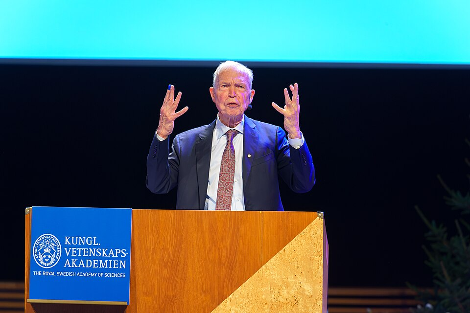

In April 1982 a physicist published his first paper on the brain: five
pages in the _Proceedings of the National Academy of Sciences_. They
treated memory as physics: a stored pattern is a valley in a landscape, and
remembering is rolling downhill. The paper helped bring neural networks back
from the cold, and forty-two years later it shared a [Nobel Prize in Physics](kloom:e/nobel-prize-in-physics).

## A physicist among neurons

**[John J. Hopfield](kloom:e/john-hopfield)**, born in Chicago in 1933, took his doctorate in physics
at Cornell in 1958. He worked on the physics of solids at [Bell Labs](kloom:e/bell-labs) and then
at Berkeley and [Princeton](kloom:e/princeton-university), and in the 1970s used physics on problems in
biology, such as how cells copy [DNA](kloom:e/dna) so accurately. Invited to a meeting about
neuroscience, he became fascinated by what large groups of simple neurons
might do together. In 1980 he left Princeton's physics department for a
chair in chemistry and biology at [Caltech](kloom:e/california-institute-of-technology), where he had computers he could
use freely. There, from 1981 to 1983, he taught a course called "The Physics
of Computation" with **[Richard Feynman](kloom:e/richard-feynman)** and **[Carver Mead](kloom:e/carver-mead)**.

## Memory as a landscape

His paper, "Neural networks and physical systems with emergent collective
computational abilities", described a network of units that are either on or
off, with every unit connected to every other. The connections are
symmetric, and they are set by [Hebb's rule](kloom:e/hebbian-theory): the weight between two units
reflects how often they agree across the patterns to be stored. To recall,
the units are updated one at a time, in no fixed order: each turns on if the
weighted sum of its inputs is positive, and off otherwise.

Hopfield gave the whole network an _energy_, a single number computed from
all the units and all the weights, and showed that every update can only
lower it or leave it alone. The network must therefore settle, and it
settles in a valley. Training digs a valley for each stored pattern. Give the
network a distorted or partial version of one and it runs downhill, like a
ball in the landscape of the drawing, to the nearest valley: the whole
memory. The paper's abstract calls this a _content-addressable memory_, which
"correctly yields an entire memory from any subpart of sufficient size".

The equations were familiar to any physicist. The same two formulas describe
magnetic materials, where each atom's _spin_ makes it a tiny magnet that
pushes its neighbours to align. Hopfield knew them from work on _spin
glasses_, and that bridge let later physicists work out the network's
properties analytically. One result was a hard limit: a classic [Hopfield network](kloom:e/hopfield-network)
stores only about 138 patterns for every 1,000 units before recall breaks
down.

The network in the 1982 paper was tiny. It had 30 units, and so 435
connections; Hopfield tried 100 units, but that was too much for the computer
he had. In 1984 he showed that units with continuous values, whose dynamics are
those of an electronic circuit, behave the same way, and with **David Tank** he used such
circuits to attack hard optimisation problems.

Hopfield was not the only source of the idea. Kaoru Nakano in 1971, Shun'ichi
Amari in 1972 and William Little in 1974 had proposed Hebbian weights on
models like this one, and Hopfield acknowledged Little's work in the 1982
paper. What his paper added was the energy function, the physics, and the
clear demonstration that a memory could emerge from the collective behaviour
of many simple parts.

## The prize

On 8 October 2024 the Royal Swedish Academy of Sciences awarded the Nobel
Prize in Physics to Hopfield, then at Princeton, and **[Geoffrey Hinton](kloom:e/geoffrey-hinton)** of
the University of Toronto, "for foundational discoveries and inventions that
enable machine learning with artificial neural networks", sharing 11 million
Swedish kronor. The committee's chair, Ellen Moons, said the laureates' work
"has already been of the greatest benefit". Hopfield was less comfortable
with where the field had gone. He had signed the March 2023 open letter
calling for a pause in training AI systems more powerful than GPT-4, and
after the award he said: "as a physicist, I'm very unnerved by something
which has no control". In 2016 he and Dimitry Krotov had shown how to raise
the network's memory far beyond the classic limit, in what are now called
modern Hopfield networks.

Hopfield's network always rolls downhill, so it can get stuck in whichever
valley is nearest, even a wrong one. The next step shook the landscape.
