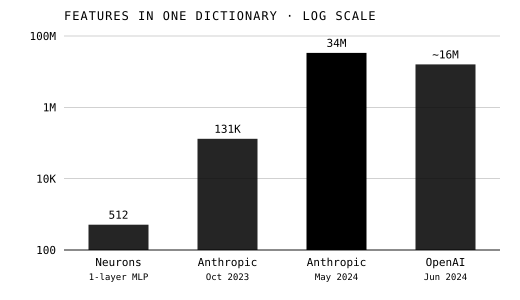

A trained network is a file of numbers, and its makers can read every one of
them without knowing what the network computes. _Interpretability_ is the
attempt to change that: to open the model and say, in human terms, what it
represents and how it reaches an answer. If alignment asks whether a system
wants what we meant, interpretability asks whether we could ever check.

## Features and circuits

Much of the modern programme began with **Chris Olah**, who worked on it at
Google Brain, then OpenAI, then Anthropic, which he co-founded, and who
published with colleagues in the online journal _Distill_, which he had also
co-founded. _Feature Visualization_ (2017) showed what parts of an image
network "are looking for" by generating idealised examples that excite
them. _Zoom In_ (2020) began with the microscope, which let biology see cells: at
such moments, it said, science "zoomed in". It then made three deliberately
speculative claims about a vision network, InceptionV1: that its basic units are _features_, which
correspond to directions in the space of neuron activations; that features
are connected by weights into _circuits_ that can be studied and
understood, such as a bank of curve detectors built from simpler edges; and
that similar features and circuits form across different models.

One finding complicated the picture. Some neurons are _polysemantic_:
neuron 4e:55 in InceptionV1 responds to cat faces, the fronts of cars and
cat legs. In 2022 **Nelson Elhage** and colleagues at Anthropic and Harvard built _toy
models_ that reproduced this, and explained it as _superposition_: a network
can store more sparse features than it has neurons by giving them
almost-perpendicular directions, at the cost of making each neuron a
jumble.

## Dictionaries of features

If features are hidden in superposition, perhaps they can be pulled apart.
The tool is _dictionary learning_ with a _sparse autoencoder_: a second
network, much wider than the layer it studies, trained to rebuild that
layer's activations from as few active units as possible. In September 2023
**Hoagy Cunningham** and colleagues showed that such autoencoders found
more interpretable directions in a language model than earlier methods. In
October Anthropic's _Towards Monosemanticity_ decomposed a one-layer
transformer's 512 neurons into as many as 131,072 features, among them
features for Arabic script, DNA sequences and base64 text. "Just 512
neurons can represent tens of thousands of features," the authors wrote.

Then the dictionaries grew.

| Study                                 | Model                 |         Largest dictionary |
| ------------------------------------- | --------------------- | -------------------------: |
| Bricken et al., Anthropic, Oct 2023   | one-layer transformer | 131,072 (from 512 neurons) |
| Templeton et al., Anthropic, May 2024 | Claude 3 Sonnet       |                 33,554,432 |
| Gao et al., OpenAI, Jun 2024          | GPT-4                 |           about 16 million |

In May 2024 _Scaling Monosemanticity_ found features in Claude 3 Sonnet for
things as specific as the Golden Gate Bridge, and for safety-relevant ideas
such as deception, sycophancy and bias. Features could be used to steer:
clamped to ten times its maximum activation, the Golden Gate Bridge feature
made the model start to identify as the bridge. OpenAI trained a 16-million
latent autoencoder on GPT-4 in June, and in August **Google DeepMind**
released _Gemma Scope_, open autoencoders for every layer of its Gemma 2 2B
and 9B models, so that researchers outside the labs could do the same work.

## From features to mechanisms, and the limits

In March 2025 Anthropic traced whole computations in Claude 3.5 Haiku with
_attribution graphs_, maps of which features cause which. Asked for "the
capital of the state containing Dallas", the model activated features for
Texas on the way to Austin, a real intermediate step; writing rhyming
couplets, it chose candidate end-words before composing the line that led
to them. The authors were candid: the graphs gave "satisfying insight for
about a quarter of the prompts we've tried".

The limits are real. The 2024 dictionaries accounted for at least 65% of the
variance in the model's activity, not all of it, and in the largest about
65% of the features were dead, never firing on a sample of ten million
tokens. In March 2025 Google DeepMind's interpretability team reported that
for detecting harmful intent, simple linear probes beat autoencoder
features, and said the field was "somewhat over invested" in them. A review
of open problems, written in January 2025 by 29 researchers from many
groups, concluded that the methods still need conceptual and practical
improvement, and that the field has yet to work out how best to use them. **Dan Hendrycks** and
Laura Hiscott argued in May 2025 that the bottom-up project is misguided,
and that complex systems are better studied from the top down.

Supporters point to progress: _MIT Technology Review_ named mechanistic
interpretability one of its breakthrough technologies of 2026, while
recording the view that language models may be "just too complicated for us
to ever fully understand". As of September 2026 nobody can read a frontier
model's reasons in full. Governments did not wait for that; the next frame
turns to the rules they began to write.
