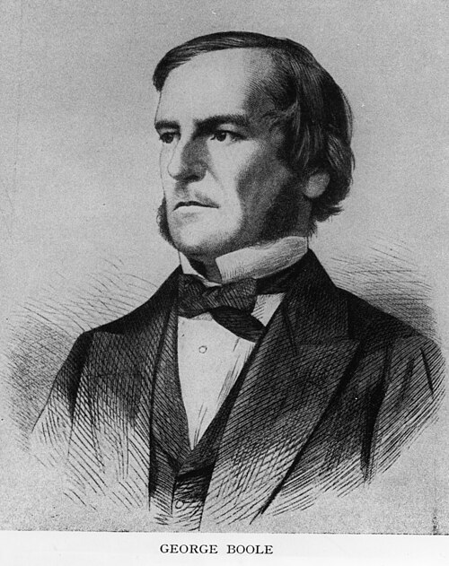
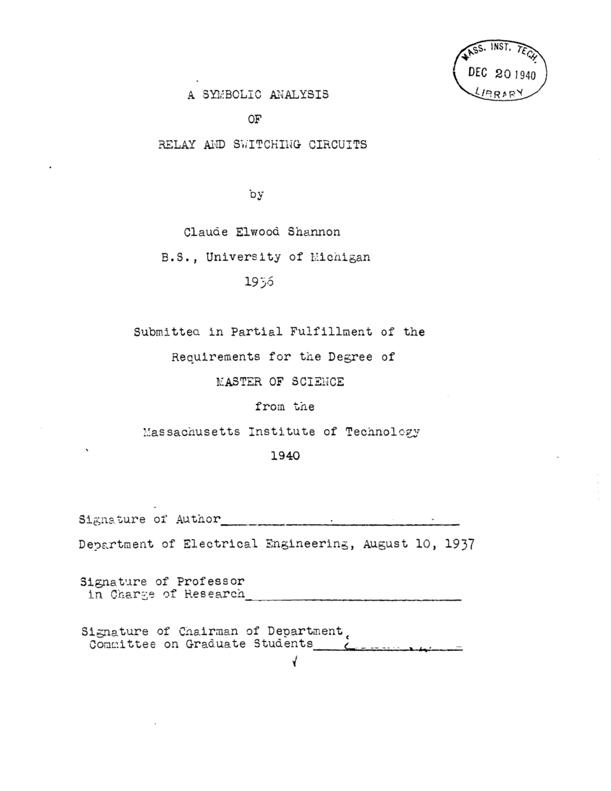

[Leibniz](kloom:e/gottfried-wilhelm-leibniz) had dreamed of reasoning by calculation, and never found the
calculus. It was found in the 1840s by a shoemaker's son from Lincoln who had
taught himself mathematics, and it waited eighty years for someone to notice
that it described a telephone exchange.

## A schoolmaster's algebra

**[George Boole](kloom:e/george-boole)** was born in Lincoln in 1815. His father's business failed,
his formal schooling stopped at primary school, and he learned languages and
mathematics largely on his own; without a teacher, it took him years to
master calculus. At sixteen he was supporting his parents and three younger
siblings as a junior teacher, and at nineteen he opened a school of his own.
His papers on analysis won him a [Royal Society](kloom:e/royal-society) medal, and in 1849 he became
the first professor of mathematics at Queen's College, Cork, in Ireland.

His first book on logic, _The Mathematical Analysis of Logic_, came out in 1847. He later thought it a flawed statement of his system, and wanted the
second, [_An Investigation of the Laws of Thought_](kloom:e/the-laws-of-thought) (1854), to be read as the
mature one. It begins with an ambition Leibniz would have recognised:

> The design of the following treatise is to investigate the fundamental laws
> of those operations of the mind by which reasoning is performed; to give
> expression to them in the symbolical language of a Calculus, and upon this
> foundation to establish the science of Logic and construct its method.

## Thought as equations

Boole let a letter stand for a class of things, and wrote the operations of
language as the signs of algebra:

| Boole's sign | What it means                                 | Example                               |
| ------------ | --------------------------------------------- | ------------------------------------- |
| _xy_         | the things that are both _x_ and _y_          | "European men"                        |
| _x_ + _y_    | _x_ and _y_ taken together (separate classes) | "trees and minerals"                  |
| 1 − _x_      | everything that is not _x_                    | "not-men"                             |
| 1            | the Universe (of the discourse)               |                                       |
| 0            | Nothing                                       |                                       |
| _x_² = _x_   | naming a class twice adds nothing             | "good, good" says no more than "good" |

The last line is the strange one. In ordinary algebra _x_² = _x_ is not a
law but an equation, and it has only two roots, 0 and 1: the parabola and
the line in the drawing meet nowhere else. So, Boole wrote, the laws of
logic are exactly the laws of an algebra "in which the symbols _x_, _y_,
_z_, etc. admit indifferently of the values 0 and 1, and of these values
alone." Rewritten as _x_(1 − _x_) = 0, the same law says that nothing is at
once _x_ and not _x_: [Aristotle](kloom:e/aristotle)'s _principle of contradiction_, which Boole
presented as a consequence of a law of thought, "mathematical in its form."

Boole's algebra is not quite the [_Boolean algebra_](kloom:e/boolean-algebra) of today. His system
allowed terms, such as 2_x_, that no class can mean, and it was his
successors (Jevons, Peirce, Schröder and Huntington among them) who turned it
into the modern version. Most readers, his wife Mary Boole later
wrote, took it as a clever method for sorting evidence and ignored his
claim that it showed how the mind itself works. Boole died in 1864.

## Relays

In 1932 **[Claude Shannon](kloom:e/claude-shannon)** went to the University of Michigan and met
Boole's work there. In 1936 he went to [MIT](kloom:e/massachusetts-institute-of-technology) to work on [Vannevar Bush](kloom:e/vannevar-bush)'s
[_differential analyzer_](kloom:e/differential-analyser), an analogue computer whose switching circuits
were complicated and designed case by case. His master's thesis, [_A Symbolic Analysis
of Relay and Switching Circuits_](kloom:e/a-symbolic-analysis-of-relay-and-switching-circuits), written in 1937 and published in 1938,
showed that Boole's two-valued algebra describes such circuits exactly. A
switch is open or closed, 0 or 1; two switches in series pass current only
if both are closed, and two in parallel if either is. The algebra could
simplify a telephone exchange's tangle of relays, and relays could in turn
solve problems in the algebra. The thesis ends with designs for circuits
that include an adder for four-bit binary numbers.

The idea had more than one discoverer: Akira Nakashima in Japan and Victor
Shestakov in the Soviet Union reached similar results in the same years. But
Shannon's paper became the foundation of digital circuit design once it was
widely read in and after the war. The computer pioneer [Herman Goldstine](kloom:e/herman-goldstine)
called it "surely ... one of the most important master's theses ever
written", which helped "to change digital circuit design from an art to a
science." The logic gates of every digital computer since descend from it.

Shannon had shown that logic could be built. The next question was what
_any_ machine built that way could compute, and a young Cambridge
mathematician had answered it the year before.
