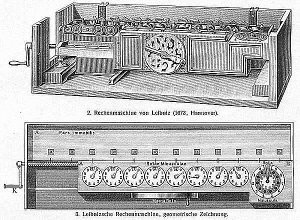

The first people to treat reasoning as something a device could do were not
engineers. They were a thirteenth-century missionary who wanted to win
arguments about God, and a seventeenth-century philosopher who wanted to end
arguments altogether.

## Llull's Art

**Ramon Llull** (c. 1232–1316), born in Palma de Mallorca, spent his life
trying to convert Muslims and Jews by reason rather than force. His tool was
what he called the _Art_: a set of basic principles, each given a letter,
and diagrams that combined them. In its final form, the _Ars generalis
ultima_ and the shorter _Ars brevis_ of 1308, the first figure carries nine
divine principles (goodness, greatness, eternity, power, wisdom, will,
virtue, truth, glory) lettered **B** to **K**, joined to each other by lines.
Other figures set them against nine relations (difference, concordance,
contrariety and so on), and the Art worked through their combinations to
turn statements into questions and answers.

The drawing on the left is that first figure: nine letters, and all
thirty-six ways of pairing them. Llull's idea was that a truth reached this
way was not his opinion but the output of a procedure anyone could follow,
whatever their faith. The Art resembles the _zairja_, a combinatorial device
of medieval Arab astrologers, and Llull knew Islamic thought well: his first
work was a compendium of al-Ghazali's logic. His Art was never adopted by the
universities, and was condemned in Aragon in the 1360s, but his books kept
being copied, and from 1499 they were printed.

## "Let us calculate"

At nineteen, in 1666, **Gottfried Wilhelm Leibniz** wrote _De Arte
Combinatoria_, inspired by Llull. He spent the rest of his life returning to
two linked ideas: a _characteristica universalis_, an alphabet of human
thought in which every basic concept had its own sign, and a _calculus
ratiocinator_, a method of reckoning with those signs. If arguments could be
written that way, he wrote, disputes would be settled like sums:

> The only way to rectify our reasonings is to make them as tangible as those
> of the Mathematicians, so that we can find our error at a glance, and when
> there are disputes among persons, we can simply say: Let us calculate,
> without further ado, to see who is right.

He was not alone. **Thomas Hobbes** had written in _Leviathan_ (1651) that
reason "is nothing but reckoning, that is adding and subtracting". What set
Leibniz apart is that he also built machines. His **stepped reckoner**,
shown to the Royal Society as a wooden model on 1 February 1673, was the
first calculator designed for all four arithmetic operations. Its stepped
drum, the _Staffelwalze_ (on the right of the drawing above), has nine teeth
of increasing length, so turning it adds any digit from one to nine.

## What they left

Neither project worked as planned. The stepped reckoner's gearing was beyond
the metalwork of the time and its carry mechanism was flawed, though the
stepped drum itself was used in calculators for two hundred years, into the
1970s. The universal characteristic was never written. But the programme
outlived both men: reasoning as symbol manipulation, and a machine to carry
it out. The cybernetician **Norbert Wiener** later called the modern
computer "nothing but a mechanization of Leibniz's calculus ratiocinator".
The next step was a machine that could do more than arithmetic, and it was
designed in London in the 1830s.
