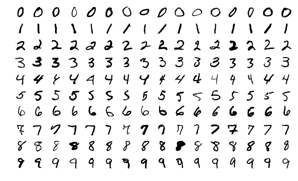

While the AI companies were folding, a small group at **[AT&T Bell
Laboratories](kloom:e/bell-labs)** in Holmdel, New Jersey, was teaching a neural network to read
the numbers people write on envelopes. It worked well enough to be put to use,
and its design, the [_convolutional network_](kloom:e/convolutional-neural-network), is the ancestor of nearly every
system that has looked at an image since.

## Zip codes from Buffalo

**[Yann LeCun](kloom:e/yann-lecun)** joined Bell Labs' Adaptive Systems Research Department, headed
by **Lawrence Jackel**, in October 1988, after a doctorate in Paris and a year
with Geoffrey Hinton in Toronto. The problem the group took on came from the
US Postal Service: 9,298 handwritten digits cut out of zip codes on mail
passing through the post office in [Buffalo](kloom:e/buffalo-new-york), New York, written "by many
different people, using a great variety of sizes, writing styles, and
instruments". Each was scaled to a 16 × 16 grid of grey levels. Some were
ambiguous, some unclassifiable, some mislabelled; two people who tried the
test set made mistakes on 2.5 per cent of it.

The group's earlier recogniser had used feature detectors designed by hand.
The 1989 paper, "Backpropagation Applied to Handwritten Zip Code
Recognition", by LeCun and six colleagues, let [backpropagation](kloom:e/backpropagation) learn
everything, "going from the normalized image of the character to the final
classification". The trick was in the wiring, shown in the drawing on the
left. A feature worth detecting, such as a stroke at a certain angle, can
appear anywhere in the image, so the first hidden layer slides one small
5 × 5 detector across the whole image, and all its copies share the same
weights. Twelve such detectors made twelve 8 × 8 _feature maps_; a second
layer did the same over them at 4 × 4; then 30 ordinary units, and ten
outputs, one per digit. The network had 64,660 connections but only 9,760
free parameters, and that economy, the authors argued, was what let it
generalise from 7,291 training examples. The paper cites **[Kunihiko
Fukushima](kloom:e/kunihiko-fukushima)**'s [_neocognitron_](kloom:e/neocognitron) of 1980, an earlier layered network for recognising
patterns "unaffected by shift in position".

It trained for three days on a Sun workstation. On the 2,007 test digits it
made 102 mistakes, 5.0 per cent; an ordinary fully connected network did
worse, at 8.1 per cent. Some of the kernels it learned were, in the authors' words,
"remarkably similar" to feature detectors found in biological vision. Loaded onto an
off-the-shelf AT&T signal-processing chip, it read 10 to 12 digits a second,
camera to answer.

## Reading cheques

Bell Labs worked with [NCR](kloom:e/ncr-voyix), which AT&T bought in 1991, to put the network into
ATMs that read the amounts written on cheques. From June 1996 a larger system
ran in banks' back offices, and by 2001 it was estimated to be reading 20
million cheques a day, about a tenth of all the cheques written in the United
States.

The design was written up in full in 1998, in "Gradient-Based Learning
Applied to Document Recognition" by LeCun, **Léon Bottou**, **[Yoshua
Bengio](kloom:e/yoshua-bengio)** and **Patrick Haffner**. Its network, **[LeNet-5](kloom:e/lenet)**, has two
convolutional layers, two subsampling layers and three fully connected ones,
about 60,000 trainable weights in all, and the paper reports a cheque reader
built around it that "reads several million checks per day".

## MNIST

A new benchmark followed in 1994, built from two collections made by the US National Institute of Standards and Technology:
one written by Census Bureau employees, the other by high school students.
Mixing them, so that training and test sets each held both, gave the
**[MNIST](kloom:e/mnist-database)** database: 60,000 training digits and 10,000 test
digits, each 28 × 28 pixels. A simple linear classifier gets about 12 per cent
of them wrong. Later networks brought the error down to around 0.2 per cent,
and MNIST became one of the most widely used datasets in machine learning.

For all that, convolutional networks stayed a specialist tool through the
2000s. Without fast hardware they were slow to train, and methods such as
[support vector machines](kloom:e/support-vector-machine) could match them on problems of this size. Their
moment came in 2012, on a much larger set of images. In the meantime the
other half of the problem, networks that could remember what they had seen a
long time ago, was being solved in Munich and Lugano.
