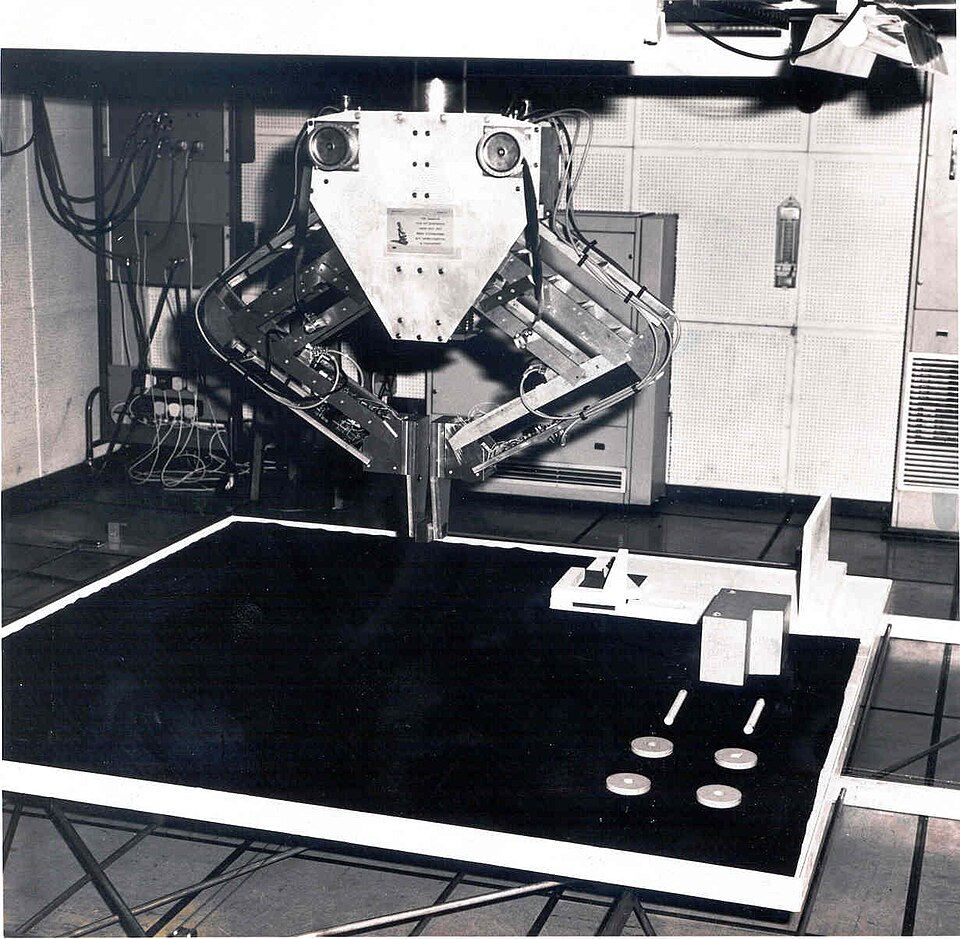

In 1972 Britain's **Science Research Council**, which paid for most of the
country's university science, was getting more and more grant applications
under the heading "Artificial Intelligence". Its chairman asked someone from
outside the field to tell the Council what it was buying. The answer, published
in 1973, became the most famous verdict ever passed on the subject, and the
start of what its researchers would later call the first [_AI winter_](kloom:e/ai-winter).

## A lay person's survey

The man asked was **[Sir James Lighthill](kloom:e/james-lighthill)**, Lucasian Professor of Applied
Mathematics at [Cambridge](kloom:e/university-of-cambridge), a fluid dynamicist best known for founding
_aeroacoustics_, the study of jet noise. He was chosen because he was not an
AI researcher. His report, [_Artificial Intelligence: A General Survey_](kloom:e/lighthill-report), dated
July 1972, says of itself that it describes how AI "appears to a lay person
after two months spent looking through the literature" and talking to people
in the field. The Council published it with replies from four scientists who
disagreed with parts of it, among them **[Donald Michie](kloom:e/donald-michie)** of [Edinburgh](kloom:e/university-of-edinburgh). The Council's decision to ask
for a review was partly a reaction to open discord inside Edinburgh's AI
department, one of the earliest and biggest centers of the subject in Britain.

Lighthill sorted the field into three. Category **A**, _Advanced Automation_,
was applied work such as character recognition and industrial design.
Category **C** was the use of computers to study the brain and the mind. Both
had "respectable" results. Between them sat category **B**, a _Bridge_
activity whose core was **Building Robots**, and here he was blunt:
"In no part of the field have the discoveries made so far produced the major
impact that was then promised," and in B progress had been "even slower and
more discouraging". The best chess programs played "of only experienced
amateur standard characteristic of county club players in England".

He named one general cause: the _combinatorial explosion_. The number of ways
of combining the pieces of a program's knowledge grows explosively as that
knowledge grows, so a method that works on a toy problem drowns on a real one.
The drawing on the left shows the arithmetic: a search that considers three
moves at each step has 3 positions to look at after one step, 81 after four,
and nearly five million after fourteen.

## The general-purpose robot

On 9 May 1973 the argument was put on television. At the **[Royal
Institution](kloom:e/royal-institution)** in London, the BBC's _Controversy_ series staged a debate on the
motion that "the general purpose robot is a mirage", with Lighthill against
Michie, **[John McCarthy](kloom:e/john-mccarthy-computer-scientist)** of Stanford and the psychologist **[Richard
Gregory](kloom:e/richard-gregory)**. Michie showed film of Edinburgh's robot, **Freddy II**, pictured
above. Given a jumbled heap of wooden parts, Freddy could find them with its
camera and assemble both a toy car and a toy boat, which took about sixteen
hours, largely because the computer controlling it was so slow. McCarthy's
reply to Lighthill's main charge, written later, was that "the combinatorial
explosion problem has been recognized in AI from the beginning".

## Where the money went

The report "formed the basis for the decision by the British government to
end support for AI research in most British universities". Accounts differ on
how many kept going; one names Edinburgh, Essex and Sussex. Large-scale British
funding did not return until 1983, when the government's **Alvey** program
answered Japan's [Fifth Generation](kloom:e/fifth-generation-computer-systems) project with £350 million.

In the United States the squeeze had begun earlier and for other reasons. The
**Mansfield Amendment** of 1969, part of the military authorization act for
1970, barred military funding of research that lacked a direct or apparent
relationship to a specific military function, and a second amendment in 1973
limited [ARPA](kloom:e/darpa) itself to projects with a direct military application. The agency, which had given AI laboratories millions
with few strings attached, now wanted "mission-oriented direct research, rather
than basic undirected research". In 1974 it canceled a three-million-dollar
annual contract for speech understanding at [Carnegie Mellon](kloom:e/carnegie-mellon-university), feeling it had
been promised more than it got. The roboticist **[Hans Moravec](kloom:e/hans-moravec)** blamed his own
colleagues: "Many researchers were caught up in a web of increasing
exaggeration."

How cold the winter really was is disputed. The cuts fell on a handful of big
laboratories (MIT, Stanford, Carnegie Mellon and Edinburgh), while the field
as a whole kept growing. The historian **Thomas Haigh** has argued that "there
was no AI winter" at all: membership of the [ACM](kloom:e/association-for-computing-machinery)'s special interest group on
AI, 1,241 when the report came out, had almost tripled to 3,500 by mid-1978.

What changed was what AI promised. General problem solvers had run into the
explosion Lighthill described, so researchers narrowed their aim to single,
well-bounded jobs where a great deal of human knowledge could stand in for
search, and by 1980 that narrower idea was making money: the [expert system](kloom:e/expert-system).
