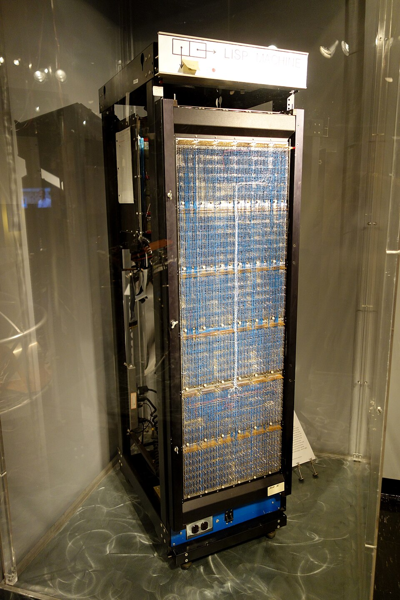
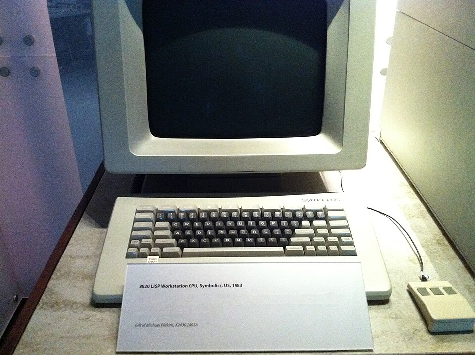

At the 1984 meeting of the American Association for Artificial Intelligence,
two veterans of the 1970s cuts, **Roger Schank** and **Marvin Minsky**, warned
business that enthusiasm for AI had spiralled out of control. They described
a chain reaction like a nuclear winter: pessimism among researchers, then in
the press, then cuts in funding, then the end of serious research. They called
it an _AI winter_. Three years later the billion-dollar AI industry began to
collapse, and the first thing to go was the hardware.

## Machines built for Lisp

Most American AI programs, the expert systems among them, were written in
**Lisp**, a language in which a value's type is checked while the program
runs. On ordinary hardware that checking was expensive: adding two numbers
could take five times as long as it needed to. In 1973 **Richard Greenblatt**
and **Thomas Knight** at the MIT AI Lab began building a computer that did the
checks in hardware, in parallel with the arithmetic, and gave each user a
machine of their own. Its second version, **CADR**, pictured below, sold
about 25 copies inside and outside MIT at around $50,000 each, and in 1978 DARPA
began paying for its development.

The idea became an industry, and split the lab. **Symbolics**, Russell
Noftsker's firm, took fourteen of its hackers; Greenblatt's rival, **Lisp
Machines Inc.**, took three or four. Both sold machines based on the MIT
design; Texas Instruments licensed LMI's, and Xerox built its own. The
Symbolics **3600** of 1983 was about the size of a household refrigerator. Its
36-bit word, drawn on the left, spent four or eight bits on a _tag_ saying
what kind of thing the rest of the word held, and the hardware read the tag on
every operation. The machines pioneered networking and garbage collection
that later became ordinary, and in 1985 Symbolics registered symbolics.com,
the first .com domain. But they were few, perhaps 7,000 in all by 1988, and
they were expensive.

## One year

In 1987 the market for Lisp machines fell apart. Workstations from **Sun
Microsystems** had become powerful alternatives, companies such as Lucid and
Franz sold Lisp systems that ran on any Unix machine, and desktop computers
from Apple and IBM, some of them as powerful as the expensive Lisp machines by
1987, could run rule-based engines such as CLIPS. There was no longer a
reason to buy a specialised computer. An industry worth half a billion dollars
was replaced in a single year. By the early 1990s most commercial Lisp
companies had failed, among them Symbolics, Lisp Machines Inc. and Lucid;
at Symbolics, a fight between its founder and its chief executive over
whether to sell software or hardware, and long property leases signed in the
boom, helped drive it into bankruptcy.

The software fared little better. The early expert systems, XCON among them,
proved too expensive to maintain: they were hard to update, they could not
learn, and they were _brittle_, making grotesque mistakes when given unusual
inputs. They were useful, but only in a few special settings.

## The governments step back

Public money went the same way. DARPA's **Strategic Computing Initiative**,
started in 1983 in answer to Japan and running 92 projects at 60 institutions
by 1985, lost its AI funding when **Jack Schwarz** took over DARPA's
computing office in 1987. He dismissed expert systems as "clever programming"
and said the agency should "surf" rather than "dog paddle"; AI, he felt, was
not "the next wave".

Japan's **Fifth Generation** project, launched by the Ministry of
International Trade and Industry in 1982, had aimed at machines that could
hold conversations, translate, interpret pictures and reason like people, on
massively parallel computers programmed in logic. The figures differ by
source: the ministry is said to have set aside $850 million, while the project
spent a little under ¥57 billion, about $320 million, between 1982 and 1994.
Even its end is dated differently: the writer HP Newquist has it ending on 1
June 1992, "not with a successful roar, but with a whimper".
It produced five working parallel inference machines and a generation of
researchers, but ordinary workstations overtook its hardware, and by 1991 its
1981 goals had not been met. By the end of 1993 more than 300 AI companies had
shut down, gone bankrupt or been bought.

## The name goes quiet

The damage to the name lasted into the next century. Researchers called their
work _machine learning_, _informatics_, _knowledge-based systems_ or
_computational intelligence_, partly because the new names won funding that
"artificial intelligence" no longer could. "At its low point," John Markoff
wrote in _The New York Times_ in 2005, "some computer scientists and software
engineers avoided the term artificial intelligence for fear of being viewed as
wild-eyed dreamers." Yet the techniques kept working, often without the label,
and one of the quietest was already reading handwriting at Bell Labs, where
the next segment of this story begins.
