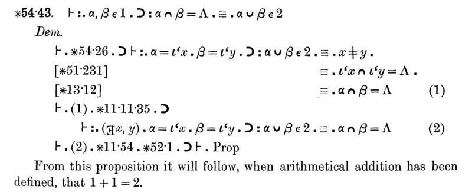

In January 1956, before the field had a name, **[Herbert Simon](kloom:e/herbert-a-simon)** told a
graduate class: "Over Christmas, Al
Newell and I invented a thinking machine." The machine was a program, and it
proved theorems of logic.

## A program that proved theorems

Simon was a political scientist who studied how organisations make
decisions; his theory of _bounded rationality_ would later win him the
Nobel Memorial Prize in Economic Sciences, in 1978. Consulting at the **[RAND
Corporation](kloom:e/rand-corporation)** in Santa Monica in the early 1950s, he watched a printer type
out a map using ordinary letters and punctuation as symbols, and saw that a
machine that manipulates symbols might simulate decision-making, and perhaps
thought. The map program was by **[Allen Newell](kloom:e/allen-newell)**, a RAND scientist, whose
own moment came in 1954 at a talk by [Oliver Selfridge](kloom:e/oliver-selfridge) on pattern matching:
"It all happened in one afternoon," he said later.

They chose a hard, well-defined target: the theorems of [Whitehead](kloom:e/alfred-north-whitehead) and
[Russell](kloom:e/bertrand-russell)'s [_Principia Mathematica_](kloom:e/principia-mathematica), and brought in RAND's programmer **[Cliff
Shaw](kloom:e/cliff-shaw)** ("the genuine computer scientist of the three", in Newell's words).
Before it ran on a computer, the **[Logic Theorist](kloom:e/logic-theorist)** was run by hand. Simon
recalled:

> In January 1956, we assembled my wife and three children together with some
> graduate students. To each member of the group, we gave one of the cards,
> so that each one became, in effect, a component of the computer program.

Shaw then got it running on RAND's computer. It proved 38 of the first 52
theorems in chapter 2 of _Principia_, and for theorem 2.85 it found a proof
shorter and more elegant than Whitehead and Russell's own. Simon showed it to
Russell, who "responded with delight". _The Journal of Symbolic Logic_
rejected a paper reporting the new proof, with the program as a co-author:
a new proof of an elementary theorem, the editors judged, was not notable.

## Reasoning as search

The program worked backward from the theorem it was given, using four
methods on the axioms and on theorems already proved:

| Method            | What it does                                                                                  |
| ----------------- | --------------------------------------------------------------------------------------------- |
| Substitution      | Finds a known theorem or axiom that becomes the goal by substituting variables or connectives |
| Detachment        | To prove _B_, finds a known _A_ → _B_, then tries to prove _A_                                |
| Chaining forward  | To prove _A_ → _C_, finds a known _A_ → _B_, then tries _B_ → _C_                             |
| Chaining backward | To prove _A_ → _C_, finds a known _B_ → _C_, then tries _A_ → _B_                             |

Each method turns one problem into new subproblems, so the program explored a
_search tree_: the theorem at the root, deductions on the branches, and a
proof wherever a branch reached axioms. The tree grows exponentially, so
Newell and Simon cut it with rules of thumb that judged which branches were
unlikely to lead anywhere. They called these _heuristics_, a word taken from
George Pólya's _How to Solve It_ (Newell had taken Pólya's courses at
Stanford). Reasoning as search, and heuristics to tame the _combinatorial
explosion_, became central ideas of AI, and remain so. To write the program the
three also invented a language, **[IPL](kloom:e/information-processing-language)**, whose symbolic list processing
later formed the basis of [McCarthy](kloom:e/john-mccarthy-computer-scientist)'s [Lisp](kloom:e/lisp-programming-language).

They generalised it in 1957 as the **[General Problem Solver](kloom:e/general-problem-solver)**, the first
program to keep its knowledge of a problem apart from its strategy for
solving it. GPS used _means–ends analysis_, setting subgoals that close the
gap between where it is and where it wants to be. It solved tidy puzzles
like the Towers of Hanoi, but on real-world problems its search was lost in
the combinatorial explosion.

## Four predictions

In a lecture published in _Operations Research_ in 1958, Simon and Newell
announced that "there are now in the world machines that think, that learn
and that create", and predicted that within ten years a computer would be
world chess champion, would discover and prove an important new
mathematical theorem, would write music that critics valued, and that most
theories in psychology would take the form of computer programs. The chess
prediction took about forty years: IBM's [Deep Blue](kloom:e/deep-blue-chess-computer) beat the reigning world
champion, Garry Kasparov, in 1997. In 1965 Simon went further, predicting
that "machines will be capable, within twenty years, of doing any work a man
can do." Optimism on this scale raised public expectations impossibly high,
and when the results failed to arrive, funding for AI was cut.

While Newell and Simon wrote rules for manipulating symbols, a psychologist
at a laboratory in Buffalo was building a machine that would find its own
rules, by being shown examples.
