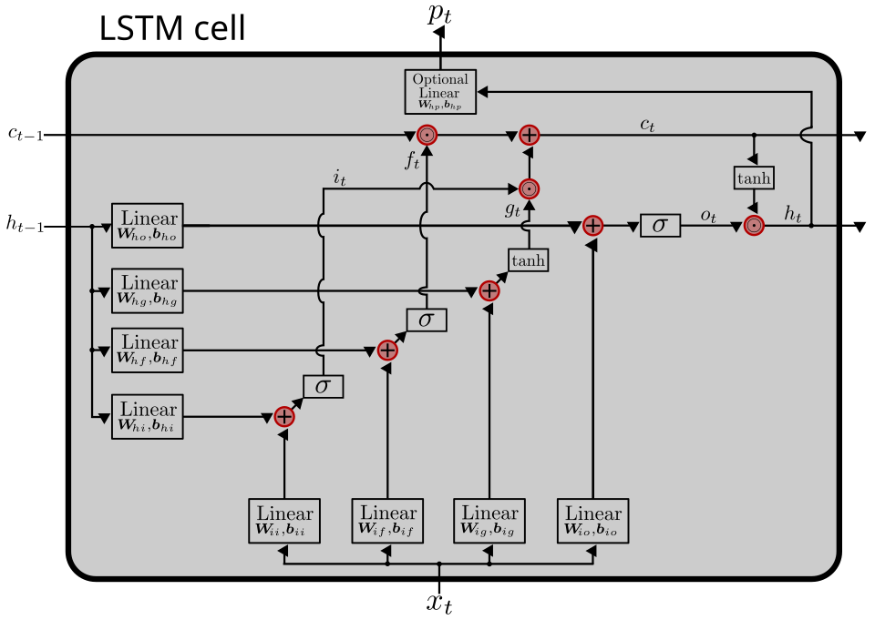

Backpropagation could train a network to look at one thing at a time. Much
of what matters, speech, handwriting, language, arrives as a sequence, where
the meaning of the present depends on something that happened a long time
ago. Networks with loops in them could in principle remember the past. In
practice they forgot it within a few steps, and in 1991 a German student
worked out why.

## Why networks forgot

A _recurrent_ network feeds its own activity back to itself, so that its state
at each moment carries a trace of what came before. To train one, the network
is unrolled in time into a very deep layered network, one layer per time step,
and the error is propagated backwards through all of them. That is where it
goes wrong. On the way back, the error signal is multiplied again and again,
once for every step, and as **Sepp Hochreiter** showed in his 1991 diploma
thesis, its size depends exponentially
on the size of the weights. If the factors are larger than one it blows up; if
they are smaller, as they usually are, it _vanishes_. The curve at the bottom
of the drawing is what happens to a signal scaled by 0.9 at each step: after
sixty steps less than one five-hundredth of it is left, and whatever caused the
error that far back can no longer be learned. This became known as the
_vanishing gradient problem_, and it afflicts deep layered networks as well as
recurrent ones.

## A constant error carousel

Hochreiter and his supervisor, **Jürgen Schmidhuber** of the IDSIA
laboratory in Lugano, published their remedy in _Neural Computation_ in
November 1997, after a technical report in 1995 and a conference paper in 1996.
They called it **Long Short-Term Memory**, because it gives a network's
short-term memory, held in its activity, a very long reach.

The idea is in the drawing on the left. At the centre of each _memory cell_ is
a linear unit connected to itself with a fixed weight of exactly 1.0. An error
signal passing round that loop is multiplied by one at every step, so it
neither grows nor shrinks; the authors called the loop a _constant error
carousel_. Left alone, such a unit would be disturbed by every input and would
disturb everything it fed, so it is guarded by two _gates_, units that multiply
the signal passing through them by a number between zero and one. The input
gate learns when to let something into the cell; the output gate learns when
to let the cell's contents out. The paper's abstract claims that an LSTM "can
learn to bridge minimal time lags in excess of 1000 discrete time steps". On
the artificial tasks it was tested on, it succeeded far more often and learned
far faster than the recurrent methods of the day, and it solved some that none
of them had ever solved.

The cell in most use today, shown above, has a third gate. In 1999 **Felix
Gers**, Schmidhuber and **Fred Cummins** added a _forget gate_, which lets a
cell clear its own memory when what it holds is no longer useful.

## A second life

For a decade LSTM was mostly a research tool. Then it began to win. In 2009 an
LSTM network trained by **Alex Graves**'s team won an international
competition in connected handwriting recognition, the first time a recurrent
network had won such a contest. In 2013 Graves, **Abdel-rahman Mohamed** and
Geoffrey Hinton used LSTM to reach a record phoneme error rate of 17.7 per
cent on TIMIT, a standard benchmark of recorded speech.

Industry followed. In September 2015 Google's speech team described the new
acoustic models behind voice search: LSTM recurrent networks, trained with a
method called _connectionist temporal classification_, that were "more
accurate, robust to noise, and faster to respond". A year later Google
published its neural machine translation system, a deep LSTM network with
eight encoder and eight decoder layers, which it reported cut translation
errors by an average of 60 per cent against its previous phrase-based system,
as judged by human raters on a set of simple
sentences. For a few years LSTMs sat inside much of the
speech recognition and translation that people used every day.

Their reign was short. A 2020 study of scaling found that on text the
transformer, the architecture of the next era, improves with size faster than
the LSTM does. But the idea outlived the network. In 2015 _highway networks_
borrowed LSTM's gates to train feedforward networks hundreds of layers deep,
and ResNet, developed at the same time, amounts to a highway network with its
gates held open: the same trick of carrying a signal across a long gap without
letting it fade, applied to depth instead of time.

The same year the LSTM paper appeared, a very different kind of machine made
the news: IBM's Deep Blue beat the
reigning world chess champion, Garry Kasparov, in a six-game match.
