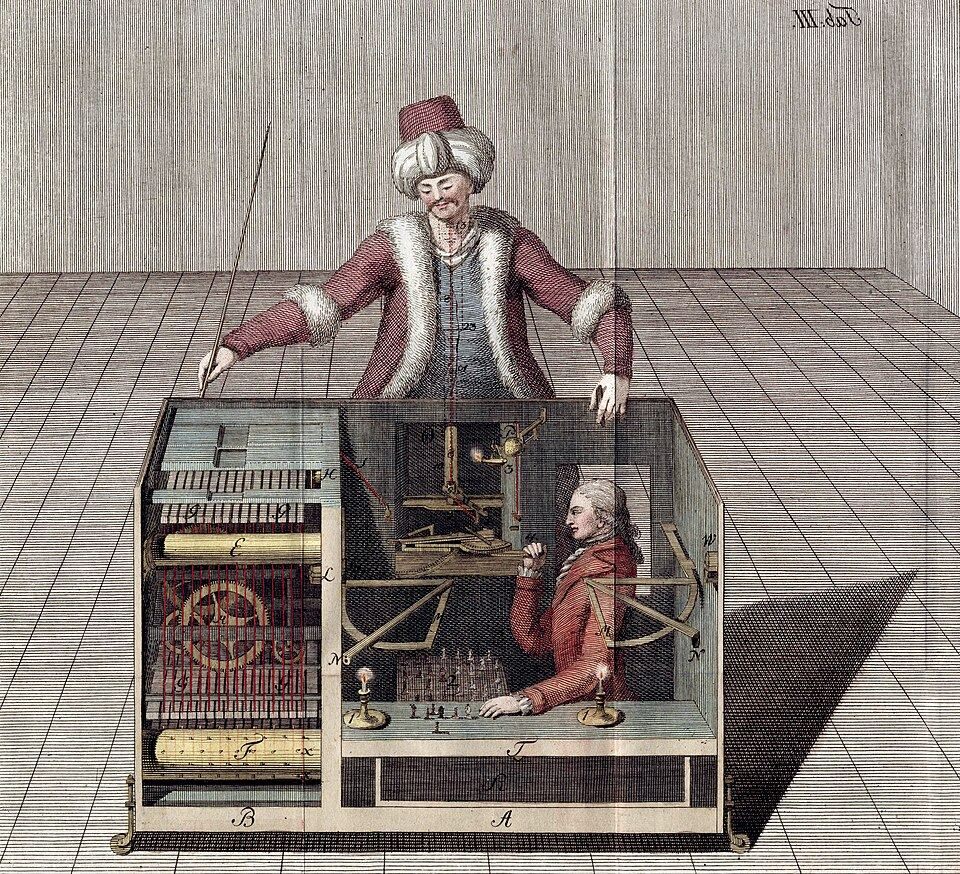

For eighty-four years, audiences in Europe and America watched a wooden man
in Ottoman robes play chess, and most of them lost to it. It was the most
famous thinking machine of its age, and it could not think at all: a chess
master sat inside it.

## The cabinet

In 1769 a French illusionist, François Pelletier, performed for the Empress
**Maria Theresa** at Schönbrunn Palace, and **Wolfgang von Kempelen**
promised to come back within a year with something better. In 1770 he showed the _Automaton Chess Player_ at Schönbrunn Palace: a
life-sized head and torso in robes and a turban, seated behind a cabinet
"three feet and a half long, two feet deep, and two and a half feet high",
with a chessboard on top.

Every show began with the doors. Kempelen opened them one at a time, and
the audience saw gears and cogs on the left and a clear view through the
back of the cabinet. The clockwork went only a third of the way in. The
operator sat on a sliding seat and moved out of the way of each door as it
opened. Under the board, every piece had a magnet in its base that pulled up
a small magnet on a string beneath its square, so the player inside could
follow the game. He answered on a pegboard of his own, and a pantograph
carried his moves up into the figure's arm and hand. He worked by
candlelight, and a later operator described the tubes that carried the smoke
up and out through the turban.

The first challenger, the courtier Ludwig von Cobenzl, lost quickly. The
Turk also completed the _knight's tour_, moving a knight to every square of
the board once, and answered questions from the audience on a letterboard.

## The tour, and the doubters

Kempelen seemed to tire of it. He was quoted calling it a trifle, avoided
showing it for a decade, and took it apart. In 1781 the Emperor **Joseph II** ordered it
rebuilt for a state visit, and in 1783 it went on tour. In Paris it lost to
the best player of the day, **François-André Danican Philidor**, who, his son
said, called it his most fatiguing game ever. Its last Paris game was
against **Benjamin Franklin**, who reportedly enjoyed it and stayed
interested in the machine for the rest of his life. In Dresden, **Joseph Friedrich Racknitz** published engravings of how
he thought it worked. The one above, from his book of 1789, is one of many
contemporary guesses, most of them wrong in their details, though right
that a person sat inside.

After Kempelen died in 1804, the showman **Johann Nepomuk Mälzel** bought
it and took it back on the road. In 1809 **Napoleon** played it at
Schönbrunn; the accounts contradict one another, but the best known has him
trying an illegal move three times, the Turk sweeping the pieces off the
board, and Napoleon resigning a real game after nineteen moves. Mälzel took
the Turk to America in 1826. In Baltimore in 1827 two boys on a rooftop saw
the operator climb out on a hot day, and a newspaper printed it; hardly
anyone believed them.

In 1836 **Edgar Allan Poe**, who had watched it in Richmond, published
"Maelzel's Chess-Player". He argued that arithmetic is "fixed and
determinate", so a machine can do it, but that chess is not: "No one move in
chess necessarily follows upon any one other." So "there is no analogy
whatever" between the Turk and **Charles Babbage**'s calculating engine. He
also argued that a real machine "would always win", and since the Turk
sometimes lost, a person must be working it. His conclusion was right. His
reasons were not, and **Claude Shannon** said so in 1950, calling the second
argument "a clear 'non sequitur'".

## Why a fake mattered

The Turk burned in a museum fire in Philadelphia on 5 July 1854. Three years
later the son of its last owner published its secret in full.

It was a hoax, but it made people argue seriously for the first time about
whether a machine could play a game of skill, and what it would mean if one
did. It set the question up in a form that lasted: a machine that thinks is
one that can beat us at chess. In 1784 it moved the prebendary **Edmund
Cartwright** to wonder whether a power loom would be harder to build than a
chess player; he patented one soon after. A genuine chess machine, **Leonardo
Torres Quevedo**'s _El Ajedrecista_ of 1912, could only win the endgame of
king and rook against king. When the question returned in earnest, it came
from a mathematician at Bell Labs who began his paper by describing the
Turk, and who meant to build the real thing out of a program.
