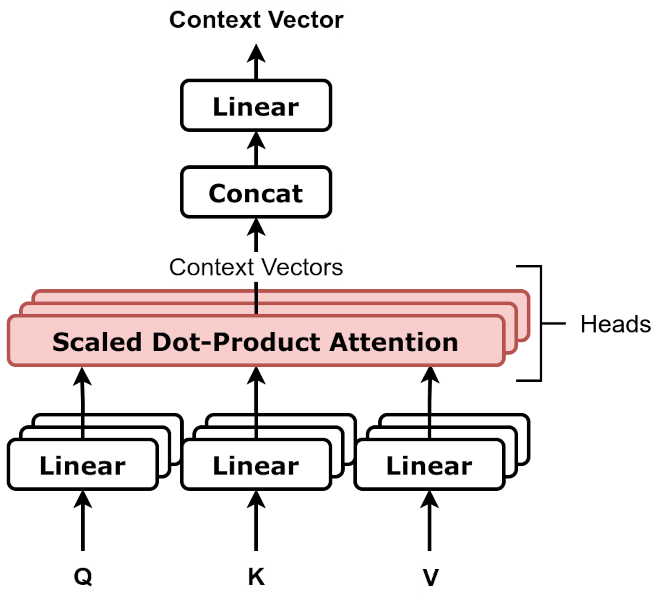

One attention head blends the tokens it finds most relevant, but it can only
have one idea of "relevant" at a time. A transformer layer therefore runs many
heads side by side, each with its own queries, keys and values, and the
research of the last few years has begun to show what some of them are
doing.

## Heads in parallel

In the 2017 transformer, each layer split its 512-dimensional vectors into
**eight heads** of 64 dimensions. Each head projected the tokens into its own
smaller query, key and value spaces, ran the attention of the previous frame,
and produced its own output; the eight outputs were joined end to end and
mixed by one more learned matrix. Because each head is small, the total cost
was about the same as one full-width head. The authors' reason: several heads
let the model "jointly attend to information from different representation
subspaces at different positions", where a single head would average them
away.

Models have since grown wider and deeper, but the recipe is the same:

| Model                    | Layers |  Width | Heads per layer | Dimensions per head |
| ------------------------ | -----: | -----: | --------------: | ------------------: |
| Transformer (2017, base) |  6 + 6 |    512 |               8 |                  64 |
| Llama 3 8B (2024)        |     32 |  4,096 |              32 |                 128 |
| Llama 3 70B (2024)       |     80 |  8,192 |              64 |                 128 |
| Llama 3 405B (2024)      |    126 | 16,384 |             128 |                 128 |

(The 2017 model had six encoder and six decoder layers; the Llama per-head
figure is width divided by heads.)

## What heads do

The 2017 authors already saw that "individual attention heads clearly learn
to perform different tasks", many of them apparently tracking the syntactic
and semantic structure of the sentence. Later studies found heads that mostly look at the next word,
and heads that look from a verb to its object.

In 2021 **Nelson Elhage**, **Chris Olah** and colleagues at **Anthropic**
published _A Mathematical Framework for Transformer Circuits_, an attempt to
reverse-engineer small transformers the way a programmer might turn a
compiled binary back into readable source code. In their account the "fundamental
action of attention heads is moving information": a head copies something
from one token's vector into another's. Each head splits into two nearly
independent parts: one that decides _where_ to look (the query–key product)
and one that decides _what_ to carry once it has looked (the values and
output). In models with two layers of attention, heads in the second layer
can build on heads in the first, and the pair can implement an algorithm
they named the **induction head**.

An induction head completes patterns. If the text so far contains
`…[A][B]…[A]`, it predicts `[B]`. It does this in two moves, which the
drawing's lowest band shows: at the second `B`, it looks back for the token
that came _after_ the previous `B` (here `C`), and copies it forward as the
prediction. The simplest version leans on a first-layer _previous-token
head_ that marks each token with its predecessor, the one-step-back pattern
in the drawing's top band. It works
even on random sequences, because all it relies on is that repeated sequences
tend to repeat.

In 2022 **Catherine Olsson** and the same group argued that induction heads
are behind much of _in-context learning_, the ability to use earlier text to
predict later text better. They found a "phase change" early in training, in
models of every size they studied, during which induction heads form and the
model's loss on tokens late in a passage suddenly improves; before it, loss
"largely stops improving around token 50". They were explicit about the
limits: the case "is stronger for small models than for large ones", where
they had to rely on "mainly correlational evidence, which could be
confounded".

## The cost of looking at everything

Every head compares every token with every other, so a context of _n_ tokens
needs _n_ × _n_ scores per head in every layer. The 2017 paper's own table
gave self-attention a cost per layer that grows as _n_²; that was cheaper than
a recurrent layer while sentences were shorter than the model's width, as
they then usually were. Contexts have since grown far past that:

| Context (tokens) | Scores per head, per layer |
| ---------------: | -------------------------: |
|            1,024 |                  1,048,576 |
|            8,192 |                 67,108,864 |
|          131,072 |             17,179,869,184 |

Doubling the context quadruples the work. Much engineering goes into living
with this. _FlashAttention_ computes attention in blocks that fit in a GPU's
cache, cutting the slow copying of data between memories; _sparse_ attention lets
each token look at only some others; and _grouped-query attention_, which
Llama 3 uses, lets many query heads share a few key and value heads (eight,
in every Llama 3 model) to save memory when generating text.

A head's output has to go somewhere. The next frame follows it into the
residual stream, the channel every layer reads and writes.
