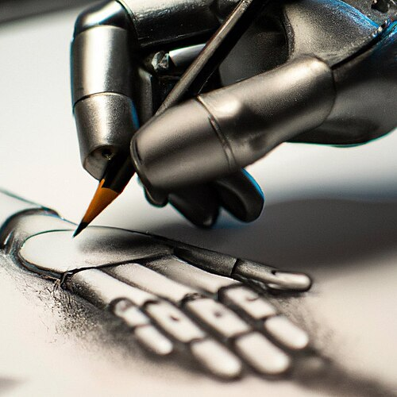

The language models of 2020 lived in text. Everything they knew about the
world arrived as words, and everything they gave back was words. Within five
years the leading models took in pictures, sound and video, and made them
too. The turn began with a way of putting images and sentences in the same
space.

## One space for words and pictures

On 5 January 2021 **[OpenAI](kloom:e/openai)** published **[CLIP](kloom:e/contrastive-language-image-pre-training)**, "Contrastive
Language–Image Pre-training". It is two networks trained side by side: one
turns an image into a vector, the other turns a caption into a vector. The
paper, by **[Alec Radford](kloom:e/alec-radford)** and colleagues, trained them on 400 million
image–text pairs collected from the internet. In each batch the matching
pairs are pulled together and every other pairing pushed apart: the
diagonal of the grid in the drawing. Nobody labeled the pictures; the
captions people had already written were the supervision.

The payoff was _zero-shot_ classification. Give CLIP the names of some
categories and it picks the caption closest to an image. Without using any
of the 1.28 million ImageNet training examples, it matched the accuracy of
the original [ResNet-50](kloom:e/residual-neural-network), a network trained on exactly those examples.

The same day OpenAI announced **[DALL·E](kloom:e/dalle)**, a 12-billion-parameter version of
GPT-3 trained to generate images from text. **DALL·E 2**, described in a
paper of April 2022, generated images from CLIP's representations, and that
August **[Stability AI](kloom:e/stability-ai)** released [_Stable Diffusion_](kloom:e/stable-diffusion) openly. By 2022
text-to-image output was beginning to be compared with photographs and human
art.

## Seeing, hearing, speaking

Next, the language models themselves learned to look. OpenAI's system card
for **GPT-4V** (September 2023) says the model's training was finished in
2022 and early access began in March 2023; it let users ask [GPT-4](kloom:e/gpt-4) about
images. In December 2023 **[Google](kloom:e/google)** introduced **[Gemini](kloom:e/gemini-language-model)**, which it
described as "natively multimodal, pre-trained from the start on different
modalities" rather than a text model with vision attached afterwards.
Gemini 1.5, in February 2024, could hold up to a million tokens of context,
enough for hours of video or audio. **[Anthropic](kloom:e/anthropic)**'s [Claude](kloom:e/claude-ai) 3 family (March 2024) added vision; Claude reads images but, by Anthropic's own
documentation, does not generate them.

In May 2024 OpenAI's **[GPT-4o](kloom:e/gpt-4o)** ("o" for "omni") accepted "any combination
of text, audio, image, and video" and produced text, audio and images, from
one network trained end to end. It could answer speech in as little as 232
milliseconds, 320 on average, which OpenAI compared with human response time
in conversation. Voice became a way of using these systems rather than a
separate product.

## Video, and its costs

On 15 February 2024 OpenAI previewed **[Sora](kloom:e/sora-text-to-video-model)**, a _diffusion transformer_
that works on "spacetime patches" of video and could make a minute of
footage. The public version of December 2024 made clips of up to 20 seconds.
Google's **Veo 3** (May 2025) added generated sound, including dialogue,
and OpenAI's **Sora 2** (30 September 2025) did the same, with a social app
built around it. Image generation moved inside the chat models: GPT-4o in
March 2025, Google's Gemini 2.5 Flash Image in August 2025.

The costs showed quickly. Sora 2 allowed copyrighted material by default
unless rights holders opted out, and was criticized for it by the Motion
Picture Association; tools that removed its watermark appeared within a
week. Labs answered with provenance marks: C2PA metadata on OpenAI's images,
Google's invisible SynthID watermark on its own. In a closely watched case,
the High Court in London ruled in November 2025 that Stable Diffusion was
not an "infringing copy" of [Getty Images](kloom:e/getty-images)' photographs, because the model
"does not store or reproduce" them; Getty won only a narrow trade-mark point
over generated watermarks.

As of September 2026 the landscape has shifted again. OpenAI closed the Sora
app on 26 April 2026 and its API on 24 September 2026; reports tied the
decision to the cost of the compute that video needs. Google's **Gemini
Omni** (May 2026) makes video with sound from text, images, audio or video.
Models that take in several kinds of input are now the norm; models that
also produce them are fewer, and often separate products.

Seeing the screen was the first step towards acting on it: models that use
tools and computers, which is the next frame.
