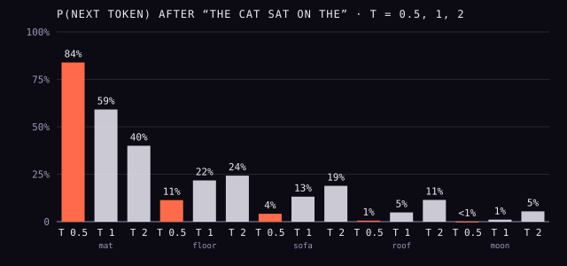

All of the machinery in this trail serves one small act. At the top of the
stack, the model looks at the final vector of the last token and produces a
probability for every token in its vocabulary. Then one is picked, appended
to the text, and the whole thing runs again.

## From vector to probabilities

The last step, the _un-embedding_, is a single learned matrix with one column
per vocabulary token (in the 2017 transformer, the same matrix as the input
embedding, turned around). Multiplying the final vector by it gives one score
per token, called a **logit**: 50,257 of them for GPT-2. A softmax, the same
function attention uses, turns the logits into probabilities that sum to 1.

Suppose the text so far is "The cat sat on the", and, keeping just five
candidates, the logits are 4.0 for " mat", 3.0 for " floor", 2.5 for " sofa",
1.5 for " roof" and 0 for " moon" (invented numbers). The softmax gives " mat"
59%, " floor" 22%, " sofa" 13%, " roof" 5% and " moon" 1%.

## Temperature and sampling

How the next token is chosen from that distribution is a separate decision,
made when the model is used rather than when it is trained. Always taking the
most likely token is _greedy_ decoding. Drawing at random in proportion to
the probabilities is _sampling_: the wheel in the drawing, with a sector for
each token.

Before sampling, the logits can be divided by a **temperature** _T_, a term
from physics: the softmax is the _Boltzmann distribution_ of statistical
mechanics. Below 1 the distribution sharpens toward the top token, and as _T_
approaches zero it becomes greedy; above 1 it flattens, and more unlikely
words get through.

| Token  | _T_ = 0.5 | _T_ = 1 | _T_ = 2 |
| ------ | --------: | ------: | ------: |
| ␣mat   |     83.9% |   59.1% |   40.0% |
| ␣floor |     11.4% |   21.7% |   24.3% |
| ␣sofa  |      4.2% |   13.2% |   18.9% |
| ␣roof  |      0.6% |    4.9% |   11.5% |
| ␣moon  |     0.03% |    1.1% |    5.4% |

Neither extreme works well. In 2020 **Ari Holtzman** and colleagues at the
University of Washington showed that picking the likeliest words, as beam
search does, produces text that is "bland, incoherent, or gets stuck in
repetitive loops", while pure sampling from the whole distribution gives text
"incoherent and almost unrelated to the context", led astray by an
"unreliable tail" of tens of thousands of unlikely tokens. With GPT-2 Large,
they found, temperatures below 0.9 "severely increase repetition". Their fix, **nucleus sampling** (or
_top-p_), samples only from the smallest set of tokens whose probabilities
add up to at least _p_. With _p_ = 0.9 in the example, the nucleus is " mat",
" floor" and " sofa" (94% together), rescaled to 63%, 23% and 14%; " roof" and
" moon" cannot be drawn.

## How it learns

Training asks the same question at every position of every text: what comes
next? The model's loss at each position is the _cross-entropy_, minus the
logarithm of the probability it gave to the token that actually came next.
If the text really continued " mat", the loss is −ln 0.59 ≈ 0.53; if it
continued " roof", −ln 0.049 ≈ 3.0. A model guessing evenly among GPT-2's
50,257 tokens would score ln 50,257 ≈ 10.8 on every token. Training nudges
every weight in the model to lower the average, over trillions of tokens.
The GPT-3 team measured progress in exactly this loss, and found it fell
smoothly as training compute grew, the regularity the main spine's scaling
laws frame is about.

## Memory and context

Generating is repetitive. At each new token only its own query is new; every
earlier token's keys and values are unchanged. So servers keep them in a
**KV cache** and compute them once. Processing the prompt to fill the cache
is called _prefill_; the token-by-token part after it is _decoding_.

The cache is large. For Llama 3 405B (126 layers, eight key–value heads of
128 dimensions each), our own arithmetic at two bytes a number gives about
0.5 MB per token, or about 66 GB for a 128,000-token context. With a separate
key and value for each of the 128 query heads, it would be sixteen times that,
which is why Meta used grouped-query attention "to reduce the size of
key-value caches during decoding".

The **context window** is the most text a model can take in at once:

| Model      | Year | Context window (tokens)                              |
| ---------- | ---: | ---------------------------------------------------- |
| GPT-2      | 2019 | 1,024 (up from 512)                                  |
| GPT-3      | 2020 | 2,048                                                |
| Llama 2    | 2023 | 4,096                                                |
| Llama 3    | 2024 | 8K in pretraining, then extended to 128K             |
| Gemini 1.5 | 2024 | near-perfect retrieval "up to at least 10M" in tests |

That is the whole machine: tokens, vectors, attention, a residual stream,
and a weighted die rolled once per token. Back on the main spine, the
transformer frame tells where it came from, and the frame after it,
pretraining, what happened when it was fed the internet.
