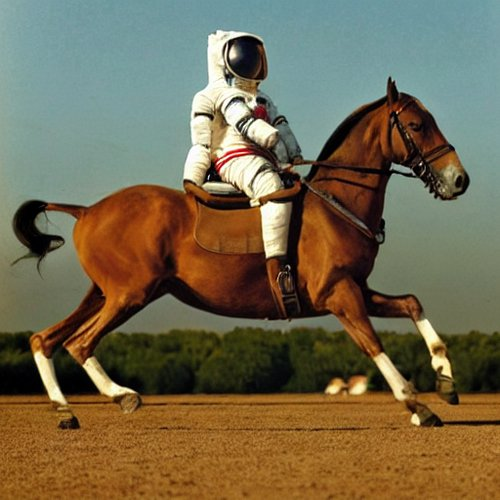

A trained model is, in the end, a file of numbers: the _weights_ of every
connection in the network. Whoever holds that file can run the model on
their own hardware, study it, and change it. Some labs keep the file and
sell access; others publish it. Whether they should became one of the
field's hardest arguments.

## The file gets out

Image generation went first. In August 2022 **[Stability AI](kloom:e/stability-ai)** released
[_Stable Diffusion_](kloom:e/stable-diffusion) with its code and weights, small enough to run on a
consumer graphics card, at a time when DALL·E and Midjourney were reachable
only through their makers' services.

For language, the turning point was **[Meta](kloom:e/meta-platforms)**'s **[LLaMA](kloom:e/llama-language-model)**, in February 2023:
models from 7 to 65 billion parameters trained only on publicly available
data. Meta released them under a non-commercial license, to researchers
approved case by case. Within days, on 3 March, a torrent of the weights was
posted with a link on 4chan and spread through AI forums; Meta filed
takedown requests, but the file was out. Commentators compared it with
Stable Diffusion, whose open release had set off a burst of tools and
experiments.

Meta then made openness its strategy. **Llama 2** (July 2023) was free for
research and commercial use, except that a company with more than 700
million monthly users had to ask Meta for a license. With **Llama 3.1 405B**
in July 2024, **[Mark Zuckerberg](kloom:e/mark-zuckerberg)** published "Open Source AI Is the Path
Forward", arguing that open models are safer because they "can be widely
scrutinized". In Paris, **[Mistral AI](kloom:e/mistral-ai)** released Mistral 7B (September 2023)
under the permissive [Apache 2.0](kloom:e/apache-license) license; Google released its smaller
**Gemma** models in 2024.

Then the center of gravity moved to China. **[DeepSeek](kloom:e/deepseek)**'s V3 (December 2024)
reported a final training run of 2.788 million GPU hours, about $5.6
million at rental prices, while noting that this left out all the research
before it; its R1 reasoning model (January 2025) came under the MIT license.
[Alibaba](kloom:e/alibaba-group)'s **[Qwen3](kloom:e/qwen)** (April 2025) and Moonshot AI's **Kimi K2** (mid-2025)
followed. In August 2025 [OpenAI](kloom:e/openai) released two open-weight models, **gpt-oss-120b**
and **gpt-oss-20b**, under Apache 2.0. Meta moved
the other way: Zuckerberg wrote in July 2025 that it would have to be
"careful about what we choose to open source", and its first model from its
new superintelligence lab, in April 2026, was kept in-house, though in
August it open-sourced a smaller one. In July 2026
Moonshot released **Kimi K3**, 2.8 trillion parameters, which it described
as the largest open-weight model yet. American labs including Anthropic,
Google DeepMind and OpenAI still keep their largest models proprietary.

## Open weights are not open source

"Open" here usually means the weights and a license, not the means to
rebuild the model. In October 2024 the **[Open Source Initiative](kloom:e/open-source-initiative)** published
the _Open Source AI Definition 1.0_. It requires three things under open
terms: the code used to train and run the system, the parameters, and
enough information about the training data that "a skilled person can
build a substantially equivalent system". Few releases meet it. The OSI had
already said that Llama's license is not open source, because it restricts
commercial use for some users. Critics call the gap _openwashing_.

## Should weights be public?

Against publishing, as one comment to the US government put it: releasing
weights is irreversible, and watching how an
open model is used after release is hard. For it: open models spread
research beyond a few companies, let users keep their data to themselves,
and check the market power of the largest labs. The US
**NTIA**, asked to weigh both, reported in July 2024 that the evidence did
not yet justify restrictions and that the government should monitor the
risks instead. The EU's [AI Act](kloom:e/artificial-intelligence-act) asks less of open-source models than of closed
ones, but not for the most capable, which it treats as a systemic risk.

The debate has become geopolitical. In 2025 a US House committee called
DeepSeek "the CCP's latest tool" for spying and for evading export
controls, and a US government evaluation reported shortcomings and risks in
DeepSeek's models. The White House's July
2025 _AI Action Plan_ nonetheless said open-weight models have "geostrategic
value" and that the government should support them. In July 2026 twenty-five
companies, including Nvidia, Microsoft, Meta, Mistral and [Hugging Face](kloom:e/hugging-face),
urged Washington to avoid "premature restrictions" on open weights, amid a
debate over whether to restrict Chinese models; OpenAI, Anthropic and
Google did not sign.

How far behind are the open models? [Epoch AI](kloom:e/epoch-ai) estimated in May 2026 that the
best of them trailed the best closed models by about four months. Both
depend on the same scarce thing, compute, which is the next frame.
