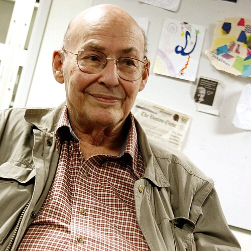

The book blamed for the first winter of neural networks is a work of
geometry. It proved hard theorems about a carefully defined kind of machine,
and then took the blame, or the credit, for a decade in which few people
built such machines at all.

## What the book set out to do

**[Seymour Papert](kloom:e/seymour-papert)** arrived at MIT in 1963, and he and **[Marvin Minsky](kloom:e/marvin-minsky)**
decided to write a theoretical account of what [perceptrons](kloom:e/perceptron) could not do. The
mathematics turned out harder than they expected, and [_Perceptrons: An
Introduction to Computational Geometry_](kloom:e/perceptrons-book) was not published by the MIT Press
until 1969. It was dedicated to **[Frank Rosenblatt](kloom:e/frank-rosenblatt)**, the perceptron's
inventor, whom Minsky had known since they were a year apart at the [Bronx
High School of Science](kloom:e/bronx-high-school-of-science).

Their perceptron was an abstraction of Rosenblatt's: a retina, one layer of
fixed feature detectors (each a yes-or-no test on some part of the retina),
and a single output unit that weighs the detectors' answers against a
threshold. Only those final weights learn. Minsky and Papert then limited the
_order_ of the machine: how many retina points any one detector may look at.
Their hardest results were about two properties of a picture. _Parity_ asks
whether the number of lit points is odd or even; they proved that a
perceptron of this kind can compute it only if at least one detector looks at
the whole retina. _Connectedness_ asks whether a figure is all in one piece;
they proved that the order it needs grows without limit as the retina
grows. A machine built from small local detectors, the kind that was
practical to build, could not do either.

## One straight line

The simplest case shows why. A single threshold unit with two inputs draws
one straight line across the plane of its inputs and answers yes on one
side, no on the other. Of the sixteen logical functions of two yes-or-no
inputs, a single unit can compute fourteen. The two it cannot compute are
[_exclusive or_](kloom:e/exclusive-or) (XOR: one input or the other, but not both) and its opposite,
because their yes-cases sit at opposite corners of the square, as in the
drawing, and no line puts both on the same side.

| Kind of function        | Examples                          | How many | One unit? |
| ----------------------- | --------------------------------- | -------: | :-------: |
| Constant                | always 0, always 1                |        2 |    Yes    |
| Copies one input        | A, B, not A, not B                |        4 |    Yes    |
| True in one case only   | A and B, A and not B, neither     |        4 |    Yes    |
| True in three cases     | A or B, not both, A or not B      |        4 |    Yes    |
| True when inputs differ | A xor B, and its opposite (A = B) |        2 |    No     |

With many inputs the picture gets worse: in [Bernard Widrow](kloom:e/bernard-widrow)'s summary, "only
a small fraction of all possible logic functions is realizable" by one unit.

## The XOR affair

A popular story says the book showed that neural networks could not compute
XOR, and so killed the field. Much of that story is wrong. That networks of
threshold units, with a hidden layer, can compute any logical function was
known to **[Warren McCulloch](kloom:e/warren-sturgis-mcculloch)** and **[Walter Pitts](kloom:e/walter-pitts)** in 1943, appears in
Rosenblatt's own book, and is mentioned in _Perceptrons_. The real gap was
elsewhere: in the 1960s nobody knew how to _train_ the hidden layer.
[Backpropagation](kloom:e/backpropagation) was still years away.

Minsky and Papert did doubt that it would be worth trying. A 1971 MIT report
said of networks with hidden layers: "We believe that it can do little more
than can a low order perceptron." In the expanded edition of 1988 they called
multilayer networks a "sterile" extension and predicted that nets trained by
gradient descent would fail to scale up.

Reviews at the time ranged widely. [Allen Newell](kloom:e/allen-newell), reviewing it for _Science_,
began: "This is a great book." H. D. Block said it studied "a severely
limited class of machines from a viewpoint quite alien to Rosenblatt's", and
called the title "seriously misleading". Widrow thought the proofs "pretty
much irrelevant", coming a decade after the perceptron.

## Who froze the field?

Neural network research did shrink in the 1970s, and funding was hard to
find. The Nobel Committee for Physics wrote in 2024 that the book "led to a
hiatus funding-wise". Minsky and Papert argued the opposite: that perceptron
research waned because of its own problems, above all that no one could do
better than Rosenblatt's rule at assigning credit inside a network. The
sociologist **Mikel Olazaran**, in a 1996 study of the controversy, argued
that the "official history" of a decisive refutation was written by the
winners, symbolic AI, as it took the field's funding and authority, and was
rewritten again when neural networks revived. Rosenblatt did not see the
revival: he died in a boating accident in July 1971, on his 43rd birthday.

The trail's next step came from outside America, in a Tokyo broadcasting
laboratory, and it went in the direction Minsky and Papert doubted: many
layers of small, local detectors, stacked one on another.
