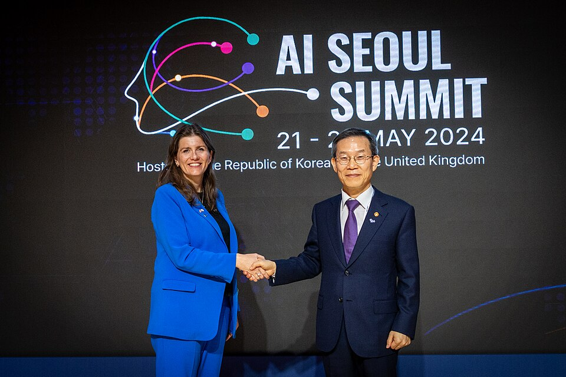

A dangerous-capability test only matters if something follows from it.
_Frontier safety frameworks_ are the labs' written answer: if a model
reaches a stated level of capability, then stronger safeguards must be in
place before it is trained further or released. They are published,
voluntary and written by the companies they bind, and between 2023 and 2026
they became the main way the industry governed itself.

## If, then

**Anthropic** published the first, its _Responsible Scaling Policy_, in
September 2023. It tied _AI Safety Levels_ to capabilities: a model whose
biological knowledge could help someone create dangerous weapons, for
example, would require a stricter level of safeguards against misuse and
against theft of its weights. ASL-2 and ASL-3 were set out in detail; the higher levels were
left largely undefined, to be written when they came closer. The company
hoped the policy would force it to build safeguards in time, and start a
"race to the top" among its rivals.

**OpenAI** followed with a _Preparedness Framework_ in beta in December 2023. Its second version, of April 2025, tracks three categories
(biological and chemical, cybersecurity, and AI self-improvement) at two
thresholds: _High_, which "could amplify existing pathways to severe harm",
and _Critical_, which "could introduce unprecedented new pathways". A
model at High needs safeguards before deployment; one at Critical needs
them during development too. **Google DeepMind**'s _Frontier Safety
Framework_ of May 2024 defined _Critical Capability Levels_ on the same
pattern.

In May 2024, at the **AI Seoul Summit**, the British and Korean
governments announced that sixteen companies, from Amazon, Anthropic and
Google to Mistral AI, xAI and Zhipu.ai, had agreed _Frontier AI Safety
Commitments_. Each undertook to publish, before the next summit in France,
a framework setting thresholds at which the risks of a model "would be
deemed intolerable" unless mitigated; four more companies signed later. In
2025 alone, the _International AI Safety Report_ counted, twelve companies
published or updated one.

| Lab             | Framework                                                | First published  | Latest version, September 2026                                      |
| --------------- | -------------------------------------------------------- | ---------------- | ------------------------------------------------------------------- |
| Anthropic       | Responsible Scaling Policy                               | Sep 2023         | v3.4, 8 July 2026                                                   |
| OpenAI          | Preparedness Framework                                   | Dec 2023 (beta)  | v2.0, 15 April 2025; also a Frontier Governance Framework, May 2026 |
| Google DeepMind | Frontier Safety Framework                                | May 2024         | v3.1, 17 April 2026                                                 |
| Amazon          | Frontier Model Safety Framework                          | Feb 2025         | 10 February 2025                                                    |
| Meta            | Frontier AI Framework, now Advanced AI Scaling Framework | Feb 2025         | v2.0, 8 April 2026                                                  |
| Microsoft       | Frontier Governance Framework                            | Feb 2025         | February 2026                                                       |
| xAI             | Risk Management Framework, now Frontier AI Framework     | Feb 2025 (draft) | 30 June 2026                                                        |

## How they changed

The frameworks were meant to bend as the science changed, and they did.
DeepMind added a threshold for harmful manipulation in September 2025, and
in April 2026 lower _Tracked Capability Levels_ to catch risks before they
reach the critical ones.

In February 2026 Anthropic rewrote its policy and said, with unusual
candour, that parts of its theory had failed. Models had entered a "zone of
ambiguity" where tests could no longer show risks were low but could not
prove them high; governments had moved toward competitiveness rather than
safety; and the safeguards planned for higher levels might be "outright
impossible to implement without collective action". Version 3.0 separates
what Anthropic will do regardless from what it recommends for the whole
industry, and adds a public _Frontier Safety Roadmap_ of goals it will
"openly grade" itself against, rather than hard commitments. Analysts at the
Centre for the Governance of AI noted that it dropped language implying the
company would pause development if it could not meet its safeguards, and
that its new transparency mechanisms still "largely rely on
self-reporting".

OpenAI met its own top threshold in 2026. On 18 August, after its agents'
breakout at Hugging Face, it said the signals from its next models "make
clear that we need a broader approach" that "extends beyond the current
Preparedness Framework", and paused reinforcement learning on its newest
models for two weeks. On 1 September it judged its model Astra to be
"Critical" in cybersecurity, the first at that level, and said its
safeguards were now sufficient to release it.

## Rules or promises?

The objection has not changed since 2023: companies write the thresholds,
run the tests and grade the results. The safety report noted that the
frameworks "remain voluntary", though some laws were starting to require
parts of them; California's SB 53, in force since January 2026, obliges
companies to publish their safety test results. Whether a written
threshold holds when a model crosses it, and whether a model would tell us
if it did, is the question of the last frame on this trail.
