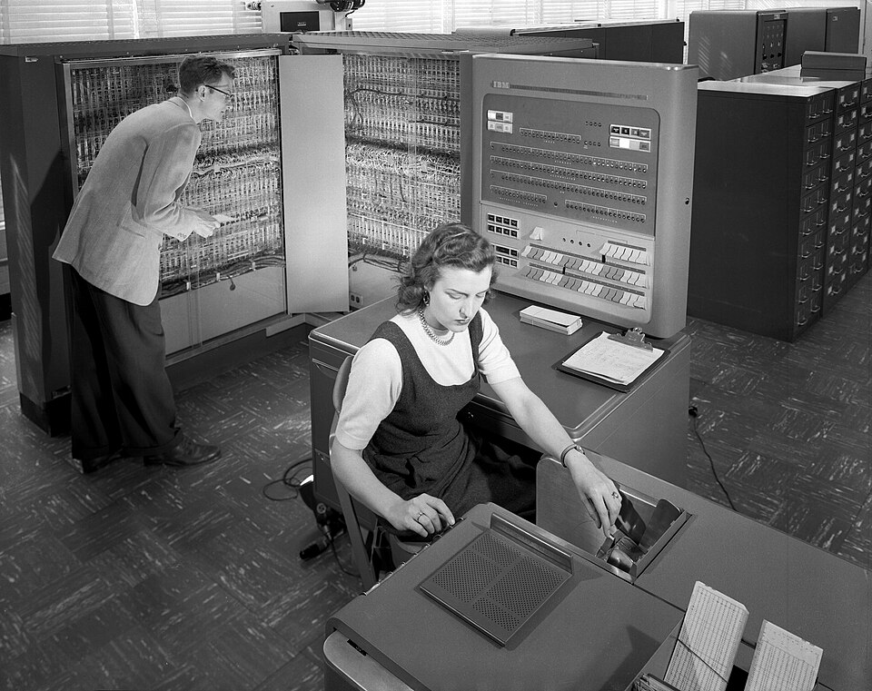

Shannon's chess machine could not learn from its mistakes. Within a decade
an engineer at IBM had a program that did, and that played checkers better
than he could.

## A checkers player at IBM

**Arthur Samuel** joined IBM at Poughkeepsie in 1949 and wrote a checkers
program for the company's first commercial computer, the **IBM 701**. It
was shown on television on 24 February 1956. IBM's president, **Thomas
Watson**, arranged a showing for shareholders and predicted that IBM's stock
would rise fifteen points; according to the checkers researcher Jonathan
Schaeffer, it did.

Samuel chose checkers over chess because its simpler rules let him
concentrate on learning. His 1959 paper, "Some Studies in Machine Learning
Using the Game of Checkers", describes the program on the faster **IBM
704**. The board fitted the machine neatly: each of the 32 playing squares
was one bit of a 36-bit word, so four words held a position. The program
looked a few moves ahead, backed up the scores by minimax as Shannon had
proposed, and scored the positions it reached with a _scoring polynomial_:
a weighted sum of features such as the piece advantage, with kings worth
three men to two.

## Learning, two ways

The first way was _rote learning_. The program saved positions it had
seen, with their scores, on tape. When one came up again in its look-ahead,
the saved score already held a search of its own, so the program in effect
saw further.

The second way was _generalization_, and it is the one that lasted. Samuel
split the program into two players, **Alpha** and **Beta**, and had them
play each other. Beta kept its polynomial for the whole game; Alpha changed
its own after every move. If Alpha won, Beta took over its polynomial. If Beta
won, Alpha got a black mark, and after three of them its leading term was
set to zero, to knock it off a false peak.

What Alpha learned from was the gap between two of its own estimates. At
each move it compared the score it had given the position one move earlier
with the score now backed up by its look-ahead. Samuel called the
difference _delta_. If delta was positive, the terms that had pushed the
earlier score up deserved more weight, and if negative, less. "We are
attempting," he wrote, "to make the score, calculated for the current board
position, look like that calculated for the terminal board position of the
chain of moves which most probably will occur during actual play." The
program kept 38 terms, 16 in use at any time and 22 in reserve, and swapped
out a term whenever it had been least useful eight times.

The paper's abstract claimed that a computer could learn "to play a better
game of checkers than can be played by the person who wrote the program",
in "8 or 10 hours of machine-playing time". Samuel is widely credited with
coining the term _machine learning_ in 1959. The paper uses it in its
title, but also says that "for some years the writer has devoted his spare
time to the subject of machine learning", a subject he had been working
on for years.

## One game, too much fame

In 1962 the program played **Robert Nealey**, a visually impaired player from Stamford,
Connecticut, whom IBM described as "a former Connecticut checkers champion,
and one of the nation's foremost players". The program won. Schaeffer, who
later analysed the game with his own program, found it a draw until Nealey
blundered at move 16, and pointed out that Nealey was not yet a state
champion; he won that title in 1966. (Schaeffer's 2007 paper in _Science_
dates the match to 1963.)

A rematch the next year, six games played by post against an **IBM 7094**,
went to Nealey with one win and five draws. In 1966 the program lost all
eight games it played against the world championship finalists Walter
Hellman and Derek Oldbury. But the single win of 1962 had become a legend
that "checkers was a 'solved' game", and for over twenty-five years, by
Schaeffer's account, researchers largely ignored checkers and turned to
chess.

Samuel's idea of learning from the difference between successive
predictions came back thirty years later, with a neural network, in a game
that adds dice.
