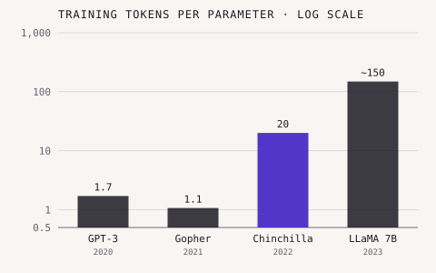

By 2019 bigger language models were plainly better, but "bigger" was a
feeling, not a plan. In January 2020 a team at [OpenAI](kloom:e/openai) turned it into
arithmetic. Their result, and the correction [DeepMind](kloom:e/google-deepmind) made to it two years
later, told the laboratories how to spend their compute, and made the growth
of AI something people could forecast.

## Kaplan's power laws

**[Jared Kaplan](kloom:e/jared-kaplan)**, of [Johns Hopkins University](kloom:e/johns-hopkins-university) and OpenAI, **Sam
McCandlish** and eight colleagues trained [transformer](kloom:e/transformer-deep-learning) language models of
many sizes, on different amounts of data, for different
lengths of time, and measured one thing: the _loss_, how surprised the model
was by text it had not seen. Their _Scaling Laws for Neural Language
Models_ found that the loss fell as a smooth _power law_ in each of three
quantities, the number of parameters _N_, the tokens of data _D_ and the
compute _C_ used to train, so long as the other two did not hold it back.
On a plot with logarithmic axes a power law is a straight line, and these
lines held, the paper said, across more than seven orders of magnitude.

The details mattered less than their shape. Width against depth, the number
of attention heads and other choices of architecture made little difference
"within a wide range"; scale made nearly all of it. The fitted exponents were
small (about 0.076 for parameters, 0.095 for data and 0.050 for compute), so
each fixed improvement cost a multiple of the compute that came before, but
it came reliably.

The paper also said how to divide a budget. As compute grows, most of it
should go on a larger model, whose optimal size grew as _C_ to the power
0.73, with comparatively little more data, "stopping significantly before
convergence". The large models of the next two years followed that advice:
[GPT-3](kloom:e/gpt-3) (175 billion parameters), Jurassic-1 (178 billion) and DeepMind's own
Gopher (280 billion) were all trained on about 300 billion tokens.

## Chinchilla

In March 2022 **Jordan Hoffmann**, **Sebastian Borgeaud**, **[Arthur
Mensch](kloom:e/arthur-mensch)** and colleagues at DeepMind published _Training Compute-Optimal Large
Language Models_. They trained more than 400 models, from 70 million to over
16 billion parameters on 5 to 500 billion tokens, fitted the results three
different ways, and got the same answer each time: parameters and data
should grow _together_. For every doubling of model size, double the tokens.
By that rule the models of the day were, in the paper's word,
"undertrained".

They tested it with the compute budget that had trained Gopher. The new
model, **[Chinchilla](kloom:e/chinchilla-language-model)**, had a quarter of the parameters (70 billion) and four
times the data (1.4 trillion tokens), and it beat Gopher, GPT-3, Jurassic-1
and the 530-billion-parameter Megatron-Turing NLG on a large range of tasks,
reaching 67.5% on the MMLU benchmark. Seventy billion parameters and 1.4
trillion tokens is 20 tokens for each parameter, and "20 tokens per
parameter" became the field's rule of thumb. It survived a check: in 2024
**Tamay Besiroglu** and colleagues at [Epoch AI](kloom:e/epoch-ai) found that one of the paper's
three fits was inconsistent with the other two, but their own refit again
came out at around 20. Why Kaplan's answer differed is still discussed; one
account is that his team counted parameters differently and studied smaller
models.

| Model      | Year | Parameters | Training tokens | Tokens per parameter |
| ---------- | ---- | ---------: | --------------: | -------------------: |
| GPT-3      | 2020 |      175 B |           300 B |                 ~1.7 |
| Gopher     | 2021 |      280 B |           300 B |                 ~1.1 |
| Chinchilla | 2022 |       70 B |           1.4 T |                   20 |
| LLaMA 7B   | 2023 |      6.7 B |           1.0 T |                 ~150 |

## Past the optimum

"Compute-optimal" meant optimal for the cost of _training_. A model that is
put into service then answers queries for a long time, and a smaller model
is cheaper for every one of them. In February 2023 Meta's **[LLaMA](kloom:e/llama-language-model)** paper said so
directly: Chinchilla's rule "disregards the inference budget", and where
Hoffmann's fit recommended training a 10-billion-parameter model on 200
billion tokens, Meta found a 7-billion-parameter model "continues to
improve even after 1T tokens". Its 13-billion-parameter model beat GPT-3 on
most benchmarks at a tenth of the size. Laboratories began to train small
models far past the Chinchilla ratio on purpose.

It also made text a limit. If data must grow with the model, the training
sets of the largest models approach all the text available on the internet,
which is why later work studies training on the same data more than once,
generating new data with other models, and what to do when it runs out.

The scaling laws predicted the loss falling smoothly. What models could _do_
did not always change smoothly, and the first place people noticed was the
prompt: GPT-3 could learn a new task from a few examples.
