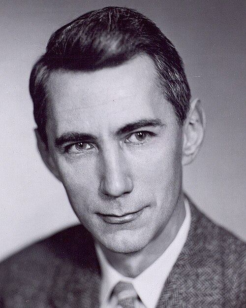

In March 1950 a mathematician at [Bell Telephone Laboratories](kloom:e/bell-labs) published the
plan that every [chess](kloom:e/chess) program for the next half-century would follow. It
had no computer to run on, and it said plainly why a perfect chess machine
could never be built.

## Why chess

**[Claude Shannon](kloom:e/claude-shannon)** wrote "Programming a Computer for Playing Chess", first given as a talk in March
1949 and printed in the _Philosophical Magazine_. He said the problem was
"perhaps of no practical importance" but a "wedge" into others: designing
circuits, routing telephone calls, translating languages. Chess suited
because its rules and goal are sharply defined, it is neither trivial nor
hopeless, and it is thought to require thinking, so that a solution "will
force us either to admit the possibility of a mechanized thinking or to
further restrict our concept of 'thinking'".

He began with [the Turk](kloom:e/mechanical-turk), and with [Poe](kloom:e/edgar-allan-poe)'s argument that a real machine would
always win, which he called "a clear 'non sequitur'".

## Too many games

In principle chess can be played perfectly: follow every variation to the
end, and work backward to see whether a position is won, drawn or lost. In
practice, Shannon estimated, a typical position offers about thirty legal
moves, so a move and a reply give about a thousand possibilities, and a
game of forty moves gives about 10¹²⁰ variations. A machine checking one
variation a microsecond "would require over 10⁹⁰ years to calculate the
first move!" This figure, a deliberately rough lower bound, is now called
the [_Shannon number_](kloom:e/shannon-number).

So a machine must judge a position without playing it out, with an
_evaluation function_ f(P). Shannon's example counted material, with small
penalties for weak pawns and a small reward for mobility:

| Term in f(P)                  | Weight |
| ----------------------------- | -----: |
| King                          |    200 |
| Queen                         |      9 |
| Rook                          |      5 |
| Bishop, knight                |      3 |
| Pawn                          |      1 |
| Doubled, backward or isolated |   −0.5 |
| Each legal move (mobility)    |    0.1 |

Each term is White's count minus Black's. The king's 200 stands for
checkmate; the 0.5 and 0.1, he wrote, were "merely the writer's rough
estimate".

## Max and min

The machine looks a few moves ahead and evaluates the positions it reaches.
Its opponent is assumed to pick the reply that is worst for the machine, so
the machine takes the _minimum_ over each set of replies and then the
_maximum_ over its own moves. The drawing is Shannon's own figure 2: three
moves for White, three replies to each, minimums of +1, −7 and −6, and so the
first move, worth +1. Repeated deeper, this is [_minimax_](kloom:e/minimax).

Searching every variation to a fixed depth Shannon called a **type A**
strategy, and he saw that it would be both slow and weak: about a billion
evaluations to look three moves ahead for each side, over sixteen minutes a
move at a microsecond each, while a world champion might, at best, see a
combination fifteen or twenty moves deep along a few lines. A **type B** strategy would do what a master does:
follow forcing lines until the position is quiet, and consider only
plausible moves. He cited a study by De Groot in which a master
weighed sixteen variations, 44 positions in all, before choosing a move.

## The paper machine

Across the Atlantic, **[Alan Turing](kloom:e/alan-turing)** and **[David Champernowne](kloom:e/d-g-champernowne)** had written
a chess program in 1948, [_Turochamp_](kloom:e/turochamp), too complex for any computer then
built. Champernowne's wife played it and lost. In 1952 Turing played it
against **Alick Glennie** by working out each move by hand, up to thirty
minutes a move; the paper machine lost in 29 moves. It never ran on a
computer in Turing's life. A reconstruction played **[Garry Kasparov](kloom:e/garry-kasparov)** at
the Turing centenary in 2012 and lost in 16.

Shannon ended with the weakness that mattered most: "the machine will not
learn by mistakes. The only way to improve its play is by improving the
program." He wondered whether a program might adjust its own coefficients
from the results of its games. Sixty-seven years later, [AlphaZero](kloom:e/alphazero)'s authors
called their selective search "arguably a more 'human-like' approach to
search, as originally proposed by Shannon". The first program to learn from
its own games played checkers, at [IBM](kloom:e/ibm).
