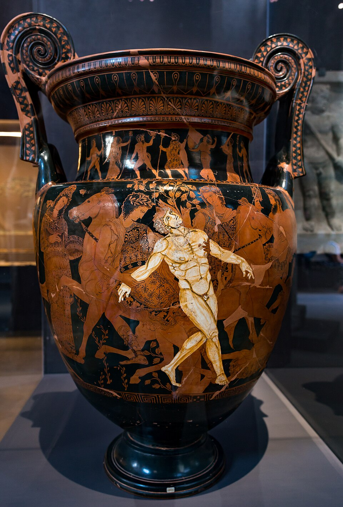

Long before anyone built a machine that could calculate, people told stories
about made things that could act on their own. The oldest of them in the
European tradition is a guard: a man of **bronze** who walked the coast of
[Crete](kloom:e/crete) and threw rocks at ships.

## The guard of Crete

The fullest version of the story is in the [_Argonautica_](kloom:e/argonautica) of **[Apollonius of
Rhodes](kloom:e/apollonius-of-rhodes)**, written in the first half of the third century BC. There **[Talos](kloom:e/talos)**
is the last of a "race of bronze", given by [Zeus](kloom:e/zeus) to Europa to protect Crete,
which he does by running around the island three times. He is invulnerable
except for one vein at his ankle, covered by a thin layer of skin. When the
Argonauts sail home with the Golden Fleece, he keeps them off with boulders
until **[Medea](kloom:e/medea)** works a spell from the ship: Talos grazes his ankle, the
divine fluid _ichor_ runs out, and he falls "like a monstrous
pine".

A later handbook, the _Library_ attributed to Apollodorus, collects other
versions. In one, Talos was made by **[Hephaestus](kloom:e/hephaestus)**, the smith of the gods,
and given to King [Minos](kloom:e/minos). He has a single vein running from his neck to his
ankles, stopped at the end with a bronze nail, and in one telling Medea kills
him by promising immortality and pulling the nail out.

The story is older than Apollonius. Vase painters showed the death of Talos
around 400 BC, most famously on the krater above, now in the Jatta National
Archaeological Museum at Ruvo di Puglia, which gave its painter his modern
name, the **Talos Painter**. He painted Talos white, to set the bronze man
apart from the living figures around him.

## A workshop of automata

Talos was not alone. Hephaestus kept automata in his workshop, and [Homer](kloom:e/homer) is
the first writer known to use the word [_automaton_](kloom:e/automaton), "acting of its own
will", for self-opening doors and wheeled tripods that moved by themselves. [Aristotle](kloom:e/aristotle) reports that [Daedalus](kloom:e/daedalus) made a statue move with
quicksilver. The historian **[Adrienne Mayor](kloom:e/adrienne-mayor)** calls these stories "biotechne":
life made by craft rather than born, imagined by people who knew bronze
casting, pumps and springs, and asked what else such craft might do.

The details are what make Talos worth remembering. He has a task (keep
strangers off Crete), a routine (three circuits a day), a power source (one
vein of ichor) and a single point of failure (the nail). He can be argued
with: in one telling, a promise is enough to make him open himself up. The
myth already asks the questions that come back in every later chapter of this
story: what a made mind is for, who controls it, and what happens when
someone finds the way to talk it out of its purpose.

## From story to plan

For two thousand years after Talos, artificial beings stayed in stories and
rumors: medieval tales of brazen heads that answered questions, the [golem](kloom:e/golem) of
Jewish legend, clockwork figures that played music. None of them thought. The
next step was not a better story but a different idea: that thinking itself
might be a kind of calculation, and so something a machine could do. That
idea begins with a Majorcan missionary's paper wheels and a German
philosopher's arithmetic.
