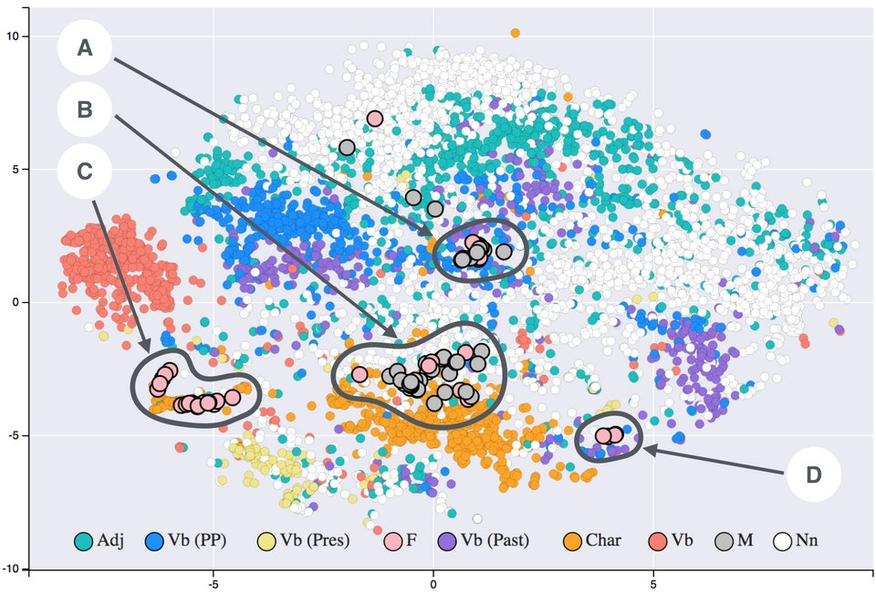

A token id is just an index. The model's first real step is to swap each id
for a long list of numbers, a **vector**, and then to stamp each vector with
where in the text it stands. Everything after this happens to those vectors.

## The embedding matrix

The swap is a table lookup. The model holds an **embedding matrix** with one
row for every token in the vocabulary and one column for every dimension of
the model; token id 3797 (" cat" for GPT-2) simply picks out row 3797.
Written as algebra, it multiplies a _one-hot_ vector, all zeros except a
single 1 at the token's id, by the matrix, which comes to the same thing.

The sizes are large. The smallest **GPT-2** has a model width of 768, so its
matrix is 50,257 rows by 768 columns: 38,597,376 numbers, about a third of
the 117 million in the model. The original **transformer** of 2017 used 512
dimensions. Meta's **Llama 3 405B** (2024) uses 16,384 numbers for every token.

Nobody writes those numbers: they are learned, like every other weight in
the model. What comes out is a geometry. A vector is a point in a space of
hundreds or thousands of dimensions, and the aim of an embedding is that
words close together in that space are similar in meaning. The idea is older
than neural networks: the linguist **J. R. Firth** wrote in 1957 that "a word
is characterized by the company it keeps", and words that keep the same
company end up as neighbours.

The map above shows that effect in word vectors made from nineteenth-century
literature by **Siobhán Grayson**, flattened to two dimensions with the
_t-SNE_ method. Verbs, adjectives, nouns and the novels' characters gather in
regions of their own. These are stand-alone word vectors of the older kind
(the main spine's word2vec frame tells that story), not a transformer's, but
a transformer's input embeddings start from the same idea.

The 2017 transformer shares one matrix between the input embedding and the
last layer, which turns vectors back into a score for each token, and some
later models do the same. The last frame of this trail comes back to it.

## Where is each token?

Attention, the next frame's subject, compares every token with every other,
and on its own it has no idea of order: "man bites dog" and "dog bites man"
would look the same. So position has to be added. There have been three main
ways.

**Sinusoidal.** The 2017 paper added a fixed pattern of sines and cosines to
each embedding. Dimension pair _i_ at position _pos_ gets
sin(_pos_ / 10000^(2_i_/_d_)) and cos(_pos_ / 10000^(2_i_/_d_)), so each pair is a
clock running at its own speed, with wavelengths from 2π up to 10000 · 2π.
The left of the drawing shows four of those clocks; the code for position 5
is the column of values where the vertical line crosses them. With a model
width _d_ of just 4:

| Position | sin(_pos_) | cos(_pos_) | sin(_pos_/100) | cos(_pos_/100) |
| -------: | ---------: | ---------: | -------------: | -------------: |
|        0 |      0.000 |      1.000 |          0.000 |          1.000 |
|        1 |      0.841 |      0.540 |          0.010 |          1.000 |
|        2 |      0.909 |     −0.416 |          0.020 |          1.000 |
|        3 |      0.141 |     −0.990 |          0.030 |          1.000 |

The fast clock tells near positions apart; the slow one tells far ones apart.
The authors chose it because a shift by a fixed offset is a linear function
of the code, which they hoped would let the model attend by relative
position, and because it might work for texts longer than any seen in
training.

**Learned.** Give each position its own trainable vector, like a second
embedding matrix. The 2017 authors found this "produced nearly identical
results", and BERT and GPT-2 used learned positions, which fixes the longest
text the model can read.

**Rotary.** In 2021 **Jianlin Su** and colleagues at Zhuiyi Technology in
Shenzhen proposed _rotary position embedding_ (RoPE). Instead of adding a
code, it rotates each query and key vector, one pair of dimensions at a time,
by an angle proportional to its position: _m_·θ at position _m_. The right of
the drawing shows the two-dimensional case. When a query at position _m_ is
compared with a key at position _n_, the rotations partly cancel and only the
difference _m_ − _n_ is left. With θ = 30° and both vectors of length 1,
pointing the same way before rotation:

| Query at | Key at | Gap | Their dot product |
| -------: | -----: | --: | ----------------: |
|        2 |      1 |   1 |             0.866 |
|        5 |      4 |   1 |             0.866 |
|        9 |      8 |   1 |             0.866 |
|        9 |      5 |   4 |            −0.500 |

The same gap always gives the same score, wherever it falls in the text.
**Llama 2** used RoPE, and **Llama 3** raised its base frequency to 500,000
to handle longer contexts.

Every token is now a vector that knows what it is and where it stands. The
next frame shows how those vectors look at one another.
