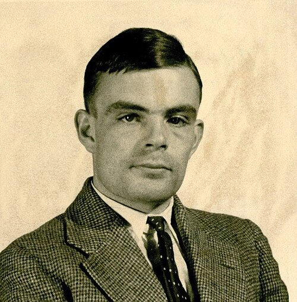

In 1936 a twenty-three-year-old [Cambridge](kloom:e/university-of-cambridge) mathematician set out to settle a
question in logic, and to do it he had to say exactly what it means to
compute. His answer was an imaginary machine made of nothing but a strip of
paper divided into squares and a short table of rules. Every computer since
can be described as one of them.

## The decision problem

In 1928 **[David Hilbert](kloom:e/david-hilbert)** asked three questions of mathematics: was it
complete, was it consistent, and was it _decidable_? The third, the
[_Entscheidungsproblem_](kloom:e/entscheidungsproblem), asked for a procedure that could take any statement
of formal logic and decide, in finitely many steps, whether it could be
proved. [Kurt Gödel](kloom:e/kurt-godel) had answered the first two in 1930. The third could not
be answered until someone defined "procedure", and in 1928 no such
definition existed.

**[Alan Turing](kloom:e/alan-turing)** heard of the problem in [M. H. A. Newman](kloom:e/max-newman)'s lectures at
Cambridge in the spring of 1935. He later told Newman that the main idea
came to him lying in the meadows at Grantchester that summer. The paper, _On
Computable Numbers, with an Application to the Entscheidungsproblem_, was
received by the London Mathematical Society on 28 May 1936, and printed in
two parts at the end of the year in its _Proceedings_ (in the volume dated
1937).

## A machine that models a clerk

Turing did not start from machinery. He started from a person doing a sum,
whom he called the _computer_, and cut away everything that was not
essential. The page becomes a **tape** divided into squares, each holding at
most one symbol. The computer attends to one square at a time: the machine
reads only the "scanned square", the one symbol "of which the machine is, so
to speak, 'directly aware'". Its memory is a finite number of states, which
Turing called _m-configurations_, because "the human memory is necessarily
limited." At each step the state and the scanned symbol decide everything:
what to print or erase, whether to move one square left or right, and which
state to go into next.

His first example prints 0 and 1 alternately forever, on every other square,
and needs only four states:

| State | Scanned symbol | Operations          | Next state |
| ----- | -------------- | ------------------- | ---------- |
| b     | blank          | print 0, move right | c          |
| c     | blank          | move right          | e          |
| e     | blank          | print 1, move right | f          |
| f     | blank          | move right          | b          |

The drawing shows that machine: the four states on a cycle above, and the
tape below it, with the head over the square it is scanning.

## One machine for all of them

Then came the decisive step. A machine's table can itself be written on the
tape as a string of symbols, which Turing called its _standard description_.
"It is possible," he wrote, "to invent a single machine which can be used to
compute any computable sequence." Given the description of any machine _M_,
this **[universal machine](kloom:e/universal-turing-machine)** _U_ does whatever _M_ would do. Program and data
are the same kind of thing, and one fixed machine can run any program. The
logician Martin Davis later argued that this idea, the stored program, shaped
[John von Neumann](kloom:e/john-von-neumann)'s design for the [EDVAC](kloom:e/edvac).

With machines numbered, Turing could turn Cantor's diagonal argument on them.
He showed that no machine can decide, for every machine, whether it will go
on printing digits forever; and from that, that no machine can decide which
formulas of logic are provable. Hilbert's _Entscheidungsproblem_, he
concluded, "can have no solution." Today the first result is usually taught
as the [_halting problem_](kloom:e/halting-problem), though Turing never used the word "halt": the name
seems to come from Martin Davis, around 1952.

## Church, first

He was not first to the answer. At [Princeton](kloom:e/princeton-university), **[Alonzo Church](kloom:e/alonzo-church)** had reached
the same conclusion by a different route, his [_lambda calculus_](kloom:e/lambda-calculus): _An
Unsolvable Problem of Elementary Number Theory_ appeared in April 1936,
before Turing's paper was even submitted. Turing added an appendix sketching a proof that his "computability"
and Church's "effective calculability" pick out exactly the same functions.
His route was the more direct: Church himself wrote, in a review, that
Turing's notion made the identification with effectiveness "evident
immediately", and it was Church who coined the name "[Turing machine](kloom:e/turing-machine)". The
claim that these equivalent definitions capture everything that can be
computed by any mechanical method is the **[Church–Turing thesis](kloom:e/church-turing-thesis)**. It cannot
be proved, because "mechanical method" is an informal idea, but every other
definition proposed since has turned out to be equivalent, and it is almost
universally accepted.

In September 1936 Turing went to Princeton to study with Church, and took
his doctorate there in 1938. Seven years after his paper, two men in Chicago
proposed that the brain itself is built from switches of this kind.
