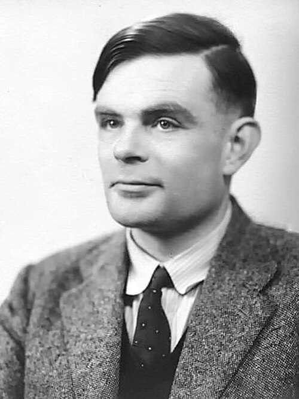

"I propose to consider the question, 'Can machines think?'" So begins the
paper that **[Alan Turing](kloom:e/alan-turing)**, by then at the [University of Manchester](kloom:e/university-of-manchester), published
in the philosophy journal _Mind_ in October 1950. In the next paragraph he
declines to answer it, because words like "machine" and "think" cannot be
settled by asking how people use them, and puts a game in its place.

## The imitation game

The game has three players in separate rooms: a man (A), a woman (B) and an
interrogator (C), who knows the other two only as X and Y. By asking
questions, C tries to work out which is the woman; A tries to mislead, B to
help. So that voices do not give them away the answers are typewritten:
"The ideal arrangement is to have a teleprinter communicating between the
two rooms." Then Turing asks: "What will happen when a machine takes the
part of A in this game?" Will the interrogator be wrong as often as when the
game is played by a man and a woman? These questions, Turing wrote, "replace
our original, 'Can machines think?'"

The test is about behavior, not about what goes on inside. The original
question Turing thought "too meaningless to deserve discussion"; the game put
something that could be tested in its place.

## Nine objections

Most of the paper answers opponents in advance. He listed nine views
contrary to his own:

| No. | Objection                        | Its claim, in brief                                        |
| --: | -------------------------------- | ---------------------------------------------------------- |
|   1 | Theological                      | thinking is a function of the immortal soul                |
|   2 | "Heads in the sand"              | the consequences would be too dreadful, so let us hope not |
|   3 | Mathematical                     | Gödel's theorem limits what any logical machine can do     |
|   4 | Consciousness                    | a machine would have to feel, not merely signal            |
|   5 | Various disabilities             | "you will never be able to make one do X"                  |
|   6 | Lady Lovelace's                  | a machine can only do what we order it to perform          |
|   7 | Continuity in the nervous system | the brain is not a discrete-state machine                  |
|   8 | Informality of behavior          | no set of rules can cover every circumstance               |
|   9 | Extrasensory perception          | telepathy would give a human player away                   |

The sixth goes back to [Ada Lovelace](kloom:e/ada-lovelace)'s note on [Babbage](kloom:e/charles-babbage)'s engine, that it "has
no pretensions to originate anything". Turing restated it as the claim that
a machine can never "take us by surprise", and replied: "Machines take me by
surprise with great frequency." The ninth is the oddest to a modern reader:
Turing thought the statistical evidence for telepathy "overwhelming", and
proposed a "telepathy-proof room".

## Predictions, and a child machine

Turing made two forecasts. The first was technical:

> I believe that in about fifty years' time it will be possible, to
> programme computers, with a storage capacity of about 10⁹, to make them
> play the imitation game so well that an average interrogator will not have
> more than 70 per cent chance of making the right identification after five
> minutes of questioning.

The second was about language: that by the end of the century "one will be
able to speak of machines thinking without expecting to be contradicted."
His measure of storage was the binary digit. The Manchester computer of
1950, by his count, held 174,380 of them; his target was about six thousand
times more.

| Machine (Turing 1950)                               | Storage, binary digits |
| --------------------------------------------------- | ---------------------: |
| A wheel that clicks between three positions         |                   ~1.6 |
| The Manchester computer, 1950                       |                174,380 |
| A human computer: 100 sheets, 50 lines of 30 digits |               ~498,000 |
| Turing's prediction for about 2000                  |                    10⁹ |

How would a machine get there? Not by programming an adult mind directly,
he suggested: "Instead of trying to produce a programme to simulate the adult
mind, why not rather try to produce one which simulates the child's?" The
child machine would then be educated, with rewards and punishments. He
ended: "We can only see a short distance ahead, but we can see plenty there
that needs to be done."

## The test since

The game became the [_Turing test_](kloom:e/turing-test), and a target for critics. In 1980 the
philosopher **[John Searle](kloom:e/john-searle)** argued, with his [_Chinese room_](kloom:e/chinese-room), that a program
could pass by manipulating symbols it did not understand, so passing could
not show that a machine thinks. The Loebner Prize ran contests from 1991 to
2019; its first winner succeeded partly by imitating human typing errors. In a preprint of March 2025, Cameron Jones and Benjamin Bergen
reported randomized three-party tests with five-minute conversations: told
to adopt a human persona, GPT-4.5 was picked as the human 73 per
cent of the time, more often than the real humans, while [ELIZA](kloom:e/eliza) managed 23
per cent. They called it the first empirical evidence that an artificial
system passes a standard three-party Turing test. Whether that shows
thinking is exactly the question Searle's argument says the test cannot
settle.

Turing's paper named a question. Six years later, the field that would try
to answer it was given a name of its own.
