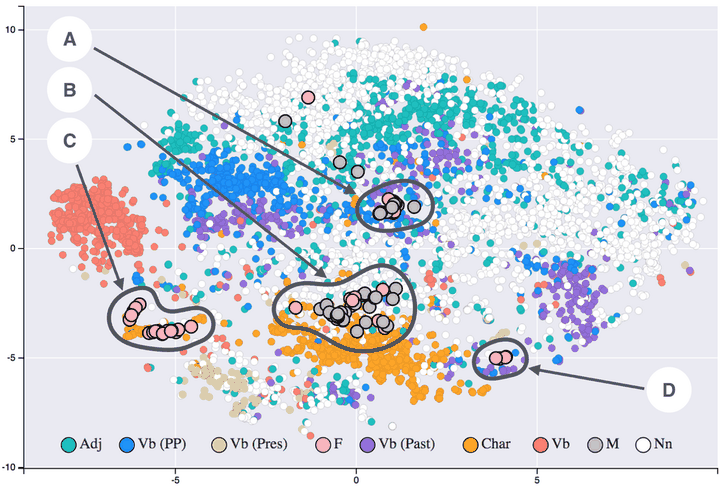

Many language systems of the early 2010s treated words as atomic units, with no notion
of similarity between them: "cat" and "kitten" were as different as "cat"
and "carburettor". In 2013 a small team at [Google](kloom:e/google)
published a quick way to give every word a position in a space of a few
hundred dimensions, learned from nothing but the text around it. Words used in
similar ways ended up close together, and some of the directions between them
turned out to mean something.

## You shall know a word by its neighbors

The idea behind it is old. Linguists call it the _distributional hypothesis_,
associated with [J. R. Firth](kloom:e/john-rupert-firth): words that occur in similar contexts have
similar meanings. Neural networks had been used to learn word vectors before,
notably by **[Yoshua Bengio](kloom:e/yoshua-bengio)** and colleagues in 2003, but training them was
slow. In January 2013 **[Tomas Mikolov](kloom:e/tomas-mikolov)**, Kai Chen, Greg Corrado and [Jeffrey
Dean](kloom:e/jeff-dean) at Google described two much simpler architectures. _Continuous
bag-of-words_ predicts a word from the words around it, as in a
fill-in-the-blank test. _Skip-gram_ does the reverse, predicting the
neighbors from the word. Both are shallow networks, and the vector each word
is given along the way is what is kept.

What made the method matter was speed. The paper reported learning
high-quality vectors from 1.6 billion words of text in less than a day, and
trained its largest models on a Google News corpus of about 6 billion words
with a vocabulary of a million. A second paper that October, with **[Ilya
Sutskever](kloom:e/ilya-sutskever)** added, sped training up by subsampling frequent words, introduced
_negative sampling_, a simpler alternative to the usual output layer, and
added a way to learn phrases, so that "Air Canada" could have a vector of its
own rather than being the sum of "Air" and "Canada". The method became known as
[_word2vec_](kloom:e/word2vec), and the second paper later received the [NeurIPS](kloom:e/conference-on-neural-information-processing-systems) Test of Time
Award, in 2023.

## King − man + woman

In a companion paper, Mikolov, Wen-tau Yih and Geoffrey Zweig showed
something odd about such vectors. If you take the vector for "king", subtract
"man" and add "woman", the nearest word to the result is "queen". The
direction from _man_ to _woman_ is roughly the same as the direction from
_king_ to _queen_, as in the plate on the left; so is the direction from
_brother_ to _sister_, and similar offsets hold for countries and their
capitals, or verbs and their past tenses. The word2vec paper built a test set
of such analogies, 8,869 semantic and 10,675 syntactic, and used it to
measure how good an embedding was.

No one had told the model about gender, royalty or geography. The structure
came from how the words were used, and _embeddings_ became a common starting
point for systems that search, classify and translate text.

## What the text carried

How the words were used included how people used them. In 2016 **Tolga
Bolukbasi** and colleagues at Boston University and [Microsoft Research](kloom:e/microsoft-research) took
the widely used word2vec vectors trained on Google News, 300 dimensions for 3
million words and phrases, and asked the same analogy question with
professions. The embedding completed "man is to computer programmer as woman
is to _x_" with _homemaker_, and "father is to doctor as mother is to _x_"
with _nurse_. They found that gender stereotypes lay along a single direction
in the space, and that a word like _receptionist_ sat nearer to _female_ than
to _male_, even though journalists, who wrote the corpus, might have been
expected to be careful. Their paper proposed a way to remove the bias along
that direction while keeping useful associations, such as _queen_ with
_female_.

The map above makes a related point on a smaller scale: in embeddings trained
on nineteenth-century novels, the gendered words used by women and by men
land in different neighborhoods. An embedding is a summary of its corpus,
and it learns the corpus's habits along with its grammar.

Word2vec's vectors are _static_: each word gets one vector, whatever sentence
it is in, so "bank" means the same beside a river as beside a loan. Later
models, [ELMo](kloom:e/elmo) and then [transformer](kloom:e/transformer-deep-learning) models such as [BERT](kloom:e/bert-language-model), made the vector depend
on the context, and by 2022 word2vec was being described as dated. But the
idea that meaning can be learned as geometry carried on in them. The
next frame turns from learning to describe data to learning to make it.
