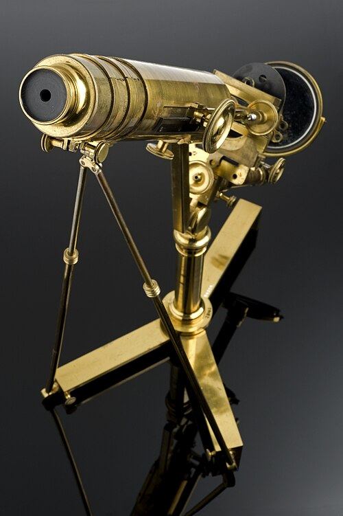

For a century and a half after Hooke and Leeuwenhoek, the [compound microscope](kloom:e/microscope), with its two or more lenses, was in one way worse than a single bead of glass. Every lens is a kind of prism. It bends blue light more than red, so the colors of a point of light come to focus at different distances, and the image of an edge is fringed with color: **[chromatic aberration](kloom:e/chromatic-aberration)**. A lens with deep curves has a second fault, spherical aberration: rays through its rim focus nearer than rays through its center. In a compound microscope each lens magnified the errors of the one before. [Isaac Newton](kloom:e/isaac-newton) had decided that a lens could never be freed of color, and built his telescope with a mirror instead.

## Two glasses that undo each other

Newton was wrong. Glasses differ not only in how much they bend light but in how much they spread it into colors. Crown glass, the ordinary kind, spreads it little; flint glass, made with lead, spreads it much more for the same bending. Put a strong convex lens of crown against a weaker concave lens of flint, and the flint can cancel the crown's spreading of the colors while leaving part of its bending: the pair still focuses, and two colors meet at one point. The plate draws a single lens and such a pair. This is the **[achromatic lens](kloom:e/achromatic-lens)**. The English lawyer **[Chester Moore Hall](kloom:e/chester-moore-hall)** made the first, in 1729 or 1733 (accounts differ), and kept it secret; the optician **[John Dollond](kloom:e/john-dollond)** made his own and patented it in 1758. Telescopes followed. Microscopes did not, because their tiny lenses needed curves as exact as a large telescope's, and every change that corrected color upset the spherical correction.

| Achromatic object-glasses before Lister's paper | Who and when, as Lister gives them                    |
| ----------------------------------------------- | ----------------------------------------------------- |
| Flint and crown cemented, four screwed together | Selligue, Paris, reported to the Academy in 1824      |
| The same turned plane side foremost             | Chevalier, Paris, 1825                                |
| Uncemented pairs, each meant to be used alone   | Utzschneider and Fraunhofer, Munich                   |
| Pairs planned for their place in a combination  | Amici, Modena, from 1824; shown in London in 1827     |
| Triple object-glasses                           | Tulley, London, 1824 and 1825, urged on by Dr. Goring |

## A wine merchant's rule

**[Joseph Jackson Lister](kloom:e/joseph-jackson-lister)** was a Quaker wine merchant in the City of London, a partner in his father's business at eighteen, who worked on lenses, he wrote, as "an occasional object of my leisure for several years past". On 21 January 1830 his paper "On some properties in achromatic object-glasses applicable to the improvement of the microscope" was read to the **[Royal Society](kloom:e/royal-society)**, and the _**[Philosophical Transactions](kloom:e/philosophical-transactions-of-the-royal-society)**_ printed it that year. He had found the fault of the old instruments in their images. With too small a cone of light, he wrote, the finest details blur into spots, "not unfrequently so much resembling small globules as to have been mistaken for them; an optical illusion having thus been the basis of some ingenious speculations on organic matter". Many naturalists of the day believed living tissue was built of globules.

He tested borrowed sets of French and German lenses in every combination, found that only a few gave a clean image, and worked out why. A cemented doublet, he showed, has on one side "two foci in its axis, for the rays proceeding from which it will be truly corrected", free of spherical aberration; between those two points it is over-corrected, and beyond them under-corrected. These are its _aplanatic foci_. So a microscope's objective could be built of several doublets, each taking the rays from the shorter aplanatic focus of the one in front and passing them on as if from its own longer one: the combination would then be free of both errors at once. He did not derive this from theory. He measured, drew magnified diagrams, and had glasses made. The first three, made for him by William Tulley, the shortest of 0.7 inch focus, gave "at an aperture of 50° the most distinct microscopic vision that I have yet met with".

Lister had a stand built to his design in 1826 by James Smith, then Tulley's workman, shown here. He worked with Smith and with Andrew Ross, who set up on his own in 1832, and gave them his principles; Smith's firm later took Lister's nephew Richard Beck as apprentice and then partner, as Smith & Beck. In 1839 Lister was among the seventeen men who met to found the Microscopical Society of London, now the **[Royal Microscopical Society](kloom:e/royal-microscopical-society)**, which bought its first instruments from the three leading makers, Powell and Lealand, Ross, and Smith.

## What the new lenses showed

The first great discovery of these years was not made with them. In 1831 the botanist **[Robert Brown](kloom:e/robert-brown-botanist-born-1773)** told the Linnean Society that in each cell of the skin of orchid leaves there was "a single circular areola", and he named it: "This areola, or nucleus of the cell as perhaps it might be termed". He found it in many other plants. The **[cell nucleus](kloom:e/cell-nucleus)** had been drawn before, by Franz Bauer in 1802, and Brown credited his drawings. Brown worked with a simple microscope, a single strong lens; his own, made by Bancks, is kept by the Linnean Society, and in 1992 the microscopist Brian Ford used it to show that it could see the jittering of particles in pollen that Brown reported in 1827, now called **[Brownian motion](kloom:e/brownian-motion)**.

For the next generation, though, the achromatic objective made the compound microscope the instrument of biology, and the frames after this one were made with it. Lister's son **[Joseph Lister](kloom:e/joseph-lister)**, born in 1827 and closely guided by his father, became the surgeon of antisepsis. The next frame is Schleiden and Schwann, who used the new instruments to argue that every living thing is made of cells.
