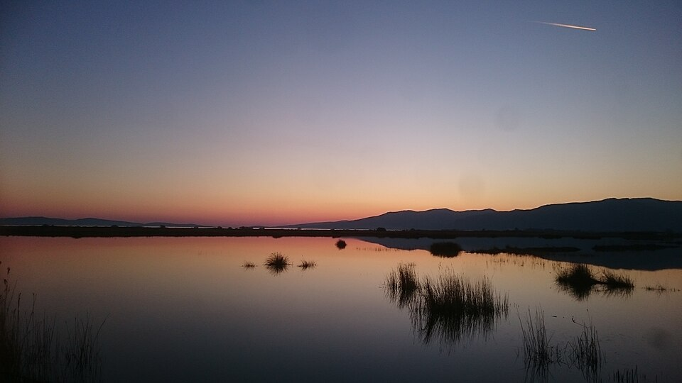
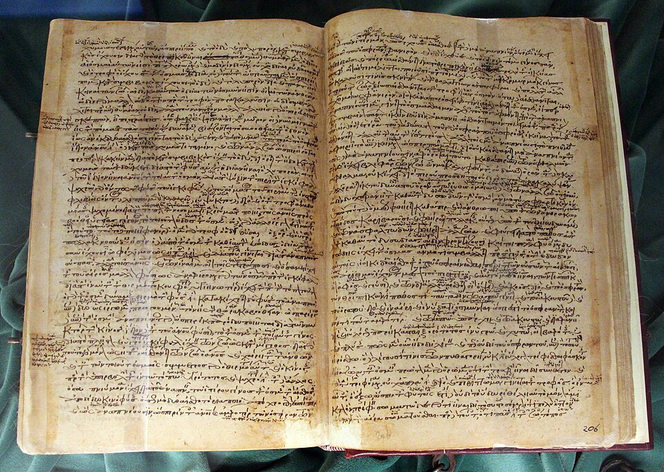

In about 345 BC the philosopher **[Aristotle](kloom:e/aristotle)** left Athens, where he had studied for some twenty years at [Plato's Academy](kloom:e/platonic-academy), and crossed to the island of **[Lesbos](kloom:e/lesbos)**. There he met a younger man, **[Theophrastus](kloom:e/theophrastus)**, and for about two years the two of them worked on living things. At the center of the island is a shallow inlet of the sea, the lagoon of Pyrrha, now the Gulf of Kalloni. Much of what Aristotle wrote about fish, octopuses, crabs and sea urchins comes from it. His **[_History of Animals_](kloom:e/history-of-animals)**, a long survey in nine books written over the following two decades, is the earliest systematic study of animals that survives.

The book names some 500 kinds of bird, mammal and fish, and dozens of insects and other invertebrates. Aristotle mentions the internal anatomy of about 110 animals, and describes about 35 in enough detail that biologists are sure he cut them open. He also asked people who knew animals for a living: beekeepers, fishermen and sponge divers. Some of what they told him was right, and some of what travelers told him was not, and he did not always tell the two apart.

## Facts first, then causes

The _History_ is a collection of facts, ordered so that they could later be explained. Aristotle says so himself: first establish _that_ something is the case (in Greek, the _hoti_), then look for _why_ it is (the _dioti_), which he did in other books, _Parts of Animals_ and _Generation of Animals_. So the _History_ sorts animals by their differences: in their parts, in how they live and feed, in what they do, and in their characters.

From those differences come groups. "Very extensive genera of animals, into which other subdivisions fall," he writes, "are the following: one, of birds; one, of fishes; and another, of cetaceans. Now all these creatures are blooded." Then come the bloodless ones: the hard-shelled kind, "another of the soft-shell kind, not as yet designated by a single term," the mollusks, and the insects. These are his great genera, drawn in the plate:

| Aristotle's genus                         | Modern group, roughly              |
| ----------------------------------------- | ---------------------------------- |
| Blooded: viviparous four-footed animals   | Mammals (other than whales)        |
| Blooded: egg-laying four-footed, snakes   | Reptiles and amphibians            |
| Blooded: birds, fishes, cetaceans         | Birds, fishes, whales and dolphins |
| Bloodless: soft-bodied (_malakia_)        | Cephalopods                        |
| Bloodless: soft-shelled (_malakostraka_)  | Crustaceans                        |
| Bloodless: shell-skinned (_ostrakoderma_) | Shelled mollusks, sea urchins      |
| Bloodless: insects (_entoma_)             | Insects, spiders and others        |

Blooded and bloodless match vertebrates and invertebrates closely. Aristotle set whales and dolphins apart from fish: they breathe air through a blowhole and suckle their young. Whether he meant to build a classification at all is debated. Most philosophers who study him say he did not; he was cataloging differences, not ranking groups. In 2022 the paleontologists **[Michel Laurin](kloom:e/michel-laurin)** and Marcel Humar tested the question another way. They turned the _History_ into a table of 147 animals scored for 161 of Aristotle's own characters, and showed that the table holds a real signal of relatedness. Run through the same software biologists use to build family trees, it recovers groups Aristotle recognized, such as the _selachē_, the sharks and rays.

## What he saw that no one believed

Some of the book's strangest claims turned out to be true. Three were confirmed only in the nineteenth century:

| Aristotle reported                                                     | Confirmed                                                                                                     |
| ---------------------------------------------------------------------- | ------------------------------------------------------------------------------------------------------------- |
| A male octopus has an organ in one tentacle used in mating             | 1852, by Jean-Baptiste Vérany and Carl Vogt, after Cuvier had named the detached arm a parasitic worm in 1829 |
| A smooth shark's young grow attached by a cord to the wall of the womb | 1842, by Johannes Müller                                                                                      |
| The male river catfish guards the eggs for forty or fifty days, alone  | 1857, by Louis Agassiz, from specimens sent from western Greece                                               |

Of the **[octopus](kloom:e/octopus)**, he passed on what fishermen said: "the male has a kind of penis in one of his tentacles." He doubted it: such an arm, he thought, could serve for holding on but not for breeding. The arm, now called the **[hectocotylus](kloom:e/hectocotylus)**, does deliver sperm, and in some species breaks off inside the female. **[Georges Cuvier](kloom:e/georges-cuvier)** found one in a female argonaut and took it for a worm. Of the shark now called the **[common smooth-hound](kloom:e/common-smooth-hound)**, he wrote that "the young develop with the navel-string attached to the womb," a kind of placenta, which **[Johannes Peter Müller](kloom:e/johannes-peter-muller)** found in 1842. And of the catfish, the male "stays and keeps on guard where the spawn is most abundant," making "a kind of muttering noise" as he drives off small fish. **[Louis Agassiz](kloom:e/louis-agassiz)** described the fish in 1857 and named it for Aristotle; it is now **[Aristotle's catfish](kloom:e/aristotles-catfish)**. Wikipedia's article on the _History_ gives Agassiz's confirmation as 1890, which cannot be right: he died in 1873.

He was wrong too. He wrote that males have more teeth than females in people, sheep, goats and pigs, which is not so; the philosopher Robert Mayhew suggests that the poorer diet of women in his day may have made it look true of people. His "fly with four feet," often held against him, was the mayfly, whose front legs are not used for walking.

## Two thousand years

The _History_ was copied in Greek, as in the twelfth-century manuscript shown here, made in Constantinople and now in Florence. It was translated into Arabic as part of the _Book of Animals_, and from Arabic into Latin by Michael Scot in the thirteenth century. It was the first book of zoology for some two thousand years, and **[Charles Darwin](kloom:e/charles-darwin)**, sent Aristotle's _Parts of Animals_ in 1882 by its translator, **[William Ogle](kloom:e/william-ogle-physician)**, wrote back: "Linnæus & Cuvier have been my two Gods, though in very different way, but they were mere school-boys to old Aristotle."

Theophrastus, who had worked beside him on Lesbos, did the same for plants.
