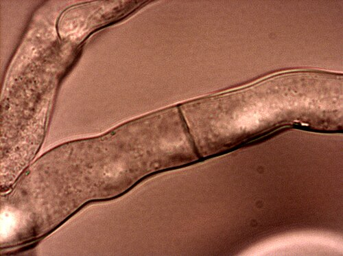

By 1940 geneticists could say where **[genes](kloom:e/gene)** were, on the chromosomes, in a line, and how they passed from parent to child. What a gene _did_ was another matter. At **[Stanford University](kloom:e/stanford-university)** the geneticist **[George Beadle](kloom:e/george-beadle)**, who had trained on maize at Cornell and on fruit flies at Caltech, and the biochemist **[Edward Tatum](kloom:e/edward-tatum)** decided to turn the question around. Instead of taking a known trait and hunting for its chemistry, they would take known chemistry and look for **[mutations](kloom:e/mutation)** that broke it. Their first report, in November 1941, described three damaged strains of a bread mold.

## A physician got there first

The idea had been put forward forty years earlier by a London physician, **[Archibald Garrod](kloom:e/archibald-garrod)**. He studied **[alkaptonuria](kloom:e/alkaptonuria)**, a rare condition whose sign is urine that turns black in air, from homogentisic acid that the body fails to break down. In one of his own cases the stained diapers were noticed 57 hours after the child's birth (52, in Wikipedia's article on him): the condition was there from the start. In 1902, in _The Lancet_, he set out the families:

| Garrod's families, 1902         | Families | Children with alkaptonuria |
| ------------------------------- | -------: | -------------------------: |
| Parents first cousins           |        6 |                         12 |
| Parents unrelated, not affected |        4 |                          6 |
| Inherited from a parent         |        1 |                          1 |

First cousins made perhaps 3 percent of English marriages, by George Darwin's estimate, yet they were the parents in 60 percent of Garrod's families where neither parent was affected. **[William Bateson](kloom:e/william-bateson)**, reading the figures, saw a recessive character in Mendel's sense, and Garrod quoted him: "the mating of first cousins gives exactly the conditions most likely to enable a rare, and usually recessive, character to show itself." Garrod looked for the cause in an **[enzyme](kloom:e/enzyme)**, one of the catalysts that speed each step of the body's chemistry. In the 1923 edition of his book _Inborn Errors of Metabolism_ he wrote that the splitting of the benzene ring of homogentisic acid "is the work of a special enzyme," and in the alkaptonuric "this enzyme is wanting." Geneticists hardly noticed: in his Nobel lecture Beadle said that no widely used textbook of genetics he had examined, up to the 1940s, so much as mentioned alkaptonuria.

## X-rays and a bread mold

**[_Neurospora crassa_](kloom:e/neurospora-crassa)**, a red bread mold, had been recommended to geneticists by the mycologist B. O. Dodge, who told Thomas Hunt Morgan it was "even better than _Drosophila_." It grows as branching threads, seen in the micrograph, and its spores come in sacs of eight, the products of a single meiosis, so the inheritance of a change can be read spore by spore. Tatum found that the wild mold needs nothing from its food but sugar, salts and one vitamin, biotin. Every amino acid and every other vitamin it makes for itself, by chains of reactions, each step speeded by its enzyme. A mutant that had lost one reaction would die on that plain food and live if given the missing product. The paper sets out the procedure:

| Step      | What they did                                                                            |
| --------- | ---------------------------------------------------------------------------------------- |
| Irradiate | X-rayed the mold before meiosis, so that its sexual spores carried any new mutation      |
| Isolate   | Grew each single spore on a "complete" medium of malt extract, yeast extract and glucose |
| Screen    | Moved each strain to the "minimal" medium of sugar, salts and biotin                     |
| Narrow    | Fed any strain that failed there vitamins, or amino acids, then one substance at a time  |
| Cross     | Crossed the mutant with normal mold and scored its spores                                |

Fearing discouragement, they grew over a thousand single-spore cultures before testing any. The 299th needed vitamin B6. The 1,085th needed B1. Among about 2,000 strains the 1941 paper reported three mutants, two of them in the sister species _N. sitophila_: one unable to make pyridoxine (B6), one unable to make the thiazole half of thiamine (B1), and one unable to make para-aminobenzoic acid. Crossed with normal mold, the pyridoxine mutant's spores sorted as if a single gene made the difference.

The method then took a pathway apart. In 1944 Adrian Srb and **[Norman Horowitz](kloom:e/norman-horowitz)**, in the same laboratory, reported seven different mutants that needed the amino acid arginine. The plate draws their test. Four would grow if given ornithine, citrulline or arginine; two only on citrulline or arginine; one only on arginine. Each was blocked at a different step of one chain, ornithine to citrulline to arginine, and the order of the blocks gave the order of the steps.

## One gene, one what?

Horowitz gave the idea its name in 1948: the **[_one gene–one enzyme hypothesis_](kloom:e/one-gene-one-enzyme-hypothesis)**. Beadle said the hypothesis had led them to the mold, not the mold to the hypothesis, and that it had grown "beginning with Garrod." Max Delbrück doubted that a single enzyme sat at each step, and Beadle recalled that after the 1951 Cold Spring Harbor symposium its supporters "could be counted on the fingers of one hand with a couple of fingers left over."

It survived by being narrowed. A **[protein](kloom:e/protein)** may be built of several chains, and from 1957 **[Vernon Ingram](kloom:e/vernon-ingram)** showed that the hemoglobin of sickle-cell disease differs from normal hemoglobin in one amino acid of one kind of chain. The rule became one gene, one polypeptide, and splicing, found in 1977, showed that one gene can make several. As the geneticist Rowland Davis put it, by 1958 "one gene, one enzyme was no longer a hypothesis to be resolutely defended; it was simply the name of a research program."

That year Beadle and Tatum shared half the Nobel Prize in Physiology or Medicine "for their discovery that genes act by regulating definite chemical events." The other half went to Tatum's former student **[Joshua Lederberg](kloom:e/joshua-lederberg)**, for genetic recombination in bacteria. Beadle told his audience that in Neurospora they had "rediscovered what Garrod had seen so clearly so many years before." What was new was that genetics and biochemistry now worked on one problem, and a mutant had become a tool for tracing a pathway. One of Beadle's fellow students in the maize group at Cornell, Barbara McClintock, came to Stanford in 1944 to describe the mold's chromosomes; the next frame is her own maize.
