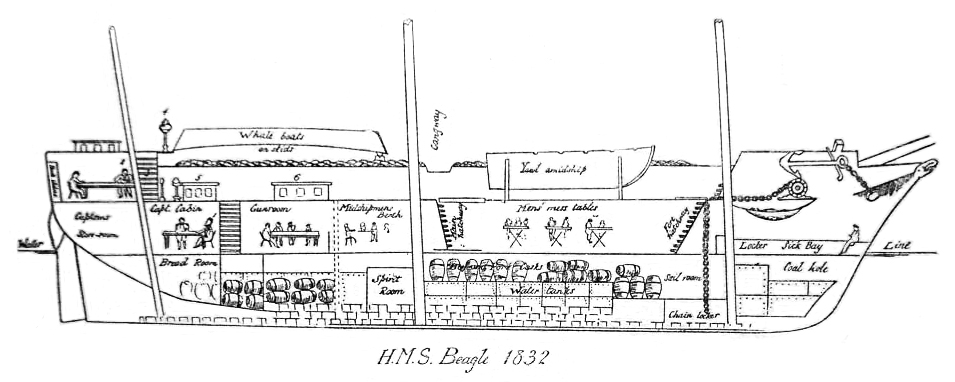
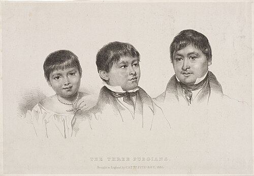

In 1831 the Admiralty sent the survey ship **[HMS _Beagle_](kloom:e/hms-beagle)** back to South America. Her commander, **[Robert FitzRoy](kloom:e/robert-fitzroy)**, was twenty-six. He had taken her over on her first voyage, in 1828, after her captain, Pringle Stokes, shot himself at Port Famine on the **[Strait of Magellan](kloom:e/strait-of-magellan)**. Now the hydrographer **[Francis Beaufort](kloom:e/francis-beaufort)** wanted the coasts of Patagonia, **[Tierra del Fuego](kloom:e/tierra-del-fuego)**, Chile and Peru charted, and FitzRoy hoped that "a chain of meridian distances might be carried round the world": the longitude of each port measured from the last by **[marine chronometers](kloom:e/marine-chronometer)**.

FitzRoy also asked that "some well-educated and scientific person should be sought for who would willingly share such accommodations as I had to offer." Beaufort asked George Peacock at Cambridge, who asked the botanist **[John Stevens Henslow](kloom:e/john-stevens-henslow)**, and on 24 August 1831 Henslow wrote to his former pupil **[Charles Darwin](kloom:e/charles-darwin)**, then twenty-two. He had recommended him, he said, "not on the supposition of yr. being a finished Naturalist, but as amply qualified for collecting, observing, & noting any thing worthy to be noted in Natural History." FitzRoy "wants a man (I understand) more as a companion than a mere collector." Historians have read loneliness into that, after Stokes's suicide and that of FitzRoy's uncle Lord Castlereagh, though no paper of FitzRoy's says so. Darwin went unpaid, sharing the cost of the captain's table and free to leave when he chose. "The Voyage is to last 2 yrs," Henslow wrote. It lasted almost five.

## A small ship full of clocks

The _Beagle_ was a ten-gun brig of the Cherokee class, about 90 feet long, rebuilt for the voyage with her upper deck raised and her hull sheathed in a second skin of planking, about 242 tons. "In a part of my own cabin," FitzRoy wrote, "twenty-two chronometers were carefully placed." At each port the officers found local noon from the sun, read Greenwich time off the chronometers, and turned the difference into longitude, fifteen degrees to the hour. FitzRoy cared enough to sail home by way of Bahia, crossing the Atlantic twice, to check his figures. The stores held lemon juice against scurvy and "a very large quantity of Kilner and Moorsom's preserved meat, vegetables, and soup" in tins.

Darwin worked at the chart table in the poop cabin at the stern, which he shared with the young surveyor John Lort Stokes, and slept there in a hammock. "My own private corner," he wrote, "looks so small that I cannot help fearing that many of my things must be left behind." The route, from the itinerary in his ornithological notes and his diary:

| Where                                   | When                   |
| --------------------------------------- | ---------------------- |
| Leaves Plymouth                         | December 27, 1831      |
| Porto Praya, Cape Verde Islands         | January 1832           |
| Bahia and Rio de Janeiro, Brazil        | February–July 1832     |
| Bahía Blanca: the fossils at Punta Alta | September 1832         |
| Tierra del Fuego; the Fuegians landed   | December 1832–1833     |
| Falkland Islands                        | March 1833, 1834       |
| Valparaíso and the Andes                | July 1834–1835         |
| Galápagos Islands                       | September–October 1835 |
| Tahiti, New Zealand, Sydney, Hobart     | November 1835–1836     |
| Keeling Islands, Mauritius, Cape Town   | April–June 1836        |
| Bahia again, for the longitudes         | August 1836            |
| Falmouth                                | October 2, 1836        |

## Three people from Tierra del Fuego

The ship also carried three Fuegians home. In 1830, after Fuegians took one of the _Beagle_'s whaleboats, FitzRoy had seized families as hostages. Most escaped. He kept a **[Kawésqar](kloom:e/kawesqar)** girl of about nine, **[Yokcushlu](kloom:e/yokcushlu)**, whom the sailors called Fuegia Basket, and two young men taken as hostages, one of them El'leparu, called York Minster. Then he persuaded a family of the **[Yahgan](kloom:e/yahgan-people)** to let a boy, Orundellico, into his boat in exchange for beads and buttons: **[Jemmy Button](kloom:e/jemmy-button)**. A fourth captive, called Boat Memory, died of smallpox at Plymouth. The other three were schooled at Walthamstow and presented to the King and Queen, and FitzRoy, who paid for them himself, meant them to carry Christianity home.

In January 1833 they were landed at Wulaia with a young missionary, Richard Matthews. Nine days later the mission's goods had been taken and shared out, and Matthews was taken off. When the ship came back in March 1834 a canoe came out with Jemmy, thin and nearly naked. "I never saw so complete & grievous a change," Darwin wrote in his diary; but Jemmy told them he had "plenty (or as he expressed himself too much) to eat", and he chose to stay. Decades later, in 1873, Yokcushlu told her own story to the missionary Thomas Bridges. In 1859 Yahgan men killed a party of missionaries at Wulaia; Jemmy, accused of leading them, denied it.

## The naturalist at sea

Darwin was seasick from the first day and never got over it. At Cambridge he had copied out long passages of **[Alexander von Humboldt](kloom:e/alexander-von-humboldt)**'s _Personal Narrative_ of his American travels, and he brought the first volume of **[Charles Lyell](kloom:e/charles-lyell)**'s _Principles of Geology_, a gift from FitzRoy. Henslow, Darwin remembered, had told him to read it "but on no account to accept the views therein advocated." The first rocks he examined, on St. Jago, convinced him of Lyell's slow changes. Geology was his main work. He kept a diary, pocket notebooks ashore, zoological notes from dissections under a single-lens microscope, and numbered catalogs of specimens, those in spirits of wine running to 1,529. Crates went home to Henslow on the Falmouth packets.

At Bahia, early on, FitzRoy praised slavery, telling Darwin that a slave owner's slaves had all answered "No" when asked whether they wished to be free. Darwin, who "abominated" slavery, asked whether such answers were worth anything, and FitzRoy, furious, declared they could no longer live together. He apologized within hours.

In 1839 Darwin's diary, rewritten, became the third volume of FitzRoy's _Narrative_, and was sold on its own as his _Journal of Researches_, revised in 1845 and known since as **[_The Voyage of the Beagle_](kloom:e/the-voyage-of-the-beagle)**. The voyage, Darwin wrote late in life, "has been by far the most important event in my life." The trail follows it port by port, beginning with the bones at Punta Alta.
