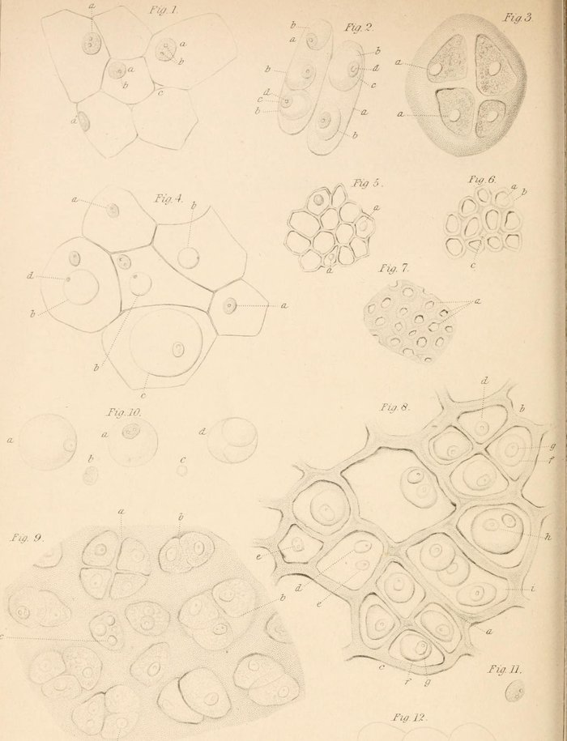

By the 1830s botanists had looked at cells for a century and a half, ever since Hooke named the boxes in cork. Plants were obviously built of them. Animals were not obviously built of anything: their tissues were fibers, globules, membranes and fluids, soft and hard to see through, and anatomists sorted them into some twenty kinds with no common plan. A few, Henri Dutrochet among them in 1824, had guessed that the cell was the unit of all life. Nobody had shown it.

## Two men in Müller's laboratory

**[Matthias Jakob Schleiden](kloom:e/matthias-jakob-schleiden)** had been a lawyer in Hamburg before he turned to botany, and in Berlin he worked in the circle of **[Johannes Peter Müller](kloom:e/johannes-peter-muller)**, the great physiologist, whose assistant was the young **[Theodor Schwann](kloom:e/theodor-schwann)**. In 1838 Schleiden published "Contributions to Phytogenesis" in Müller's _Archiv_. Every plant above the simplest, he wrote, "is an aggregate of fully individualized, independent, separate beings, even the cells themselves. Each cell leads a double life: an independent one, pertaining to its own development alone; and another incidental, in so far as it has become an integral part of a plant." He also said how cells arise: granules gather in a fluid into a [nucleus](kloom:e/cell-nucleus), which he called the _cytoblast_, and a new cell rises on it "like a watch-glass upon a watch".

Schleiden told Schwann his results before they were printed, in October 1837, by Schwann's account. The story, as later told, is that it came up over dinner, and that Schwann at once remembered nuclei he had seen in animal tissue.

## How Schwann argued it

Schwann's book of 1839, _Mikroskopische Untersuchungen_, translated by Henry Smith for the Sydenham Society in 1847 as _Microscopical Researches into the Accordance in the Structure and Growth of Animals and Plants_, explains the argument as it happened. In 1837, studying the nerves in the tails of frog larvae, he had seen "the beautiful cellular structure" of the **[notochord](kloom:e/notochord)**, the rod along an embryo's back, and found nuclei in its cells; Müller had already shown that the notochord of fishes is made of separate cells. But nobody knew what the nuclei meant, so "the fact led to no farther result". Schleiden's account of the cytoblast gave them a meaning. Schwann then compared, feature by feature, the cells of cartilage and notochord with the cells of plants:

| What Schwann looked for     | In plant cells (Schleiden)      | In the animal cells he examined           |
| --------------------------- | ------------------------------- | ----------------------------------------- |
| A nucleus                   | The cytoblast, against the wall | Matching it in position, form and changes |
| A wall that thickens        | Seen as the cell grows          | Seen in growing cartilage cells           |
| Young cells inside old ones | Formed around new nuclei        | In the branchial cartilage of frog larvae |
| Growth without vessels      | Plants have no blood vessels    | Cartilage and notochord grow without them |

"Thus was the similarity in the process of vegetation of animal and vegetable cells still further developed," he wrote, and once cartilage was settled, "the matter was decided". He went on through epithelium, the egg, blood, fat, muscle, nerve and bone, and drew them in his plates, mostly magnified about 450 times, the first of which sets an onion's cells beside a fish's notochord. His conclusion was general: "The elementary parts of all tissues are formed of cells in an analogous, though very diversified manner, so that it may be asserted, that there is one universal principle of development for the elementary parts of organisms, however different, and that this principle is the formation of cells." This is **[cell theory](kloom:e/cell-theory)**. The plate redraws his comparison, and the image is his own Plate I.

## What they got wrong

On how cells form, Schleiden and Schwann were both mistaken. Schwann thought most animal cells formed outside other cells, in a structureless fluid he called the _cytoblastema_, and he compared their growth to crystallization: the nucleolus might first form "by a sort of crystallization from out of a concentrated fluid". In the 1850s **[Robert Remak](kloom:e/robert-remak)**, Albert Kölliker and Rudolf Virchow showed instead that cells come from cells, by division, which the next frame follows.

Schwann was a careful experimenter in other fields too. In 1836 he found **[pepsin](kloom:e/pepsin)** in the stomach lining, and in 1837 he showed that fermentation needs living **[yeast](kloom:e/yeast)**, and that a boiled liquid given only air that had passed through hot glass did not ferment. **[Justus von Liebig](kloom:e/justus-von-liebig)** and **[Friedrich Wöhler](kloom:e/friedrich-wohler)**, who held fermentation to be pure chemistry, mocked the idea in a satire in 1839. That year Schwann left Berlin for a chair at the Catholic university of Louvain, and did little research of note afterward; historians disagree whether his faith had anything to do with it.

Why do the two names stand for the theory? Wikipedia's article on cell theory notes that Schleiden's crystallizing cells were not his own idea, and that Remak, not they, supplied the rule that every cell comes from a cell. Their claim rests on the generalization: Schwann's demonstration, tissue by tissue, that one kind of unit, marked by its nucleus, builds plants and animals alike.
