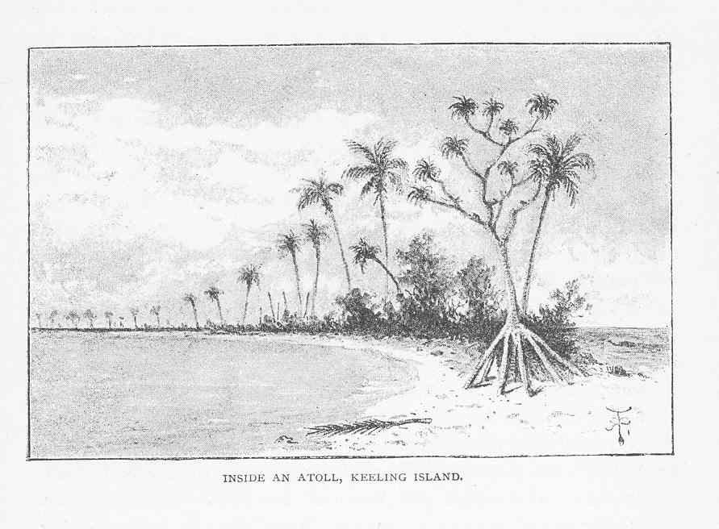
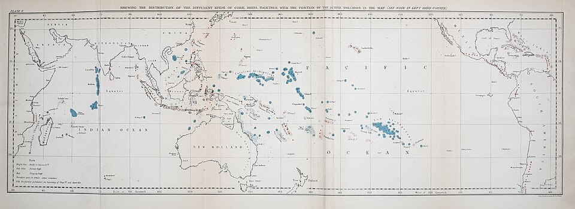

On 1 April 1836 **[HMS Beagle](kloom:e/hms-beagle)** reached the **[Keeling Islands](kloom:e/cocos-keeling-islands)**, or Cocos, a ring of low coral islets around a shallow lagoon in the Indian Ocean. The Admiralty's orders had asked for a survey of just such an island. For eleven days the crew sounded the lagoon and the sea outside it, while **[Charles Darwin](kloom:e/charles-darwin)** waded out to the living edge of the **[coral reef](kloom:e/coral-reef)**. He had a theory to test.

## A puzzle in the open ocean

An **[atoll](kloom:e/atoll)** was a riddle. Reef-building corals grow only in shallow water, yet atolls rise from an ocean thousands of meters deep. The favored answer, given by **[Charles Lyell](kloom:e/charles-lyell)** in the _Principles of Geology_ that Darwin carried on the voyage, was that corals had capped the rims of drowned volcanic craters.

Darwin's answer came from South America, where he had found beaches and shells lifted high above the sea: the land was rising. If continents could rise, the ocean floor could sink. In his autobiography, forty years later, he said that the whole theory "was thought out on the west coast of South America, before I had seen a true coral reef." His manuscripts tell a slightly different story. Its first full statement, an essay headed "Coral Islands," was written in December 1835, after he had seen the atolls of the Tuamotus and looked down from Tahiti on **[Moʼorea](kloom:e/moorea)**, ringed by its reef: "Remove the central group of mountains, & there remains a Lagoon Isd." The geographer David Stoddart, who published the essay in 1962, judged that the idea had been forming since mid-1835 and may have been set off by that view.

## Three reefs, one history

Darwin joined the three kinds of coral reef into one sequence, as the plate draws it. A _fringing reef_ grows against the shore of a volcanic island. If the island slowly sinks, the corals on the reef's outer edge keep growing upward to stay at the surface, while the land shrinks inside them: the reef becomes a _barrier reef_, cut off from the shore by a lagoon. When the last peak goes under, a ring of reef is left around a lagoon: an atoll. In his book of 1842, **[_The Structure and Distribution of Coral Reefs_](kloom:e/the-structure-and-distribution-of-coral-reefs)**, he put it in one sentence: "the bases on which the reefs first became attached, slowly and successively sank beneath the level of the sea, whilst the corals continued to grow upwards."

## Tallow on the lead

The theory stood on one fact: that reef-building corals cannot live deep. At Keeling, **[Robert FitzRoy](kloom:e/robert-fitzroy)** sounded the outer slope himself with a bell-shaped lead four inches across, its hollow base "armed" with tallow, which picked up sand or took the print of rock. Each arming went to Darwin:

| Depth of the sounding                 | What the tallow showed                                                                      |
| ------------------------------------- | ------------------------------------------------------------------------------------------- |
| Down to 10–12 fathoms (18–22 m)       | Clean but deeply dented by rugged rock; at 8 fathoms, the print of a living _Astraea_ coral |
| 12–20 fathoms (22–37 m)               | Sand and coral prints, "an equal number of times"                                           |
| Over 20 fathoms (37 m): 25 soundings  | Sand, every time                                                                            |
| 200–360 fathoms (370–660 m)           | Fine sand of ground-up coral                                                                |
| A line of 7,200 feet, 2,200 yards out | No bottom at all                                                                            |

The living reef was a thin skin on a mountain whose sides plunged into "the unfathomable ocean at an angle of 45°." From Keeling and others' soundings, Darwin concluded that reef-building corals "do not flourish at greater depths than between twenty and thirty fathoms," 37 to 55 meters. Later work put it nearer 100 meters. Hundreds of mountains could not all have risen to within a few fathoms of the surface and no higher; sinking ones explained it.

His book ended on a world map colored by kind of reef. The blue areas of atolls and barrier reefs, sinking in his view, held no active volcanoes; the red fringing reefs, on rising land, lay among them. Lyell gave up his craters: "I must give up my volcanic crater theory for ever," he wrote in May 1837, "though it cost me a pang at first."

## The drill

The oceanographer **[John Murray](kloom:e/john-murray-oceanographer)**, of the _Challenger_ expedition of 1872–76, argued that reefs grew on banks of sediment built up from the deep, with no sinking needed. The Royal Society drilled **[Funafuti](kloom:e/funafuti)** atoll from 1896 to 1898 and stopped at 1,114 feet (340 meters), still in coral rock, which settled nothing.

The answer came with a weapons test. In 1951 and 1952 the **[United States Geological Survey](kloom:e/united-states-geological-survey)** drilled at **[Enewetak Atoll](kloom:e/enewetak-atoll)** in the Marshall Islands, for the Atomic Energy Commission. On Parry Island, hole E-1 struck basalt at 4,158 feet (1,267 meters), and brought up a core of solid basalt from 4,208 to 4,222 feet. On **[Elugelab](kloom:e/elugelab)**, hole F-1 hit hard rock at 4,610 feet (1,405 meters). Soon after, Elugelab was destroyed by **[Ivy Mike](kloom:e/ivy-mike)**, the first test of a hydrogen bomb. Just above the basalt lay Eocene limestone holding reef corals that do not live below about 150 feet: the reef had begun in shallow water on a volcano and sunk more than 4,000 feet as it grew. The atoll stood on "a basaltic volcano that rises 2 miles above the floor of the ocean," wrote Harry Ladd and Seymour Schlanger in the Survey's report, which "confirmed one of the most important features of Darwin's subsidence theory." The cores also held leached layers, where the sinking had paused and left the reef above the sea. In 2021 the geologists André Droxler and Stéphan Jorry argued that today's atolls owe their ring shape less to the sunken volcano than to the Ice Age rise and fall of the sea, working on flat-topped banks.

For Darwin the reefs taught a method: read forms seen side by side today as the stages of one history too slow to watch. While he wrote them up in London, he opened a notebook on a larger series, the species.
