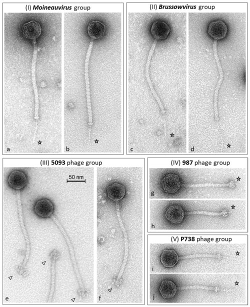

On 28 June 2012 _Science_ published online a short paper from Martin Jinek, Krzysztof Chylinski, Ines Fonfara, Michael Hauer, **[Jennifer Doudna](kloom:e/jennifer-doudna)** of the University of California, Berkeley and **[Emmanuelle Charpentier](kloom:e/emmanuelle-charpentier)**, then at Umeå in Sweden. It described a bacterial enzyme, **[Cas9](kloom:e/cas9)**, that cuts both strands of DNA wherever a short RNA tells it to, and an RNA that could be rewritten to send it anywhere. Its abstract ended on a prediction, "the potential to exploit the system for RNA-programmable genome editing," and it came true within months. The tool was a bacterial defense against viruses, first noticed twenty-five years earlier.

## Repeats with a memory

In 1987 **[Yoshizumi Ishino](kloom:e/yoshizumi-ishino)** and his colleagues at Osaka University, sequencing a gene of _E. coli_, found beside it something odd: "Five highly homologous sequences of 29 nucleotides were arranged as direct repeats with 32 nucleotides as spacing." They added: "the biological significance of these sequences is not known." **[Francisco Mojica](kloom:e/francisco-mojica)**, at the University of Alicante, found similar repeats in salt-loving archaea in 1993 and then in organism after organism, and with Ruud Jansen in the Netherlands gave them a name in 2002: clustered regularly interspaced short palindromic repeats, **[CRISPR](kloom:e/crispr)**. In 2005 his group reported that the spacers between the repeats matched the DNA of viruses and plasmids, and that those elements "fail to infect the specific spacer-carrier strain." The paper, by Wikipedia's account, was turned down by four journals before the _Journal of Molecular Evolution_ took it; two other groups reached the same idea the same year.

The test came from yogurt. **[_Streptococcus thermophilus_](kloom:e/streptococcus-thermophilus)** turns milk into yogurt and cheese, and the viruses that kill it, the bacteriophages in the micrographs, are "a major problem in the dairy fermentation industry." In 2007 **[Rodolphe Barrangou](kloom:e/rodolphe-barrangou)**, Philippe Horvath and their colleagues at the starter-culture firm Danisco infected it with phages and kept the survivors. The resistant bacteria had gained new spacers copied from the phage; adding or removing a spacer gave or took away resistance to that phage. CRISPR was an immune system that learns.

## How Cas9 cuts

In 2011 Charpentier's group found a second small RNA in _Streptococcus pyogenes_, the tracrRNA, which pairs with the CRISPR RNA. She and Doudna then found that Cas9 would not cut DNA with the CRISPR RNA alone, and would with both. Then they joined the two RNAs into one, a single guide RNA, and showed that changing its first twenty letters changed what Cas9 cut. The parts, and what each does, as the plate draws them:

| Part                 | What it does                                                                                     |
| -------------------- | ------------------------------------------------------------------------------------------------ |
| Guide (20 letters)   | Pairs with one strand of the target DNA; a change here retargets the enzyme                      |
| Scaffold (tracrRNA)  | Folds into stem-loops that hold the guide in Cas9                                                |
| PAM, NGG             | Three letters beside the target that Cas9 must find first; without them it does not cut          |
| Cas9                 | Opens the DNA, checks the pairing, and cuts both strands three letters before the PAM            |
| HNH and RuvC domains | The two blades: HNH cuts the strand paired with the guide, RuvC the other                        |
| The cell's repair    | Joins the ends roughly, often knocking out a gene (NHEJ), or copies in a supplied template (HDR) |

The PAM is why a bacterium does not cut its own CRISPR array, whose spacers lack it. Credit is argued. **[Virginijus Šikšnys](kloom:e/virginijus-siksnys)** in Vilnius showed Cas9 cutting where its RNA guided it in a paper sent to _Cell Reports_ in April 2012, rejected without review, and published in _PNAS_ that September. The Nobel committee wrote that his group "did not notice the crucial importance of tracrRNA"; the Kavli Prize of 2018 went to him with Charpentier and Doudna.

## Into human cells, and into court

In January 2013 _Science_ published online two papers side by side: **[Feng Zhang](kloom:e/feng-zhang)**'s group at the Broad Institute in Cambridge, Massachusetts, and **[George Church](kloom:e/george-church-geneticist)**'s at Harvard edited human cells with Cas9. Church's team, aiming at a site on chromosome 19, reported targeting rates of 10 to 25 percent in one human cell line and 2 to 4 percent in induced stem cells. The University of California and the Broad then fought for a decade over the patents for editing such cells. The patent board sided with the Broad in 2017 and 2022; an appeals court sent the case back in May 2025, and in March 2026 the board again found for the Broad.

In November 2018 **[He Jiankui](kloom:e/he-jiankui)**, a biophysicist in Shenzhen, announced the birth of twin girls, known as Lulu and Nana, from embryos in which he had disabled the gene _CCR5_ to make them resistant to HIV; their father had HIV. The edits were incomplete and uneven, the parents' consent form called the project "an AIDS vaccine development project," and what the edits will mean for the girls is unknown. A third edited child was born in 2019. The organizers of the summit in Hong Kong where he spoke called it "irresponsible." A Shenzhen court sentenced him in December 2019 to three years in prison and a fine of three million yuan; he was released in 2022. In 2023 the third summit, in London, concluded: "Heritable human genome editing remains unacceptable at this time."

## The first medicine

The same summit hailed the results for **[sickle cell disease](kloom:e/sickle-cell-disease)**. **[Casgevy](kloom:e/exagamglogene-autotemcel)**, from Vertex and CRISPR Therapeutics, takes a patient's own blood stem cells, uses Cas9 to cut an enhancer of the gene _BCL11A_, whose protein represses fetal hemoglobin, and returns them after chemotherapy has cleared the marrow. Britain approved it on 16 November 2023 and the United States on 8 December, when 29 of 31 patients followed long enough had been free of severe pain crises for at least a year. Its list price in the United States is $2.2 million. In crops, CRISPR can change a plant's own genes without adding foreign ones; the first edited food, a tomato richer in the compound GABA, went on sale in Japan in 2021. In 2020 Charpentier and Doudna shared the **[Nobel Prize in Chemistry](kloom:e/nobel-prize-in-chemistry)** "for the development of a method for genome editing."

The last segment steps back from the molecule to whole living worlds.
