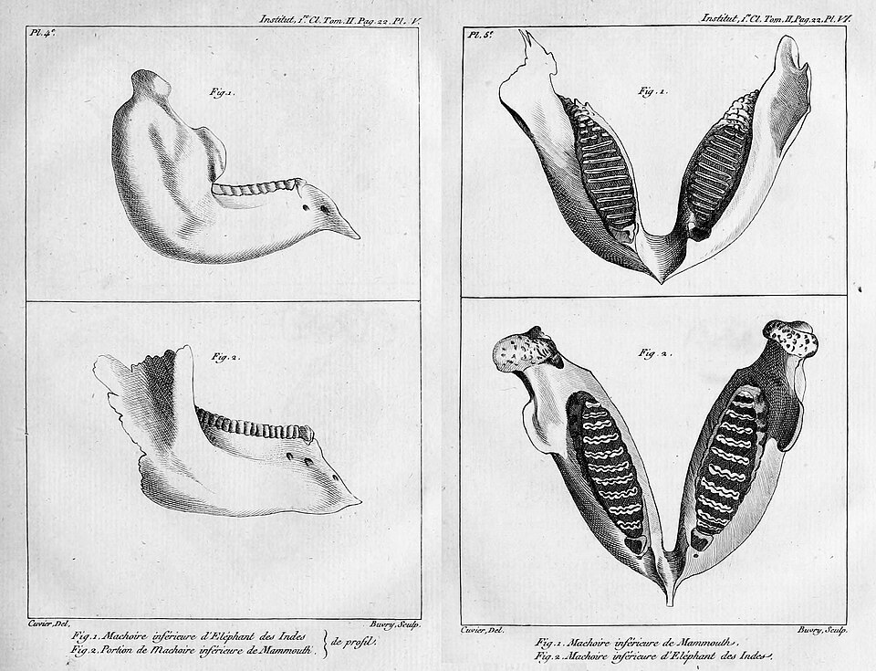

In 1795 a 25-year-old tutor from Normandy, **[Georges Cuvier](kloom:e/georges-cuvier)**, came to Paris as assistant to the professor of animal anatomy at the **[National Museum of Natural History](kloom:e/national-museum-of-natural-history-france)**, the Muséum, which the revolutionary Convention had made out of the king's garden two years before. Within months he read a memoir to the new National Institute, "on the species of elephants, living and fossil." The printed text says it was read on 1 Pluviôse of the year IV, 21 January 1796 by our arithmetic; Martin Rudwick, who translated it, dates its reading at the Institute's public session to 4 April. It reached print only in 1799, with plates Cuvier drew himself.

## Two elephants, then four

Everyone who had written about elephants, Cuvier began, had assumed there was only one kind. Big bones dug up in Siberia and across Europe were taken to be elephants too, and the favored explanation was that elephants had once lived in the north and moved south as the earth cooled. Cuvier set out to compare.

The skulls he needed came with the war. In his own words, in our translation, "the conquest that the Republic and the natural sciences have made of the collection of the Prince of Orange, former stadholder of Holland" had brought to Paris the skulls of an elephant from Ceylon, an **[Asian elephant](kloom:e/asian-elephant)**, and one from the Cape of Good Hope, an **[African elephant](kloom:e/african-elephant)**. They differed in the forehead, the jaw and above all the grinding teeth, each built of plates of enamel whose worn edges make a pattern on the crown. He then laid the fossil jaws beside them:

| Animal                                      | Pattern of enamel on the worn molar                                   | Plates in a molar  | Living?                   |
| ------------------------------------------- | --------------------------------------------------------------------- | ------------------ | ------------------------- |
| Elephant of the Cape (the African elephant) | Lozenges, 2½ or 3 times as wide as long, edges hardly curved          | 8 or 9             | Yes                       |
| Elephant of Ceylon (the Asian elephant)     | Narrow ribbons with parallel edges, finely scalloped                  | Up to 12 or more   | Yes                       |
| Mammoth, Siberia and Europe                 | Ribbons like Ceylon's, thinner, closer, more numerous, less scalloped | More than Ceylon's | No known original         |
| The "Ohio animal"                           | Three or four pairs of big blunt points, worn to lozenges             | Far fewer, thicker | No trace among the living |

The mammoth's lower jaw differed too: the base of the triangle its two branches make is to its height "as 4 to 3," where in the elephant of Ceylon they are equal. The Ohio animal, whose bones Indigenous people had given to a French officer, Longueuil, near the Ohio River in 1739, was the beast Cuvier later named the **[mastodon](kloom:e/mastodon)**. Cuvier did not claim to be first: the anatomists **[Petrus Camper](kloom:e/petrus-camper)**, Sebald Brugmans and Barthélemy Faujas had already suspected two kinds of elephant, and his note added in 1798 conceded that Blumenbach's handbook had meanwhile given the teeth. What was new was the conclusion. The **[woolly mammoth](kloom:e/woolly-mammoth)** was a species of its own, and no one had seen it alive. He ended, in our translation:

> Ask why we find so many remains of unknown animals, while we find almost none that can be said to belong to the species we know, and you will see how probable it is that they belonged to beings of a world earlier than ours, beings destroyed by some revolutions of this globe.

That was the case for **[extinction](kloom:e/extinction)**, made from teeth. The same year he named **[_Megatherium_](kloom:e/megatherium)**, a giant from the banks of the Luján River near Buenos Aires, which he showed to be a ground sloth. He worked from engravings sent from Madrid, where the skeleton had been mounted. Its describers there, Juan Bautista Bru and Joseph Garriga, published theirs too, and which description came first has been argued over.

## From one bone, the whole animal

Cuvier made his method a law, the correlation of parts. In the English edition of 1827, "the form of the tooth regulates the forms of the condyle, of the scapula, and of the claws, in the same manner as the equation of a curve regulates all its properties." How far it held, he admitted himself: theory was not enough, and his rules rested on comparison, on the Muséum's "skeletons of all the genera and sub-genera of quadrupeds." It failed him at times. In 1823 he gave great bony shells from the Pampas to _Megatherium_; they belonged to glyptodonts, as **[Richard Owen](kloom:e/richard-owen)** showed in 1839.

## Revolutions of the globe

In the preliminary discourse to his _Researches on Fossil Bones_ (1812), later printed alone as the _Discourse on the Revolutions of the Globe_, he concluded that "life, therefore, has often been disturbed on this earth by terrible events," floods and upheavals that wiped out whole faunas. He refused transmutation. The mummified ibises and cats that his colleague **[Étienne Geoffroy Saint-Hilaire](kloom:e/etienne-geoffroy-saint-hilaire)** brought back from Napoleon's expedition to Egypt matched the living ones, so, he argued, species did not change. In **[_Le Règne Animal_](kloom:e/le-regne-animal)** (1817) he divided animals into four branches, the _embranchements_: vertebrates, mollusks, articulated animals and radiates, four separate plans of body that broke with the old picture of a single chain of beings.

## Sarah Baartman

His anatomy served race science too. In 1815 he examined **[Sarah Baartman](kloom:e/sarah-baartman)**, a Khoekhoe woman exhibited across Europe as the "Hottentot Venus." When she died in Paris, at the turn of 1816, Cuvier dissected her, kept her skeleton, brain and genitals, and in his account compared her to apes. Paris museums displayed her skeleton and a cast of her body until 1974. They were returned to South Africa and buried in the Gamtoos River valley in 2002.

Another colleague at the Muséum, **[Jean-Baptiste Lamarck](kloom:e/jean-baptiste-lamarck)**, read the same fossils the opposite way.
