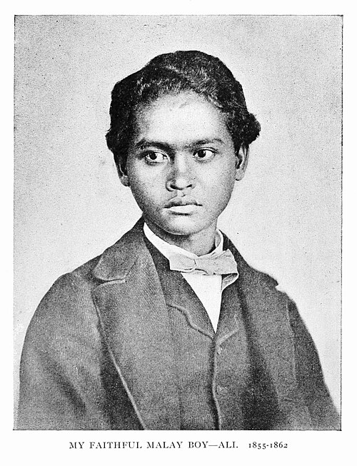
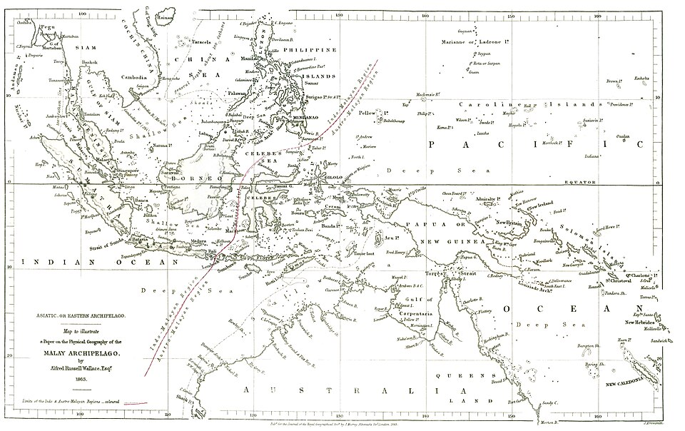

In 1854 **[Alfred Russel Wallace](kloom:e/alfred-russel-wallace)**, a self-taught naturalist of 31 who paid his way by selling specimens to collectors in London, sailed for Singapore. He spent the next eight years in the islands between Asia and Australia, and brought back, by his own count, 125,660 specimens of natural history. In **[Sarawak](kloom:e/sarawak)**, on Borneo, in February 1855, he wrote a paper that ended with a law: "Every species has come into existence coincident both in space and time with a pre-existing closely allied species." **[Charles Lyell](kloom:e/charles-lyell)** read it and urged **[Charles Darwin](kloom:e/charles-darwin)**, who had been working on the question privately since 1837, to publish before someone else did.

In Sarawak, too, Wallace hired a Malay youth named **[Ali](kloom:e/ali-wallace-naturalist)** as his cook and servant. Ali learned to shoot birds and to skin and prepare them, and he went with Wallace through most of the archipelago. In 2015 the historians [John van Wyhe](kloom:e/john-van-wyhe) and Gerrell Drawhorn pieced together his wages and journeys from the surviving records, and concluded that Ali may have collected most of Wallace's bird specimens, among them the bird of paradise named for Wallace, the standardwing. Wallace printed Ali's photograph in his autobiography of 1905 under the caption "My faithful Malay boy". When the American zoologist Thomas Barbour visited **[Ternate](kloom:e/ternate)** in 1907, an old man stopped him in the street and said, "I am Ali Wallace."

## The essay from Ternate

Early in 1858, in the [Moluccas](kloom:e/maluku-islands), Wallace lay ill with what he called "a sharp attack of intermittent fever," probably malaria, with daily cold and hot fits. In his own telling, written nearly fifty years later, he remembered **[Malthus](kloom:e/thomas-robert-malthus)**'s "positive checks," the disease, accidents, war and famine that keep human numbers down, and applied them to animals, which breed far faster:

> Vaguely thinking over the enormous and constant destruction which this implied, it occurred to me to ask the question, Why do some die and some live? And the answer was clearly, that on the whole the best fitted live.

He wrote the idea out over two evenings and posted it to Darwin, asking him to pass it to Lyell. The essay, "On the Tendency of Varieties to Depart Indefinitely from the Original Type," is signed "Ternate, February, 1858," though Wallace's journal suggests he was then on the larger island of Gilolo, now Halmahera. "The life of wild animals is a struggle for existence," it begins its argument, and it likens the culling of ill-fitted varieties to "the centrifugal governor of the steam engine, which checks and corrects any irregularities almost before they become evident."

## A delicate arrangement

Darwin wrote to Lyell on 18 June 1858: "Your words have come true with a vengeance that I shd. be forestalled. … I never saw a more striking coincidence. if Wallace had my M.S. sketch written out in 1842 he could not have made a better short abstract! Even his terms now stand as Heads of my Chapters." A week later, with his baby son ill with scarlet fever, he asked whether he could still publish honorably: "I would far rather burn my whole book than that he or any man shd. think that I had behaved in a paltry spirit." Lyell and **[Joseph Dalton Hooker](kloom:e/joseph-dalton-hooker)** decided for him. On 1 July 1858 the secretary of the **[Linnean Society](kloom:e/linnean-society-of-london)** read four documents:

| Document                                   | Written                                    | Author           |
| ------------------------------------------ | ------------------------------------------ | ---------------- |
| A covering letter                          | 30 June 1858                               | Lyell and Hooker |
| An extract from Darwin's unpublished essay | Sketched 1839, copied 1844                 | Darwin           |
| An abstract of a letter to Asa Gray        | 5 September 1857 ("October" in the letter) | Darwin           |
| "On the Tendency of Varieties to Depart …" | February 1858                              | Wallace          |

Neither author was there. Darwin's son had died on 28 June, and Wallace was in New Guinea, where he had gone in March. The papers appeared in the society's journal on 20 August, Darwin's first, in "the order of their dates." Little followed. Its president, **[Thomas Bell](kloom:e/thomas-bell-zoologist)**, said in May 1859 that the year had not "been marked by any of those striking discoveries which at once revolutionize, so to speak, the department of science on which they bear."

## Was it fair?

Wallace was not asked before his essay was read, and Darwin's documents went first. From 1969 the historians John Brooks and H. Lewis McKinney argued from the mail steamers' schedules that the essay reached Darwin in May or early June, and in 2012 Roy Davies argued that it came on 3 June, giving Darwin two weeks to rework his book. In 2012 van Wyhe and Kees Rookmaaker found that Wallace's letter went on the April steamer, not the March one, and would have arrived on 18 June, just as Darwin said; van Wyhe's Darwin Online calls the charge disproved.

Wallace's own view was generous. He named his own book on **[natural selection](kloom:e/natural-selection)** _Darwinism_ (1889), and in 1908, at the jubilee of the reading, said that their shares should be weighed "as 20 years is to one week."

## The line

Wallace's travels gave him a second discovery. In **[Bali](kloom:e/bali)** he found Asian birds, barbets and woodpeckers; on **[Lombok](kloom:e/lombok)**, across a strait he called fifteen miles wide in one chapter of [_The Malay Archipelago_](kloom:e/the-malay-archipelago) (1869) and less than twenty in another, cockatoos and honeyeaters of Australian families. "We may pass in two hours from one great division of the earth to another." He drew the boundary in 1859, and his map of 1863 shows it, from south of Bali through the Makassar Strait. Huxley named it the **[Wallace Line](kloom:e/wallace-line)** in 1868. The strait is deep: when the ice ages lowered the sea and joined Bali to Java and Asia, Lombok stayed an island.

Darwin, meanwhile, turned his big book into an abstract of nearly 500 pages, [_On the Origin of Species_](kloom:e/on-the-origin-of-species).
