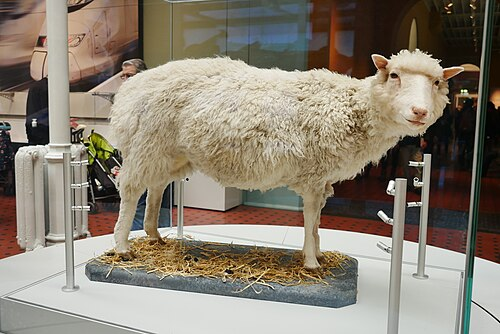

On 5 July 1996, at the **[Roslin Institute](kloom:e/roslin-institute)** outside Edinburgh, a Scottish Blackface ewe gave birth to a white-faced lamb of another breed, a Finn Dorset. The lamb had no father. She had grown from an egg whose own chromosomes had been taken out and replaced with the nucleus of a cell from the udder of a six-year-old Finn Dorset ewe. She was **[Dolly](kloom:e/dolly-sheep)**, the first mammal cloned from a cell of an adult. Her birth was announced on 22 February 1997, and the paper describing it appeared in _Nature_ that week. "Dolly is derived from a mammary gland cell," **[Ian Wilmut](kloom:e/ian-wilmut)**, who led the work, explained of her name, "and we couldn't think of a more impressive pair of glands than Dolly Parton's." Wilmut also wrote that one of the stockmen christened her.

## Can a grown cell start over?

The question was older than mammal **[cloning](kloom:e/cloning)**. A fertilized egg becomes every kind of cell; does a specialized cell keep all the instructions it started with, or lose the ones it no longer needs? In 1952 **[Robert Briggs](kloom:e/robert-briggs-scientist)** and **[Thomas King](kloom:e/thomas-joseph-king)**, in Philadelphia, tested it in the northern leopard frog. They pricked an egg with a glass needle to start it developing, lifted out its nucleus, drew a single cell of an older embryo into a fine pipette so that its surface broke, and injected it. Their table:

| Briggs and King, 1952                                   | Eggs |
| ------------------------------------------------------- | ---: |
| Enucleated eggs injected with a nucleus from a blastula |  197 |
| Cleaved                                                 |  104 |
| Became complete blastulae                               |   63 |
| Complete blastulae left to develop                      |   50 |
| Grew into embryos normal in appearance                  |   15 |

Their donor cells were still young. In 1962 **[John Gurdon](kloom:e/john-gurdon)**, at Oxford, used the nuclei of intestinal cells from feeding tadpoles of the **[African clawed frog](kloom:e/african-clawed-frog)**, and some of the eggs grew into normal tadpoles; repeated, the experiment gave adult frogs. Whether those cells were fully specialized was doubted until 1975, when a Basel group got tadpoles from the nucleus of an antibody-making cell. As of 2015, Wilmut wrote, no adult frog had ever come from a single transfer of a nucleus from an adult frog.

## How Dolly was made

**[Keith Campbell](kloom:e/keith-campbell-biologist)**, a cell biologist at Roslin, saw why mammals had resisted: the donor nucleus and the egg had to be at matching points in the cycle of cell division. His answer was to starve the donor cells of serum for five days, so that they stopped dividing and rested. In 1995 that method gave two lambs, Megan and Morag, from embryo cells kept in culture. The next year the team tried three kinds of donor cell, from an embryo, from a fetus and, for Dolly, from the mammary gland of a ewe in the last months of pregnancy, kept in culture by the company PPL Therapeutics. The plate follows the steps:

| Step     | What was done                                                                                      |
| -------- | -------------------------------------------------------------------------------------------------- |
| Donor    | Udder cells, grown in culture and starved of serum until they stopped dividing                     |
| Egg      | An unfertilized egg from a Scottish Blackface ewe, its chromosomes drawn out with a fine pipette   |
| Fusion   | A donor cell set against the empty egg; electric pulses fused the two and started the egg dividing |
| Culture  | The new embryo grown for about a week                                                              |
| Transfer | Embryos that reached the morula or blastocyst stage placed in Scottish Blackface surrogate ewes    |
| Birth    | A white-faced lamb, of the donor's breed and not the surrogate's; DNA tests confirmed her origin   |

This **[somatic cell nuclear transfer](kloom:e/somatic-cell-nuclear-transfer)** was costly. In Ramiro Alberio and Eckhard Wolf's account of the 1997 paper, 277 nuclear transfers from the udder cells gave one lamb. Wilmut gave the share of embryos that reached the morula or blastocyst stage as 11.75 percent from the adult cells, against 27.4 from fetal and 39.0 from embryo cells. Wikipedia's article on cloning gives another count, 435 attempts.

## Whose sheep

Wilmut led the team and his name came first on the paper; Campbell's name came last. In 2006 Wilmut agreed that Campbell deserved "66 per cent" of the credit and that the statement "I did not create Dolly" was accurate. When Campbell died in 2012, Wilmut's obituary of him named two key insights, the coordination of the cell cycles and the resting of the donor cells, as Campbell's. The goal had always been farm animals with precise genetic changes. In 1997 the same method gave Polly, a lamb carrying the human gene for **[factor IX](kloom:e/factor-ix)**, the clotting protein that people with hemophilia B lack, built to make it in her milk.

## A watched life

Dolly lived at Roslin, indoors for her security, and had six lambs. At a year old her telomeres, the caps on the ends of her chromosomes that wear down with age, were shorter than those of other **[sheep](kloom:e/sheep)** her age, and people asked whether she had been born old; Roslin later found the shortening tracked time in culture more than the donor's age. A conference abstract reported osteoarthritis in her left knee at five and a half. She was put down on 14 February 2003, at six, with a lung tumor caused by a virus that was in the flock. In 2017 veterinary surgeons X-rayed her skeleton and those of three other Roslin sheep, and judged her arthritis no worse than naturally bred sheep get; thirteen clones aged seven to nine, four of them from Dolly's cell line, had aged normally too. Her stuffed body is in the National Museum of Scotland.

Laws soon followed her. Britain's **[Human Reproductive Cloning Act 2001](kloom:e/human-reproductive-cloning-act-2001)** made it a crime, punishable by up to ten years in prison, to place in a woman "a human embryo which has been created otherwise than by fertilisation"; in 2005 the United Nations General Assembly adopted a declaration against human cloning, 84 votes to 34, with 37 abstentions, which binds no one. And in 2006 **[Shinya Yamanaka](kloom:e/shinya-yamanaka)**, in Kyoto, turned mouse fibroblasts, cells of connective tissue, back into **[induced pluripotent stem cells](kloom:e/induced-pluripotent-stem-cell)** with four genes and no egg at all. Gurdon and Yamanaka shared the Nobel Prize in 2012; Wilmut, who said in 2008 that he would turn to Yamanaka's method himself, died in 2023.

Five years after Dolly's birth, a draft of the human genome was published, in the next frame.
