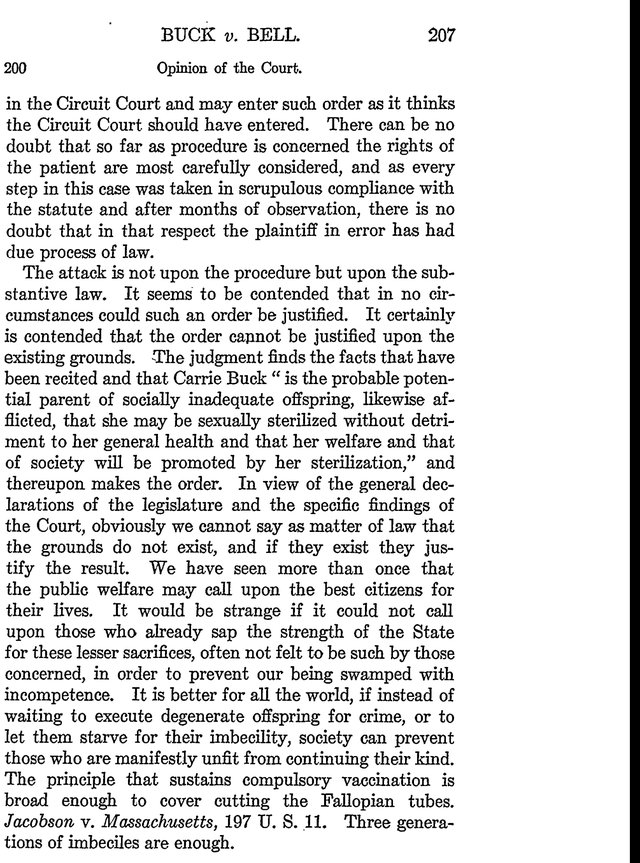

On 19 October 1927, at the Virginia State Colony for Epileptics and Feeble Minded near Lynchburg, its superintendent, John Hendren Bell, cut and tied the Fallopian tubes of a 21-year-old patient, **[Carrie Buck](kloom:e/carrie-buck)**. Five months earlier the Supreme Court of the United States had ruled, eight votes to one, that Virginia could do it. The idea behind the operation was **[eugenics](kloom:e/eugenics)**: that a nation could improve its heredity by stopping the "unfit" from having children. Its American advocates were biologists, physicians and lawmakers, and its targets were the poor, the institutionalized and the disabled.

## A word, an office and a model law

**[Francis Galton](kloom:e/francis-galton)** coined the word in 1883, in a footnote to _Inquiries into Human Faculty_. "We greatly want a brief word to express the science of improving stock," he wrote, one that would give "the more suitable races or strains of blood a better chance of prevailing speedily over the less suitable." In 1910 the biologist **[Charles Davenport](kloom:e/charles-davenport)** opened the **[Eugenics Record Office](kloom:e/eugenics-record-office)** at **[Cold Spring Harbor](kloom:e/cold-spring-harbor-laboratory)** on Long Island, paid for chiefly by Mary Harriman, a railroad fortune's widow, and later by the Carnegie Institution. Its superintendent, **[Harry H. Laughlin](kloom:e/harry-h-laughlin)**, sent trained field workers door to door to collect family pedigrees, and treated traits such as "feeblemindedness" as simple Mendelian characters, passed on like the color of Mendel's peas.

Indiana passed the first sterilization law in 1907. Others followed, but doctors used them little, fearing lawsuits. So in 1922 Laughlin published a "Model Eugenical Sterilization Law", written to survive a court, and Virginia's act of 20 March 1924 followed it closely. The opinion that upheld it sets out its procedure:

| Step     | What the Virginia act required                                                                |
| -------- | --------------------------------------------------------------------------------------------- |
| Petition | The superintendent swears to the board of his institution that an inmate should be sterilized |
| Notice   | The inmate, a guardian and any parents are served with the petition                           |
| Hearing  | The board hears evidence, all of it written down, and orders for or against                   |
| Appeals  | To the county circuit court, then to the Supreme Court of Appeals of Virginia                 |
| Grounds  | "Hereditary forms of insanity, imbecility, etc." in a state institution                       |

## A test case

The colony's superintendent, Albert Priddy, chose Carrie Buck to test the law. Raised by foster parents, she had been committed in January 1924, pregnant, she said, after their nephew raped her. Her mother, Emma, was already in the colony. At the trial in November 1924, Aubrey Strode, who had drafted the act, called witnesses, only two of whom had ever met her. A eugenics field worker, Arthur Estabrook, had spent a single day with the Bucks. Laughlin, who never met them, sent a deposition calling the family part of "the shiftless, ignorant, and worthless class of anti-social whites of the South." Her lawyer, Irving Whitehead, a former member of the colony's board, called no one.

In **[_Buck v. Bell_](kloom:e/buck-v-bell)**, decided on 2 May 1927, Justice **[Oliver Wendell Holmes Jr.](kloom:e/oliver-wendell-holmes-jr)** accepted the finding that she was "the probable potential parent of socially inadequate offspring":

> It is better for all the world, if instead of waiting to execute degenerate offspring for crime, or to let them starve for their imbecility, society can prevent those who are manifestly unfit from continuing their kind. The principle that sustains compulsory vaccination is broad enough to cover cutting the Fallopian tubes. … Three generations of imbeciles are enough.

The legal historian **[Paul A. Lombardo](kloom:e/paul-a-lombardo)** spent decades in the case's records, and found Carrie Buck before she died in 1983. The plate sets the court's three generations beside what the records show:

| The court's finding                   | What the records show                                                                                              |
| ------------------------------------- | ------------------------------------------------------------------------------------------------------------------ |
| Emma Buck, "feeble-minded"            | Poor, abandoned by her husband, committed in 1920 for "immorality"                                                 |
| Carrie Buck, "feeble-minded"          | An average pupil, in school until the sixth grade; her pregnancy from rape; born to married parents                |
| Vivian, her daughter, "feeble-minded" | Judged from a glance at a baby a few months old; on her school's honor roll in April 1931; dead of measles in 1932 |

Her half-sister Doris was sterilized too, without her knowledge, while in hospital for appendicitis; she learned why she had no children in 1980. Lombardo concluded that the suit was collusive: "there were two lawyers working for Dr. Priddy and none for Carrie Buck."

## From one case to 65,000

Before 1927, 8,515 Americans had been sterilized under these laws; in the decade after, almost 28,000. Thirty-two states passed them between 1907 and 1937. Lombardo counts 65,370 people sterilized in all, a third of them in California; another study puts the national total at "more than 60,000."

Laughlin served Congress as its "expert eugenics agent", and his figures on "inadequacy" among recent immigrants, which the biologist Herbert Spencer Jennings judged invalid, helped pass the **[Immigration Act of 1924](kloom:e/immigration-act-of-1924)**, whose quotas cut immigration from southern and eastern Europe. In **[Nazi Germany](kloom:e/nazi-germany)** the **[Law for the Prevention of Hereditarily Diseased Offspring](kloom:e/law-for-the-prevention-of-hereditarily-diseased-offspring)** of July 1933 set up courts of a judge and two doctors that could order sterilization by force: 62,400 people in 1934 alone, and some 400,000 by 1945. Some accounts call it closely based on Laughlin's model; others point out that a Prussian committee had drafted it in 1932, before the Nazis took power. Heidelberg gave Laughlin an honorary degree in 1936. From 1939 the regime went on to murder disabled people in **[Aktion T4](kloom:e/aktion-t4)**, a step toward **[the Holocaust](kloom:e/the-holocaust)**, and at Nuremberg defense counsel cited Holmes.

## How it ended, and when

In 1939 the Carnegie Institution closed the Eugenics Record Office. That August, at the International Congress of Genetics in Edinburgh, twenty-three geneticists signed a manifesto drafted chiefly by **[Hermann Joseph Muller](kloom:e/hermann-joseph-muller)**. It is often read as a rejection of eugenics; it was not. It argued that genetic improvement was possible but required economic and social equality first. In Germany, the geneticist Peter Harper writes, geneticists were "among the perpetrators."

In the United States the laws outlived the war. Virginia repealed its own in 1974. Governor Mark Warner apologized in 2002, and California in 2003. North Carolina set aside $10 million in 2013 and paid $20,000 each to 220 of 768 claimants. Virginia offered $25,000 in 2015. Between 2006 and 2010 California's prisons sterilized 144 women without the required consent.

Eugenics took heredity as a weapon in the hands of the state. The next frame shows a state that denied heredity altogether.
