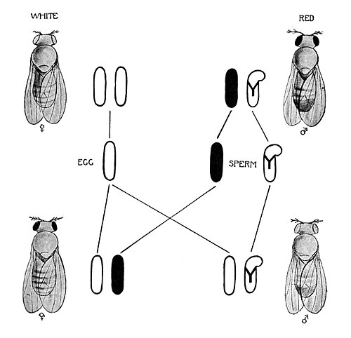

In 1909 **[Thomas Hunt Morgan](kloom:e/thomas-hunt-morgan)**, professor of experimental zoology at **[Columbia University](kloom:e/columbia-university)**, did not believe in [genes](kloom:e/gene). Mendel's "factors" were explaining too much, he wrote that year: "We work backwards from the facts to the factors, and then, presto! explain the facts by the very factors that we invented to account for them." He wanted to know what, physically, a factor was. Within five years his laboratory had answered him, and put the factors in a row.

The laboratory was the "fly room," a rather small room, in the words of one of his students, "16 by 23 feet, with eight desks crowded into it." Its animal was the fruit fly **[_Drosophila melanogaster_](kloom:e/drosophila-melanogaster)**, which the entomologist Charles Woodworth had proposed for research in 1901 and the geneticist William Castle had already bred. It was cheap and quick: a generation took about ten days, a pair left hundreds of offspring, and a cell held only four pairs of [chromosomes](kloom:e/chromosome). The flies were reared in milk bottles, at first on bananas, and sorted under hand lenses.

## The white-eyed male

In 1910, in a culture that had run for nearly a year, a male appeared with white eyes instead of red. Morgan's paper in _Science_ that July gave the counts:

| Cross                        | Red-eyed females   | Red-eyed males | White-eyed females | White-eyed males |
| ---------------------------- | ------------------ | -------------- | ------------------ | ---------------- |
| White male × his red sisters | 1,237 (both sexes) | (with females) | 0                  | 3                |
| Their offspring, inbred      | 2,459              | 1,011          | 0                  | 782              |
| White male × his daughters   | 129                | 132            | 88                 | 86               |

White eyes came back in the grandchildren, as a recessive should, but only in males. Morgan saw that the factor went wherever the sex chromosome went. Five years earlier **[Nettie Stevens](kloom:e/nettie-stevens)**, working on mealworms at Bryn Mawr, where she later bred the fly too, had found that half of a male's sperm carry a small chromosome and half a large one, and that this decides the sex of the offspring; Edmund Beecher Wilson found the same independently. A male has one X, so a single white factor on it shows. "The fact is that this R and X are combined," Morgan wrote, "and have never existed apart." It was the first factor tied to a particular chromosome: **[sex linkage](kloom:e/sex-linkage)**. The white-eyed males were also scarcer than a 3 to 1 ratio predicts, 782 where about 1,060 were due, by our arithmetic, because they survive less well.

## Crossing over, and a map

More sex-linked mutants followed: yellow body, vermilion eyes, miniature and rudimentary wings. Factors on the same chromosome should always travel together, and mostly they did, but not always. Morgan proposed that the paired chromosomes exchange pieces, **[crossing over](kloom:e/chromosomal-crossover)**, and that two factors far apart would be separated more often than two close together.

Late in 1911, in conversation with Morgan, the undergraduate **[Alfred Sturtevant](kloom:e/alfred-sturtevant)** saw that the proportions could order the factors along the chromosome. He went home, as he told it, and spent most of the night drawing the first map. His paper of 1913 gave the method: count the new combinations among the sons, and take the percentage as the distance. Of 405 sons from one cross, 109 had the vermilion and rudimentary factors recombined, so they lay 26.9 units apart. (His own counts of those sons add up to 458, which would make it 23.8 by our arithmetic; he noted the slip in 1961.) Laid end to end, the short distances gave his map:

| Factor              | Position on the 1913 map | Crossing over with yellow, observed (%) |
| ------------------- | ------------------------ | --------------------------------------- |
| Yellow body         | 0.0                      | n/a                                     |
| White and eosin eye | 1.0                      | 1.0                                     |
| Vermilion eye       | 30.7                     | 32.2                                    |
| Miniature wing      | 33.7                     | 35.5                                    |
| Rudimentary wing    | 57.6                     | 37.6                                    |

The map was built from neighboring pairs only, and the distances measured across it nearly added up, which only factors in a line would allow. The far one fell short, and Sturtevant saw why: two crossovers between distant factors cancel out. He warned too that his units measured how often a chromosome breaks, not its length, since "we have no means of knowing that the chromosomes are of uniform strength." Haldane later proposed calling a hundred such units a morgan, and one is now the **[centimorgan](kloom:e/centimorgan)**.

## The students

Sturtevant's classmate **[Calvin Bridges](kloom:e/calvin-bridges)** proved the point in 1916: in flies whose X chromosomes failed to separate, the white factor followed the error. **[Hermann Joseph Muller](kloom:e/hermann-joseph-muller)** added the theory and the fourth linkage group. In 1915 the four of them published _The Mechanism of Mendelian Heredity_. Not everyone was persuaded. William Bateson, reviewing it, thought it "inconceivable that particles of chromatin" could carry heredity.

Credit was unequal. Muller, whose part was often the ideas, felt cheated when he was left off the group's major papers; Morgan shared his Nobel Prize money of 1933 with Bridges and Sturtevant. Stevens died in 1912, and many later accounts gave her discovery to Wilson alone, or to Morgan; Morgan's obituary of her allowed that she "had a share in a discovery of importance."

In 1927, at the University of Texas, Muller showed that the fly's genes could be changed on purpose. Dosed with [X-rays](kloom:e/x-ray), which Wilhelm Röntgen had found in 1895, the flies' germ cells gave, as he put it in his Nobel lecture, "over a hundred times as many mutations" in half an hour as they would have made alone in a generation. Genes were physical things, and could be broken. From the fly room the fruit fly went out into the wild, and into the modern synthesis.
